# Guida Implementativa: Pratiche di Sviluppo, Pattern e Metodologie

**Basata sul repository tech-citizen-sw-gateway**  
**Versione**: 1.0  
**Data**: Dicembre 2025

---

## Indice

1. [Checklist Completa delle Pratiche](#1-checklist-completa-delle-pratiche)
2. [Metodologie e Principi di Sviluppo](#2-metodologie-e-principi-di-sviluppo)
3. [Architettura Esagonale (Ports & Adapters)](#3-architettura-esagonale-ports--adapters)
4. [Git Workflow: Trunk-Based Development](#4-git-workflow-trunk-based-development)
5. [Testing Strategy (Piramide dei Test)](#5-testing-strategy-piramide-dei-test)
6. [Quality Gates e Automazioni DX](#6-quality-gates-e-automazioni-dx)
7. [Conventional Commits e Semantic Release](#7-conventional-commits-e-semantic-release)
8. [Diagrammi di Flusso Automazioni](#8-diagrammi-di-flusso-automazioni)
9. [Setup Nuovo Repository](#9-setup-nuovo-repository)

---

## 1. Checklist Completa delle Pratiche

### 1.1 Metodologie Fondamentali

| Pratica | Descrizione | Implementato |
|---------|-------------|:------------:|
| **YAGNI** | You Aren't Gonna Need It - implementa solo ciò che serve ora | ☐ |
| **KISS** | Keep It Simple, Stupid - preferisci soluzioni semplici | ☐ |
| **DRY** | Don't Repeat Yourself - una sola fonte di verità | ☐ |
| **SOLID** | Single Responsibility, Open/Closed, Liskov, Interface Segregation, Dependency Inversion | ☐ |
| **XP** | Extreme Programming - TDD, CI, Small releases, Refactoring | ☐ |

### 1.2 Workflow e Versionamento

| Pratica | Descrizione | Implementato |
|---------|-------------|:------------:|
| **Trunk-Based Development** | Branch short-lived (< 3 giorni), merge frequenti su main | ☐ |
| **Conventional Commits** | Formato standard per messaggi commit | ☐ |
| **Semantic Versioning** | Major.Minor.Patch basato su commit types | ☐ |
| **Protected main branch** | CI deve passare prima del merge | ☐ |

### 1.3 Architettura

| Pratica | Descrizione | Implementato |
|---------|-------------|:------------:|
| **Hexagonal Architecture** | Separazione Domain/Application/Infrastructure | ☐ |
| **Ports & Adapters** | Interfacce (ports) + implementazioni (adapters) | ☐ |
| **Dependency Injection** | Dipendenze iniettate, non create internamente | ☐ |
| **ADR (Architecture Decision Records)** | Documentazione decisioni architetturali | ☐ |

### 1.4 Testing

| Pratica | Descrizione | Implementato |
|---------|-------------|:------------:|
| **TDD** | Test-Driven Development - Red/Green/Refactor | ☐ |
| **BDD** | Behavior-Driven Development - Gherkin/Cucumber | ☐ |
| **Unit Tests (~70%)** | Test domain logic pura, zero dipendenze esterne | ☐ |
| **Integration Tests (~20%)** | Test adapters con Testcontainers | ☐ |
| **E2E Tests (~10%)** | Test flussi utente completi | ☐ |
| **Coverage Target** | Minimo 70% line coverage | ☐ |

### 1.5 Quality Gates

| Pratica | Descrizione | Implementato |
|---------|-------------|:------------:|
| **ESLint** | Linting con regole SonarJS | ☐ |
| **Prettier** | Formattazione codice automatica | ☐ |
| **Commitlint** | Validazione formato commit messages | ☐ |
| **Husky** | Git hooks per pre-commit/pre-push | ☐ |
| **lint-staged** | Linting solo su file staged | ☐ |
| **Secret scanning** | Prevenzione leak credenziali | ☐ |
| **Complexity limits** | Cognitive < 10, Cyclomatic < 10 | ☐ |

### 1.6 DevOps & CI/CD

| Pratica | Descrizione | Implementato |
|---------|-------------|:------------:|
| **Docker Compose** | Infrastruttura containerizzata | ☐ |
| **Testcontainers** | Container ephemeral per test | ☐ |
| **Environment Strategy** | Solo Test + Production (no staging) | ☐ |
| **Semantic Release** | Versioning automatico da commit | ☐ |

---

## 2. Metodologie e Principi di Sviluppo

### 2.1 Principi YAGNI, KISS, DRY

Il principio **YAGNI (You Aren't Gonna Need It)** ci impone di implementare solo ciò che serve nel momento presente. Non dobbiamo anticipare funzionalità future che potrebbero non essere mai necessarie, perché questo riduce la complessità del codebase e accelera il time-to-market. In pratica, quando ti trovi a pensare "potrebbe servire in futuro", fermati e chiediti se serve davvero adesso.

Il principio **KISS (Keep It Simple, Stupid)** ci guida verso soluzioni semplici. La complessità è il nemico della manutenibilità: ogni livello di astrazione aggiunto deve giustificare il suo costo in termini di comprensione e debug. Se puoi risolvere un problema con 10 righe di codice invece che con un pattern elaborato, scegli le 10 righe.

Il principio **DRY (Don't Repeat Yourself)** stabilisce che ogni pezzo di conoscenza deve avere una singola, non ambigua, rappresentazione autorevole nel sistema. Quando ti accorgi di copiare-incollare codice, è il momento di estrarre una funzione o un modulo riutilizzabile.

### 2.2 Principi SOLID

I principi SOLID rappresentano le fondamenta della programmazione orientata agli oggetti ben progettata.

**Single Responsibility Principle (SRP)** significa che ogni classe o modulo dovrebbe avere una sola ragione per cambiare. Se una classe gestisce sia la logica di business che la persistenza, viola SRP.

**Open/Closed Principle (OCP)** stabilisce che le entità software dovrebbero essere aperte all'estensione ma chiuse alla modifica. Aggiungi nuove funzionalità creando nuove classi, non modificando quelle esistenti.

**Liskov Substitution Principle (LSP)** richiede che gli oggetti di una superclasse siano sostituibili con oggetti delle sue sottoclassi senza alterare la correttezza del programma.

**Interface Segregation Principle (ISP)** afferma che nessun client dovrebbe essere forzato a dipendere da interfacce che non usa. Preferisci molte interfacce specifiche a una singola interfaccia generale.

**Dependency Inversion Principle (DIP)** stabilisce che i moduli di alto livello non dovrebbero dipendere da moduli di basso livello; entrambi dovrebbero dipendere da astrazioni. Questo è il fondamento dell'architettura esagonale.

### 2.3 Extreme Programming (XP)

L'Extreme Programming è la metodologia agile che adottiamo, caratterizzata da pratiche specifiche che si rafforzano a vicenda.

**Test-Driven Development (TDD)** significa scrivere i test prima del codice di produzione, seguendo il ciclo Red-Green-Refactor. Prima scrivi un test che fallisce (Red), poi scrivi il codice minimo per farlo passare (Green), infine migliora il codice mantenendo i test verdi (Refactor).

**Continuous Integration (CI)** richiede che ogni sviluppatore integri il proprio codice nel trunk principale almeno una volta al giorno. Ogni integrazione è verificata da una build automatizzata che include l'esecuzione dei test.

**Small Releases** significa rilasciare frequentemente piccoli incrementi di funzionalità. Questo riduce il rischio e permette feedback rapido dagli utenti.

**Refactoring continuo** è il processo di miglioramento della struttura interna del codice senza modificarne il comportamento esterno. Il refactoring deve essere fatto in piccoli passi, sempre supportato dai test.

---

## 3. Architettura Esagonale (Ports & Adapters)

### 3.1 Fondamenti

L'architettura esagonale, ideata da Alistair Cockburn, separa il codice in tre zone concentriche. La metafora dell'esagono rappresenta un "centro" (il dominio) circondato da "lati" (le porte) attraverso cui il mondo esterno comunica.

```
┌─────────────────────────────────────────────────────────────────────────┐
│                           ADAPTERS (Esterno)                            │
│  ┌───────────────────────────────────────────────────────────────────┐  │
│  │                         PORTS (Interfacce)                        │  │
│  │  ┌─────────────────────────────────────────────────────────────┐  │  │
│  │  │                                                             │  │  │
│  │  │                     DOMAIN / CORE                           │  │  │
│  │  │                                                             │  │  │
│  │  │   • Business Logic pura                                     │  │  │
│  │  │   • Entità di dominio (User, Session, Token)                │  │  │
│  │  │   • Value Objects (Email, Password, UserId)                 │  │  │
│  │  │   • Domain Services (AuthService, SessionService)           │  │  │
│  │  │   • Nessuna dipendenza da framework o infrastruttura        │  │  │
│  │  │                                                             │  │  │
│  │  └─────────────────────────────────────────────────────────────┘  │  │
│  │                                                                   │  │
│  │  INBOUND PORTS (Driving)          OUTBOUND PORTS (Driven)         │  │
│  │  • IAuthUseCase                   • IUserRepository               │  │
│  │  • ISessionUseCase                • ISessionRepository            │  │
│  │  • IProfileUseCase                • IIdentityProvider             │  │
│  │                                                                   │  │
│  └───────────────────────────────────────────────────────────────────┘  │
│                                                                         │
│  INBOUND ADAPTERS (Primary)          OUTBOUND ADAPTERS (Secondary)      │
│  • FastifyAuthController             • KeycloakIdentityAdapter          │
│  • GraphQL Resolvers                 • RedisSessionAdapter              │
│  • CLI Commands                      • PostgresUserAdapter              │
│                                      • InMemoryAdapter (test)           │
└─────────────────────────────────────────────────────────────────────────┘
```

### 3.2 Regola delle Dipendenze

La regola fondamentale è che **le dipendenze puntano sempre verso l'interno**. Il Domain non conosce nulla degli Adapters. L'Application conosce il Domain ma non gli Adapters. Gli Adapters conoscono tutto ma non sono conosciuti da nessuno.

### 3.3 Struttura Directory Consigliata

```
packages/auth/
├── src/
│   ├── domain/                    # CORE - Business logic pura
│   │   ├── entities/
│   │   │   └── session.entity.ts
│   │   ├── value-objects/
│   │   │   └── session-id.vo.ts
│   │   └── services/
│   │       └── session.service.ts
│   │
│   ├── application/               # USE CASES + PORTS
│   │   ├── ports/
│   │   │   ├── inbound/
│   │   │   │   └── refresh-session.port.ts
│   │   │   └── outbound/
│   │   │       ├── session-repository.port.ts
│   │   │       └── identity-provider.port.ts
│   │   └── use-cases/
│   │       └── refresh-session.use-case.ts
│   │
│   └── infrastructure/            # ADAPTERS
│       ├── adapters/
│       │   ├── redis-session.adapter.ts
│       │   ├── keycloak-identity.adapter.ts
│       │   └── mock-identity.adapter.ts
│       └── http/
│           └── auth.controller.ts
│
└── test/
    ├── unit/                      # Test Domain + Use Cases (NO infra)
    │   ├── domain/
    │   └── use-cases/
    └── integration/               # Test Adapters (CON infra)
        └── adapters/
```

### 3.4 Esempio Implementativo

```typescript
// === DOMAIN: Business logic pura ===
// src/domain/services/session.service.ts
export class SessionService {
  // Nessuna dipendenza esterna - pura logica di business
  isSessionExpired(session: Session): boolean {
    return session.expiresAt < new Date();
  }
  
  calculateNewExpiry(session: Session, extensionMinutes: number): Date {
    return new Date(Date.now() + extensionMinutes * 60 * 1000);
  }
}

// === APPLICATION: Port (interfaccia) ===
// src/application/ports/outbound/session-repository.port.ts
export interface SessionRepositoryPort {
  // Definisce COSA serve, non COME è implementato
  getSession(sessionId: string): Promise<Session | null>;
  saveSession(session: Session): Promise<void>;
  deleteSession(sessionId: string): Promise<void>;
}

// === APPLICATION: Use Case ===
// src/application/use-cases/refresh-session.use-case.ts
export class RefreshSessionUseCase {
  // Dependency Injection: le ports sono iniettate
  constructor(
    private readonly sessionRepository: SessionRepositoryPort,
    private readonly identityProvider: IdentityProviderPort,
    private readonly sessionService: SessionService,
  ) {}

  async execute(sessionId: string): Promise<RefreshSessionResult> {
    // Orchestrazione della business logic
    const session = await this.sessionRepository.getSession(sessionId);
    
    if (!session || this.sessionService.isSessionExpired(session)) {
      return { success: false, error: 'SESSION_EXPIRED' };
    }
    
    // La logica usa le ports senza sapere l'implementazione
    const newExpiry = this.sessionService.calculateNewExpiry(session, 30);
    session.expiresAt = newExpiry;
    await this.sessionRepository.saveSession(session);
    
    return { success: true, session };
  }
}

// === INFRASTRUCTURE: Adapter concreto ===
// src/infrastructure/adapters/redis-session.adapter.ts
export class RedisSessionAdapter implements SessionRepositoryPort {
  // Implementazione concreta della Port
  constructor(private readonly redis: Redis) {}

  async getSession(sessionId: string): Promise<Session | null> {
    const data = await this.redis.get(`session:${sessionId}`);
    return data ? JSON.parse(data) : null;
  }
  
  async saveSession(session: Session): Promise<void> {
    await this.redis.set(
      `session:${session.id}`,
      JSON.stringify(session),
      'EX',
      3600
    );
  }
  
  async deleteSession(sessionId: string): Promise<void> {
    await this.redis.del(`session:${sessionId}`);
  }
}
```

### 3.5 Vantaggi per il Testing

La separazione esagonale permette di testare ogni layer in isolamento, rendendo i test veloci e affidabili.

I **test unitari** (Domain + Use Cases) usano mock delle Ports, eseguono in millisecondi, e non richiedono alcun container Docker. Questo livello copre circa il 70% dei test totali e verifica tutta la logica di business.

I **test di integrazione** (Adapters) usano Testcontainers per avviare infrastruttura reale come Redis e Keycloak in container ephemeral. Questi test verificano che gli adapter funzionino correttamente con i sistemi esterni e coprono circa il 20% dei test.

I **test E2E** verificano i flussi utente completi, usano lo stack Docker completo, e coprono circa il 10% dei test. Sono scritti in Gherkin per essere leggibili anche dai non-tecnici.

---

## 4. Git Workflow: Trunk-Based Development

### 4.1 Rationale

Il Trunk-Based Development è stato scelto per i seguenti motivi. Il team size di 1-2 sviluppatori non giustifica l'overhead di Git Flow. La release frequency è continua, quindi non servono release branches. La complessità è bassa, applicando il principio YAGNI. Il CI/CD richiede fast feedback loops. L'XP methodology pone la continuous integration come pratica core.

### 4.2 Workflow Visuale

```
main (protected)
  │
  ├─ feat/gateway-routes  ← 2-3 giorni max
  │     └── merge → main
  │
  └─ fix/docker-binding   ← hotfix immediato
        └── merge → main
```

### 4.3 Regole Fondamentali

Prima regola: **main è sempre deployable** (branch protetto). Seconda regola: **feature branches vivono meno di 3 giorni**. Terza regola: **commit early, push often**. Quarta regola: **CI deve passare prima del merge**. Quinta regola: **niente develop branch** (YAGNI).

### 4.4 Naming Convention per i Branch

```bash
feat/short-description    # Nuove funzionalità
fix/issue-description     # Bug fixes
chore/task-description    # Tooling, dipendenze
docs/topic                # Documentazione
refactor/description      # Refactoring codice
test/description          # Aggiunta/fix test
```

### 4.5 Flusso Giornaliero

```bash
# Inizio giornata: sync con main
git checkout main && git pull

# Nuova feature
git checkout -b feat/health-metrics

# Lavoro iterativo con commit frequenti
git add -A && git commit -m "feat(metrics): add Prometheus endpoint"
git push -u origin feat/health-metrics

# Crea PR e merge (se CI passa)
gh pr create --fill
gh pr merge --squash --delete-branch
```

### 4.6 Alternative Rifiutate

**Git Flow** è stato rifiutato perché è overkill con 5 tipi di branch (main/develop/feature/release/hotfix), richiede overhead per merge ceremonies e long-lived branches, e non è adatto per continuous delivery.

**GitHub Flow** è stato rifiutato perché richiede PR reviews obbligatorie che per un solo sviluppatore rappresentano spreco. Diventa utile con 3 o più sviluppatori più processo di code review.

---

## 5. Testing Strategy (Piramide dei Test)

### 5.1 Piramide dei Test

```
┌─────────────────────────────────────────────────────────┐
│                    ACCEPTANCE LEVEL                      │
│   BDD (Cucumber/Gherkin)                                │
│   - Feature files in e2e/features/                      │
│   - Step definitions in e2e/steps/                      │
│   - ~10% dei test totali                                │
└─────────────────────────────────────────────────────────┘
                          │
                          ▼
┌─────────────────────────────────────────────────────────┐
│                  INTEGRATION LEVEL                       │
│   Tap/Jest + Testcontainers                             │
│   - Test adapter/infrastructure                         │
│   - Container reali (Keycloak, Redis, Postgres)         │
│   - ~20% dei test totali                                │
└─────────────────────────────────────────────────────────┘
                          │
                          ▼
┌─────────────────────────────────────────────────────────┐
│                      UNIT LEVEL                          │
│   Tap/Jest + In-memory fakes                            │
│   - Test domain logic pura                              │
│   - Zero dipendenze esterne                             │
│   - ~70% dei test totali                                │
└─────────────────────────────────────────────────────────┘
                          │
                          ▼
┌─────────────────────────────────────────────────────────┐
│                    SMOKE LEVEL                           │
│   Post-deploy verification                              │
│   - Health checks                                       │
│   - Critical path validation                            │
│   - ~5 test, < 30 secondi                               │
└─────────────────────────────────────────────────────────┘
```

### 5.2 Comandi di Test

```bash
# Unit tests (veloce, no Docker richiesto)
npm run test:unit              # ~182 test in ~7s

# Integration tests (con Testcontainers, richiede Docker)
npm run test:integration       # ~73 test in ~6s

# E2E con Cucumber (richiede stack completo)
npm run test:e2e:cucumber      # Scenari Gherkin

# Suite completa
npm test                       # Unit → Integration → E2E

# Coverage
npm run test:cov               # HTML report
```

### 5.3 Configurazione Jest/Tap

```javascript
// jest.preset.cjs - Configurazione condivisa per tutti i package
module.exports = {
  preset: 'ts-jest',
  testEnvironment: 'node',
  extensionsToTreatAsEsm: ['.ts'],
  moduleNameMapper: {
    // Supporto ESM: rimuove estensione .js dagli import
    '^(\\.{1,2}/.*)\\.js$': '$1',
  },
  transform: {
    '^.+\\.tsx?$': ['ts-jest', { useESM: true }],
  },
  collectCoverageFrom: [
    'src/**/*.ts',
    '!src/**/*.d.ts',
    '!src/**/index.ts',
  ],
  coverageThreshold: {
    global: {
      branches: 60,
      functions: 70,
      lines: 70,
      statements: 70,
    },
  },
};

// jest.config.cjs - Unit tests (estende preset)
module.exports = {
  ...require('./jest.preset.cjs'),
  displayName: 'Unit Tests',
  testMatch: ['**/*.spec.ts', '**/*.test.ts'],
  testPathIgnorePatterns: [
    '.*\\.integration\\..*',
    '.*\\.e2e\\..*',
  ],
  testTimeout: 10000,  // 10 secondi max
};

// jest.integration.config.cjs - Integration tests
module.exports = {
  ...require('./jest.preset.cjs'),
  displayName: 'Integration Tests',
  testMatch: ['**/*.integration.spec.ts', '**/*.integration.test.ts'],
  testTimeout: 120000,  // 2 minuti per container startup
  maxWorkers: 1,        // Esecuzione seriale per evitare conflitti
};
```

### 5.4 Esempio Test con Gherkin (BDD)

```gherkin
# e2e/features/auth-login.feature
Feature: Autenticazione Utente

  Scenario: Login con credenziali valide
    Dato che il gateway è in esecuzione
    E che Keycloak è configurato con realm "test"
    E che esiste un utente "testuser" con password "testpass"
    Quando l'utente effettua login con username "testuser" e password "testpass"
    Allora il login ha successo
    E riceve un access token valido
    E riceve un refresh token valido
    E la sessione viene salvata in Redis

  Scenario: Login con credenziali non valide
    Dato che il gateway è in esecuzione
    Quando l'utente effettua login con username "wrong" e password "wrong"
    Allora il login fallisce
    E riceve errore "INVALID_CREDENTIALS"
```

---

## 6. Quality Gates e Automazioni DX

### 6.1 Stack Quality

| Tool | Scopo | Config File |
|------|-------|-------------|
| **ESLint** | Linting + SonarJS rules | `eslint.config.mjs` |
| **Prettier** | Code formatting | `.prettierrc` o `package.json` |
| **Husky** | Git hooks automation | `.husky/` |
| **Commitlint** | Commit message validation | `commitlint.config.cjs` |
| **lint-staged** | Lint solo file staged | `package.json` |
| **Secret Scanner** | Previene leak credenziali | `scripts/check-secrets.cjs` |

### 6.2 Configurazione ESLint

```javascript
// eslint.config.mjs
import js from '@eslint/js';
import tseslint from 'typescript-eslint';
import sonarjs from 'eslint-plugin-sonarjs';
import prettier from 'eslint-config-prettier';

export default [
  js.configs.recommended,
  ...tseslint.configs.recommended,
  {
    plugins: { sonarjs },
    rules: {
      // Limiti di complessità per codice leggibile
      'sonarjs/cognitive-complexity': ['error', 10],
      'complexity': ['error', 10],
      'max-lines-per-function': ['warn', 50],
      
      // Best practices
      'no-console': 'warn',
      'no-unused-vars': 'off',
      '@typescript-eslint/no-unused-vars': ['error', { 
        argsIgnorePattern: '^_' 
      }],
    },
  },
  prettier,  // Disabilita regole che confliggono con Prettier
];
```

### 6.3 Configurazione Commitlint

```javascript
// commitlint.config.cjs
module.exports = {
  extends: ['@commitlint/config-conventional'],
  rules: {
    'type-enum': [2, 'always', [
      'feat',     // Nuove funzionalità → MINOR version
      'fix',      // Bug fixes → PATCH version
      'docs',     // Documentazione
      'style',    // Formattazione (no logic change)
      'refactor', // Refactoring codice
      'perf',     // Performance improvements
      'test',     // Aggiunta/modifica test
      'build',    // Build system changes
      'ci',       // CI/CD changes
      'chore',    // Maintenance tasks
      'revert',   // Revert changes
    ]],
    'scope-enum': [2, 'always', [
      'gateway',  // Gateway service
      'auth',     // Auth package
      'cache',    // Cache package
      'telemetry',// Telemetry package
      'infra',    // Infrastructure
      'test',     // Testing
      'deps',     // Dependencies
    ]],
    'subject-max-length': [2, 'always', 72],
    'body-max-line-length': [2, 'always', 100],
  },
};
```

### 6.4 Configurazione Husky + lint-staged

```json
// package.json (sezione lint-staged)
{
  "lint-staged": {
    "*.{ts,js}": [
      "eslint --fix --ignore-pattern '.tap/**'",
      "prettier --write"
    ],
    "*.{json,md,yml}": [
      "prettier --write"
    ]
  }
}
```

```bash
# .husky/pre-commit
#!/bin/sh

echo "🔍 Running pre-commit checks..."

# Format e lint dei file staged
echo "📝 Formatting and linting staged files..."
npx lint-staged

# Controllo per secrets hardcoded
echo "🔐 Checking for hardcoded secrets..."
node scripts/check-secrets.cjs

echo "✅ Pre-commit checks passed!"
```

```bash
# .husky/commit-msg
#!/bin/sh

echo "🔍 Validating commit message format..."
npx --no-install commitlint --edit "$1"

if [ $? -eq 0 ]; then
  echo "✅ Commit message format is valid"
else
  echo "❌ Commit message format is invalid"
  echo "📝 Please use conventional commit format:"
  echo "   <type>[optional scope]: <description>"
  echo "   Example: feat(api): add user authentication"
  exit 1
fi
```

---

## 7. Conventional Commits e Semantic Release

### 7.1 Formato Commit

```
<type>(<scope>): <subject>

[optional body]

[optional footer]
```

Il **type** indica la natura del cambiamento. Lo **scope** indica il modulo interessato (opzionale ma consigliato). Il **subject** è una descrizione breve in modo imperativo.

### 7.2 Esempi di Commit Corretti

```bash
# Feature: aggiunge funzionalità → bumpa MINOR version
feat(gateway): add circuit breaker for patient-api

# Bug fix: corregge bug → bumpa PATCH version
fix(cache): prevent race condition in Redis connection

# Documentation: solo docs → nessun bump
docs(adr): add decision record for event schema

# Test: solo test → nessun bump
test(routes): add e2e scenario for health check

# Breaking change: cambiamento incompatibile → bumpa MAJOR version
feat(auth)!: change token format to JWT

BREAKING CHANGE: Token format changed from opaque to JWT.
Clients must update their token parsing logic.
```

### 7.3 Semantic Versioning Automatico

| Commit Type | Version Bump | Esempio |
|-------------|--------------|---------|
| `fix:` | PATCH | 1.0.0 → 1.0.1 |
| `feat:` | MINOR | 1.0.0 → 1.1.0 |
| `feat!:` o `BREAKING CHANGE:` | MAJOR | 1.0.0 → 2.0.0 |
| `docs:`, `style:`, `refactor:`, `test:`, `chore:` | Nessuno | - |

### 7.4 Script Release

```bash
# Preview della prossima versione senza modifiche
npm run release:suggest

# Esegui release completa
npm run release

# Il comando release esegue automaticamente:
# 1. Analizza commits dal last tag
# 2. Calcola nuova versione (semver)
# 3. Aggiorna package.json e package-lock.json
# 4. Genera CHANGELOG.md
# 5. Crea git commit: chore(release): bump version to X.Y.Z
# 6. Crea git tag: vX.Y.Z
# 7. Push commit e tag al remote
```

---

## 8. Diagrammi di Flusso Automazioni

### 8.1 Flusso Pre-Commit

```mermaid
flowchart TD
    A[git commit] --> B{Husky Pre-commit}
    B --> C[lint-staged]
    C --> D[ESLint --fix su .ts/.js]
    D --> E[Prettier --write su tutti i file]
    E --> F[check-secrets.cjs]
    F --> G{Secrets trovati?}
    G -->|Sì| H[❌ ABORT COMMIT]
    G -->|No| I[Commitlint]
    I --> J{Formato valido?}
    J -->|No| K[❌ ABORT COMMIT]
    J -->|Sì| L[✅ COMMIT SUCCESS]
    
    style H fill:#ff6b6b
    style K fill:#ff6b6b
    style L fill:#51cf66
```



### 8.2 Flusso Pre-Push

```mermaid
flowchart TD
    A[git push] --> B{Husky Pre-push}
    B --> C{Branch = main?}
    C -->|No| D[Skip checks]
    D --> E[✅ PUSH SUCCESS]
    C -->|Sì| F[npm run build]
    F --> G{Build OK?}
    G -->|No| H[❌ ABORT PUSH]
    G -->|Sì| I{Auto-release enabled?}
    I -->|No| E
    I -->|Sì| J[npm run release]
    J --> K[Analyze commits]
    K --> L[Calculate version]
    L --> M[Update CHANGELOG]
    M --> N[Create tag]
    N --> E
    
    style H fill:#ff6b6b
    style E fill:#51cf66
```



### 8.3 Flusso CI/CD Pipeline

```mermaid
flowchart TD
    A[Push to main] --> B[CI Pipeline Start]
    B --> C[Checkout code]
    C --> D[npm ci]
    D --> E[npm run lint:check]
    E --> F{Lint OK?}
    F -->|No| G[❌ PIPELINE FAIL]
    F -->|Sì| H[npm run test:unit]
    H --> I{Unit tests OK?}
    I -->|No| G
    I -->|Sì| J[npm run test:integration]
    J --> K{Integration OK?}
    K -->|No| G
    K -->|Sì| L[npm run build]
    L --> M{Build OK?}
    M -->|No| G
    M -->|Sì| N[Deploy to Production]
    N --> O[Smoke Tests]
    O --> P{Smoke OK?}
    P -->|No| Q[Rollback]
    Q --> G
    P -->|Sì| R[✅ PIPELINE SUCCESS]
    
    style G fill:#ff6b6b
    style R fill:#51cf66
```



### 8.4 Flusso TDD (Red-Green-Refactor)

```mermaid
flowchart TD
    A[Nuovo Requisito] --> B[🔴 RED: Scrivi test che fallisce]
    B --> C[npm run test:watch]
    C --> D{Test fallisce?}
    D -->|No| E[Test non valido, riscrivi]
    E --> B
    D -->|Sì| F[🟢 GREEN: Scrivi codice minimo]
    F --> G{Test passa?}
    G -->|No| H[Correggi codice]
    H --> G
    G -->|Sì| I[🔵 REFACTOR: Migliora codice]
    I --> J{Test ancora verde?}
    J -->|No| K[Annulla refactor]
    K --> I
    J -->|Sì| L{Altri requisiti?}
    L -->|Sì| A
    L -->|No| M[✅ Feature completa]
    
    style B fill:#ff6b6b
    style F fill:#51cf66
    style I fill:#74c0fc
    style M fill:#51cf66
```



### 8.5 Flusso Testing Strategy

```mermaid
flowchart TD
    A[Nuovo Codice] --> B{Tipo di codice?}
    
    B -->|Domain Logic| C[Unit Test]
    C --> D[Mock delle Ports]
    D --> E[Test in millisecondi]
    E --> F[~70% coverage]
    
    B -->|Adapter/Infrastructure| G[Integration Test]
    G --> H[Testcontainers]
    H --> I[Container reali efimeri]
    I --> J[~20% coverage]
    
    B -->|User Flow| K[E2E Test]
    K --> L[Cucumber/Gherkin]
    L --> M[Full Docker stack]
    M --> N[~10% coverage]
    
    F --> O[npm run test:unit]
    J --> P[npm run test:integration]
    N --> Q[npm run test:e2e]
    
    O --> R{CI Pipeline}
    P --> R
    Q --> R
    R --> S[✅ Ready for Deploy]
    
    style S fill:#51cf66
```



### 8.6 Flusso Developer Experience Completo

```mermaid
flowchart TD
    subgraph Development["🖥️ Development Phase"]
        A[Clone repo] --> B[npm install]
        B --> C[Husky installa hooks]
        C --> D[npm run dev]
        D --> E[Modifica codice]
        E --> F[npm run test:watch]
        F --> E
    end
    
    subgraph Commit["📝 Commit Phase"]
        E --> G[git add .]
        G --> H[git commit]
        H --> I{Pre-commit hook}
        I --> J[lint-staged]
        J --> K[Secret scan]
        K --> L{Commitlint}
        L -->|Fail| M[❌ Fix message]
        M --> H
        L -->|Pass| N[✅ Commit saved]
    end
    
    subgraph Push["🚀 Push Phase"]  
        N --> O[git push]
        O --> P{Pre-push hook}
        P --> Q[Build check]
        Q -->|Fail| R[❌ Fix build]
        R --> E
        Q -->|Pass| S[Push to remote]
    end
    
    subgraph CI["⚙️ CI/CD Phase"]
        S --> T[CI Pipeline]
        T --> U[Lint + Test + Build]
        U -->|Fail| V[❌ Fix issues]
        V --> E
        U -->|Pass| W[Auto Deploy]
        W --> X[Smoke Tests]
        X --> Y[✅ Production]
    end
    
    style M fill:#ff6b6b
    style R fill:#ff6b6b
    style V fill:#ff6b6b
    style N fill:#51cf66
    style Y fill:#51cf66
```

---

## 9. Setup Nuovo Repository

### 9.1 Checklist Setup Iniziale

```bash
# 1. Inizializza progetto
mkdir my-new-project && cd my-new-project
npm init -y
git init

# 2. Configura Node.js version
echo "22" > .nvmrc
echo "engine-strict=true" > .npmrc

# 3. Installa dipendenze dev
npm install -D \
  typescript \
  @types/node \
  eslint \
  @eslint/js \
  typescript-eslint \
  eslint-plugin-sonarjs \
  eslint-config-prettier \
  eslint-plugin-prettier \
  prettier \
  husky \
  lint-staged \
  @commitlint/cli \
  @commitlint/config-conventional \
  tap \
  testcontainers \
  tsx

# 4. Inizializza TypeScript
npx tsc --init

# 5. Inizializza Husky
npx husky init
```

### 9.2 File da Creare

```bash
# Struttura file di configurazione
touch eslint.config.mjs
touch commitlint.config.cjs
touch .prettierrc
touch .gitignore
touch .env.example
touch .env.test.example

# Hooks Husky
echo '#!/bin/sh
npx lint-staged
node scripts/check-secrets.cjs' > .husky/pre-commit

echo '#!/bin/sh
npx --no-install commitlint --edit "$1"' > .husky/commit-msg

chmod +x .husky/pre-commit .husky/commit-msg
```

### 9.3 package.json Scripts Essenziali

```json
{
  "scripts": {
    "dev": "tsx watch src/index.ts",
    "build": "tsc",
    "start": "node dist/index.js",
    
    "test": "npm run test:unit && npm run test:integration",
    "test:unit": "tap --no-coverage",
    "test:integration": "tap --no-coverage **/*.integration.test.ts",
    "test:e2e": "cucumber-js",
    "test:cov": "tap --coverage-report=html",
    
    "lint": "eslint . --fix",
    "lint:check": "eslint .",
    "format": "prettier --write .",
    "format:check": "prettier --check .",
    
    "verify": "npm run format:check && npm run lint:check && npm test && npm run build",
    
    "release:suggest": "node scripts/auto-release.js --dry-run",
    "release": "node scripts/auto-release.js",
    
    "prepare": "husky"
  },
  "lint-staged": {
    "*.{ts,js}": ["eslint --fix", "prettier --write"],
    "*.{json,md,yml}": ["prettier --write"]
  }
}
```

### 9.4 Struttura Directory Consigliata

```
my-new-project/
├── .github/
│   ├── copilot-instructions.md    # Istruzioni per AI assistants
│   └── ADR-TEMPLATE.md            # Template per ADR
├── .husky/
│   ├── pre-commit
│   └── commit-msg
├── docs/
│   ├── architecture/
│   │   └── decisions/             # ADR
│   │       └── README.md
│   ├── development/
│   │   └── GIT_WORKFLOW.md
│   └── README.md                  # Index documentazione
├── packages/                       # Monorepo packages
│   └── [package-name]/
│       ├── src/
│       │   ├── domain/
│       │   ├── application/
│       │   └── infrastructure/
│       └── test/
│           ├── unit/
│           └── integration/
├── services/                       # Microservizi
│   └── [service-name]/
├── scripts/
│   ├── check-secrets.cjs
│   ├── auto-release.js
│   └── analyze-complexity.js
├── e2e/
│   ├── features/                  # Gherkin scenarios
│   └── steps/                     # Step definitions
├── eslint.config.mjs
├── commitlint.config.cjs
├── tsconfig.json
├── package.json
├── .env.example
├── .env.test.example
├── .gitignore
├── README.md
└── CONTRIBUTING.md
```

### 9.5 Template .gitignore

```gitignore
# Dependencies
node_modules/
.npm

# Build outputs
dist/
build/
*.tsbuildinfo

# Environment
.env
.env.local
.env.*.local
!.env.example
!.env.test.example

# Test
coverage/
.tap/
*.lcov

# IDE
.idea/
.vscode/
*.swp
*.swo

# OS
.DS_Store
Thumbs.db

# Logs
*.log
logs/

# Temp
tmp/
temp/
```

### 9.6 Verifica Setup

```bash
# Verifica che tutto funzioni
npm run verify

# Test commit workflow
git add .
git commit -m "feat(init): initialize project with quality gates"

# Se commit passa, setup completato!
```

---

## Appendice A: Metriche di Successo

| Metrica | Target | Misurazione |
|---------|--------|-------------|
| **Lead time** | < 1 giorno | Commit → Production |
| **Deployment frequency** | Multiple/giorno | Deploy count |
| **MTTR** | < 1 ora | Incident → Recovery |
| **Change failure rate** | < 15% | Failed deploys / Total deploys |
| **Test coverage** | > 70% | Line coverage |
| **Cognitive complexity** | < 10 | SonarJS metric |
| **Build time** | < 5 minuti | CI pipeline duration |
| **Unit test time** | < 30 secondi | npm run test:unit |

---

## Appendice B: Risorse e Riferimenti

**Architettura**

- Alistair Cockburn - "Hexagonal Architecture" (2005)
- Robert C. Martin - "Clean Architecture" (2017)
- Eric Evans - "Domain-Driven Design" (2003)

**Metodologie**

- Kent Beck - "Extreme Programming Explained" (2004)
- Martin Fowler - "Refactoring" (2018)
- Paul Hammant - "Trunk Based Development" (trunkbaseddevelopment.com)

**Testing**

- Kent Beck - "Test-Driven Development by Example" (2002)
- Dan North - "Introducing BDD" (dannorth.net)
- Freeman & Pryce - "Growing Object-Oriented Software, Guided by Tests" (2009)

---

**Documento generato dal repository tech-citizen-sw-gateway**  
**Autore**: Antonio Cittadino  
**Licenza**: MIT
