# TicOps Tactical Hub - Roadmap Completa Consolidata

**Versione**: 2.0  
**Data**: 26 Dicembre 2024  
**Stato**: Master Reference Document

---

## 📋 Indice

1. [Vision e Obiettivi](#1-vision-e-obiettivi)
2. [Architettura di Sistema](#2-architettura-di-sistema)
3. [Domini Funzionali](#3-domini-funzionali)
4. [Catalogo Feature Consolidato](#4-catalogo-feature-consolidato)
5. [Dipendenze e Sequenza Implementativa](#5-dipendenze-e-sequenza-implementativa)
6. [Roadmap per Sprint](#6-roadmap-per-sprint)
7. [Flussi Funzionali Dettagliati](#7-flussi-funzionali-dettagliati)
8. [Stack Tecnico](#8-stack-tecnico)

---

## 1. Vision e Obiettivi

### Mission Statement

TicOps è una piattaforma all-in-one per la gestione di competizioni airsoft tactical che copre l'intero ciclo di vita: dalla gestione federazioni e tesseramenti, all'organizzazione partite, al tracking real-time con IoT, fino alla gestione commerciale per negozi specializzati.

### Target Users

```
┌─────────────────────────────────────────────────────────────────┐
│                      USER SEGMENTS                               │
├─────────────────────────────────────────────────────────────────┤
│                                                                  │
│  GIOCATORI          ORGANIZZATORI         COMMERCIALE           │
│  ─────────          ─────────────         ──────────            │
│  • Player           • Federation Admin    • Shop Owner          │
│  • Team Leader      • Org Admin           • Field Manager       │
│  • Spectator        • Division Manager                          │
│                     • Referee                                    │
│                                                                  │
└─────────────────────────────────────────────────────────────────┘
```

---

## 2. Architettura di Sistema

### 2.1 High-Level Architecture

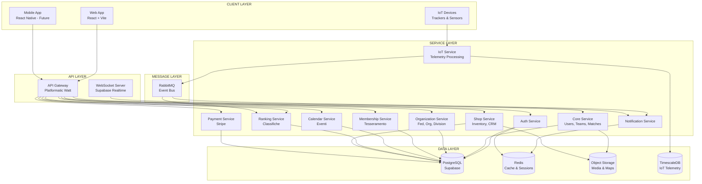

### 2.2 Multi-Organization Hierarchy

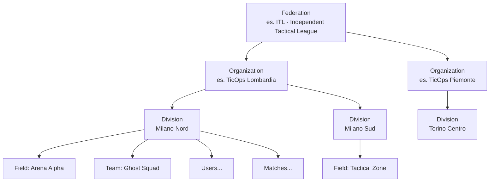

### 2.3 RBAC - Access Levels

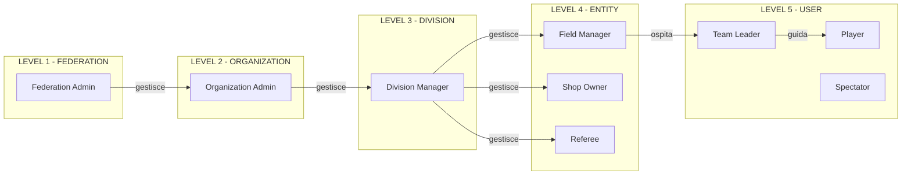

---

## 3. Domini Funzionali

Il sistema è organizzato in **8 domini funzionali** distinti:

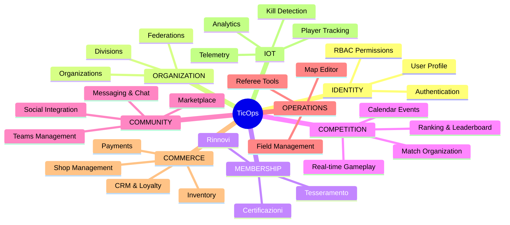

---

## 4. Catalogo Feature Consolidato

### Legenda Stati

| Simbolo | Significato |
|---------|-------------|
| ✅ | Completata |
| 🚧 | In Sviluppo |
| 📋 | Pianificata |
| 💡 | Concept/Future |

---

### DOMINIO: IDENTITY (Identità e Accesso)

| ID | Feature | Descrizione | Stato | Priorità |
|----|---------|-------------|-------|----------|
| ID-01 | **Authentication** | Login/Logout, JWT tokens, session management | ✅ | P0 |
| ID-02 | **User Registration** | Signup con email verification | ✅ | P0 |
| ID-03 | **User Profile** | Gestione profilo, avatar, bio, social links | ✅ | P0 |
| ID-04 | **RBAC System** | 5 livelli di accesso con permission matrix | ✅ | P0 |
| ID-05 | **Password Recovery** | Reset password via email | 📋 | P1 |
| ID-06 | **OAuth Social Login** | Google, Facebook, Discord | 💡 | P3 |
| ID-07 | **2FA Authentication** | Two-factor via TOTP | 💡 | P3 |

---

### DOMINIO: ORGANIZATION (Gerarchia Organizzativa)

| ID | Feature | Descrizione | Stato | Priorità |
|----|---------|-------------|-------|----------|
| ORG-01 | **Federation Management** | CRUD federazioni nazionali | 🚧 | P0 |
| ORG-02 | **Organization Management** | CRUD organizzazioni regionali/franchising | 🚧 | P0 |
| ORG-03 | **Division Management** | CRUD divisioni locali | 🚧 | P0 |
| ORG-04 | **Division Switcher** | Switch tra divisioni per admin multi-division | 📋 | P1 |
| ORG-05 | **RLS Filters** | Row Level Security per visibilità dati | 📋 | P0 |
| ORG-06 | **Org Settings** | Configurazioni per organizzazione | 📋 | P2 |
| ORG-07 | **Hierarchy Reports** | Report aggregati per livello gerarchico | 💡 | P3 |

---

### DOMINIO: MEMBERSHIP (Tesseramento)

| ID | Feature | Descrizione | Stato | Priorità |
|----|---------|-------------|-------|----------|
| MEM-01 | **Player Registration** | Iscrizione giocatore a federazione | 📋 | P1 |
| MEM-02 | **Membership Card** | Generazione tessera digitale con QR | 📋 | P1 |
| MEM-03 | **Membership Renewal** | Rinnovo annuale con reminder | 📋 | P1 |
| MEM-04 | **Membership Verification** | Verifica validità tessera via QR scan | 📋 | P1 |
| MEM-05 | **Membership History** | Storico tesseramenti per utente | 📋 | P2 |
| MEM-06 | **Referee Certification** | Livelli certificazione arbitri (L1/L2/L3) | 📋 | P2 |
| MEM-07 | **Certification Exams** | Test online per upgrade certificazione | 💡 | P3 |
| MEM-08 | **Bulk Import** | Import massivo tesserati da CSV/Excel | 💡 | P3 |

---

### DOMINIO: COMPETITION (Competizioni)

| ID | Feature | Descrizione | Stato | Priorità |
|----|---------|-------------|-------|----------|
| CMP-01 | **Match Creation** | Creazione partita con parametri | ✅ | P0 |
| CMP-02 | **Match Join/Leave** | Iscrizione/disiscrizione partite | ✅ | P0 |
| CMP-03 | **Match Lifecycle** | Stati: scheduled → in_progress → completed | ✅ | P0 |
| CMP-04 | **Team Assignment** | Assegnazione giocatori a team Alpha/Bravo | ✅ | P0 |
| CMP-05 | **Live Gameplay View** | Vista giocatore durante partita | ✅ | P0 |
| CMP-06 | **Spectator View** | Vista spettatore con tracking live | ✅ | P0 |
| CMP-07 | **Referee View** | Dashboard arbitro per controllo match | ✅ | P0 |
| CMP-08 | **Kill Confirmation** | Sistema conferma eliminazioni | ✅ | P1 |
| CMP-09 | **Score Tracking** | Punteggio real-time per team | ✅ | P0 |
| CMP-10 | **Match History** | Storico partite per utente/team | ✅ | P1 |
| CMP-11 | **Player Leaderboard** | Classifica giocatori (divisione) | ✅ | P1 |
| CMP-12 | **Federation Ranking** | Classifica ufficiale federazione | 📋 | P2 |
| CMP-13 | **Seasonal Rankings** | Classifiche per stagione competitiva | 📋 | P2 |
| CMP-14 | **Tournament Mode** | Organizzazione tornei multi-match | 📋 | P2 |
| CMP-15 | **Bracket System** | Tabelloni eliminazione diretta | 💡 | P3 |

---

### DOMINIO: CALENDAR (Calendario Eventi)

| ID | Feature | Descrizione | Stato | Priorità |
|----|---------|-------------|-------|----------|
| CAL-01 | **Event Creation** | Creazione eventi (partite, tornei, raduni) | 📋 | P1 |
| CAL-02 | **Event Calendar View** | Vista calendario con filtri | 📋 | P1 |
| CAL-03 | **Event Registration** | Iscrizione online a eventi | 📋 | P1 |
| CAL-04 | **Federation Events** | Eventi a livello federazione (nazionali) | 📋 | P2 |
| CAL-05 | **Org Events** | Eventi a livello organizzazione | 📋 | P2 |
| CAL-06 | **Division Events** | Eventi locali per divisione | 📋 | P2 |
| CAL-07 | **Event Reminders** | Notifiche reminder pre-evento | 📋 | P2 |
| CAL-08 | **iCal Export** | Export calendario per Google/Apple Calendar | 💡 | P3 |
| CAL-09 | **Recurring Events** | Eventi ricorrenti (es. partita settimanale) | 💡 | P3 |

---

### DOMINIO: COMMUNITY (Comunità)

| ID | Feature | Descrizione | Stato | Priorità |
|----|---------|-------------|-------|----------|
| COM-01 | **Team Creation** | Creazione e gestione team | ✅ | P0 |
| COM-02 | **Team Roster** | Gestione membri team | ✅ | P0 |
| COM-03 | **Team Invite** | Invito membri via link/email | ✅ | P1 |
| COM-04 | **Team Stats** | Statistiche aggregate team | ✅ | P1 |
| COM-05 | **Direct Messaging** | Chat privata 1:1 | ✅ | P1 |
| COM-06 | **Team Radio** | Chat di gruppo per team | ✅ | P1 |
| COM-07 | **Match Radio** | Chat durante partita (per team) | ✅ | P1 |
| COM-08 | **Marketplace Listings** | Annunci compra/vendi/scambia | ✅ | P1 |
| COM-09 | **Marketplace Chat** | Chat tra venditore e acquirente | ✅ | P1 |
| COM-10 | **Seller Reviews** | Recensioni venditori | ✅ | P2 |
| COM-11 | **Social Links** | Integrazione profili social (FB, IG, Discord) | ✅ | P2 |
| COM-12 | **Achievements** | Sistema badge e achievement | ✅ | P2 |
| COM-13 | **Rewards Points** | Sistema punti fedeltà | 📋 | P2 |
| COM-14 | **User Feed** | Activity feed personalizzato | 💡 | P3 |
| COM-15 | **Forum/Discussions** | Forum comunitario | 💡 | P3 |

---

### DOMINIO: OPERATIONS (Gestione Operativa)

| ID | Feature | Descrizione | Stato | Priorità |
|----|---------|-------------|-------|----------|
| OPS-01 | **Field CRUD** | Gestione campi da gioco | ✅ | P0 |
| OPS-02 | **Field Reviews** | Recensioni e rating campi | ✅ | P1 |
| OPS-03 | **Field Search** | Ricerca avanzata campi | ✅ | P1 |
| OPS-04 | **Field Availability** | Calendario disponibilità campo | ✅ | P1 |
| OPS-05 | **Field Booking** | Prenotazione slot campo | 📋 | P2 |
| OPS-06 | **Map Editor** | Editor mappe tattiche (Field Mapper) | 🚧 | P1 |
| OPS-07 | **Map Storage** | Salvataggio mappe su database | 📋 | P1 |
| OPS-08 | **Map Layers** | Toggle layer su viste gameplay | 📋 | P1 |
| OPS-09 | **Referee Assignment** | Assegnazione arbitri a partite | 📋 | P2 |
| OPS-10 | **Referee Performance** | Tracking performance arbitri | 💡 | P3 |
| OPS-11 | **Admin Dashboard** | Pannello amministrativo unificato | 🚧 | P0 |
| OPS-12 | **Admin Anagrafiche** | CRUD tutte le entità (UI pulita) | 📋 | P1 |
| OPS-13 | **System Notifications** | Alert di sistema | ✅ | P1 |
| OPS-14 | **Audit Log** | Log azioni amministrative | 💡 | P3 |

---

### DOMINIO: COMMERCE (Commerciale)

| ID | Feature | Descrizione | Stato | Priorità |
|----|---------|-------------|-------|----------|
| SHP-01 | **Shop Profile** | Profilo negozio con info e orari | 📋 | P2 |
| SHP-02 | **Product Catalog** | Catalogo prodotti con categorie | 📋 | P2 |
| SHP-03 | **Inventory Management** | Gestione magazzino e stock | 📋 | P2 |
| SHP-04 | **Stock Alerts** | Alert giacenze minime | 📋 | P2 |
| SHP-05 | **Order Management** | Gestione ordini clienti | 📋 | P2 |
| SHP-06 | **Sales Analytics** | Dashboard vendite real-time | 📋 | P2 |
| SHP-07 | **CRM** | Database clienti con storico | 📋 | P2 |
| SHP-08 | **Loyalty Program** | Punti fedeltà e sconti | 📋 | P3 |
| SHP-09 | **Push Promotions** | Notifiche promo a clienti | 📋 | P3 |
| SHP-10 | **E-commerce** | Vendita online con ritiro in store | 💡 | P3 |

---

### DOMINIO: PAYMENT (Pagamenti)

| ID | Feature | Descrizione | Stato | Priorità |
|----|---------|-------------|-------|----------|
| PAY-01 | **Payment Gateway** | Integrazione Stripe | 📋 | P1 |
| PAY-02 | **Membership Payment** | Pagamento tesseramento online | 📋 | P1 |
| PAY-03 | **Event Payment** | Pagamento iscrizione eventi | 📋 | P2 |
| PAY-04 | **Subscription Plans** | Abbonamenti per federazioni/org | 📋 | P2 |
| PAY-05 | **Invoice Generation** | Generazione fatture | 📋 | P2 |
| PAY-06 | **Refund Management** | Gestione rimborsi | 📋 | P3 |
| PAY-07 | **IoT Pre-order** | Pre-ordine hardware IoT | 📋 | P3 |

---

### DOMINIO: IOT (Internet of Things)

| ID | Feature | Descrizione | Stato | Priorità |
|----|---------|-------------|-------|----------|
| IOT-01 | **Player Tracker** | Device indossabile GPS + IMU | 💡 | P3 |
| IOT-02 | **Position Tracking** | Tracking posizione real-time | 💡 | P3 |
| IOT-03 | **Kill Detection** | Rilevamento automatico eliminazioni | 💡 | P3 |
| IOT-04 | **Smart Targets** | Obiettivi IoT per CTF/Domination | 💡 | P3 |
| IOT-05 | **Beacon Network** | Rete beacon per indoor positioning | 💡 | P3 |
| IOT-06 | **Telemetry Processing** | Elaborazione dati sensori | 💡 | P3 |
| IOT-07 | **IoT Gateway** | Edge device per aggregazione dati | 💡 | P3 |
| IOT-08 | **IoT Analytics** | Dashboard analytics telemetria | 💡 | P3 |
| IOT-09 | **Barcode Scanner** | Integrazione scanner per inventory | 💡 | P3 |
| IOT-10 | **Smart POS** | Tablet POS per shop | 💡 | P3 |

---

### DOMINIO: PLATFORM (Infrastruttura)

| ID | Feature | Descrizione | Stato | Priorità |
|----|---------|-------------|-------|----------|
| PLT-01 | **API Gateway** | Platformatic Watt orchestrator | ✅ | P0 |
| PLT-02 | **Database** | PostgreSQL via Supabase | ✅ | P0 |
| PLT-03 | **Real-time** | WebSocket via Supabase Realtime | ✅ | P0 |
| PLT-04 | **Message Broker** | RabbitMQ per eventi async | ✅ | P0 |
| PLT-05 | **Object Storage** | Storage per media e mappe | 📋 | P1 |
| PLT-06 | **Redis Cache** | Caching e session storage | 📋 | P1 |
| PLT-07 | **CI/CD Pipeline** | GitHub Actions automation | 📋 | P1 |
| PLT-08 | **Docker Compose** | Environment containerizzato | 📋 | P1 |
| PLT-09 | **Kubernetes** | Orchestrazione produzione | 💡 | P3 |
| PLT-10 | **Observability** | Prometheus + Grafana + Loki | 📋 | P2 |
| PLT-11 | **Error Tracking** | Sentry integration | 📋 | P2 |
| PLT-12 | **Feature Flags** | Toggle feature per rollout | 💡 | P3 |

---

## 5. Dipendenze e Sequenza Implementativa

### 5.1 Dependency Graph

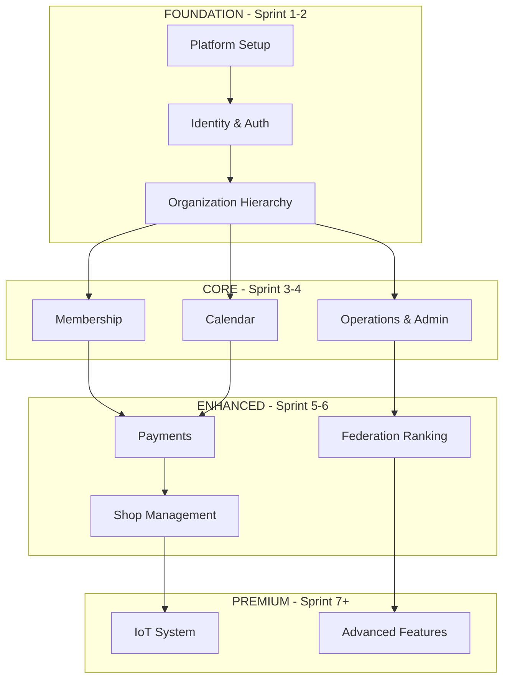

### 5.2 Feature Dependencies Detail

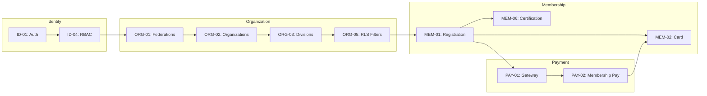

---

## 6. Roadmap per Sprint

### Overview Timeline

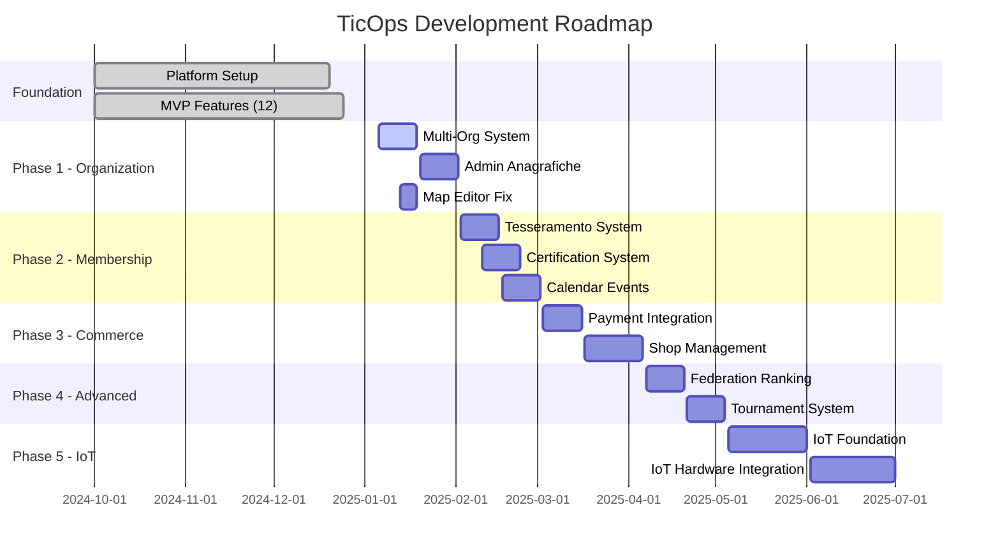

---

### Sprint 1-2: Multi-Organization System (Gennaio 2025)

**Obiettivo**: Implementare la gerarchia organizzativa completa

| Task ID | Feature | Effort | Dipendenze |
|---------|---------|--------|------------|
| ORG-01.1 | Mock data Fed/Org/Division | 4h | - |
| ORG-01.2 | OrgContext provider | 4h | ORG-01.1 |
| ORG-01.3 | useOrgContext hook | 2h | ORG-01.2 |
| ORG-05.1 | RLS filter helpers | 4h | ORG-01.3 |
| ORG-05.2 | Apply RLS to all services | 8h | ORG-05.1 |
| ORG-01.4 | Admin Federations page | 8h | ORG-05.2 |
| ORG-02.1 | Admin Organizations page | 8h | ORG-01.4 |
| ORG-03.1 | Admin Divisions page | 8h | ORG-02.1 |
| ORG-04.1 | Division Switcher component | 4h | ORG-03.1 |
| OPS-06.1 | Fix Field Mapper build | 4h | - |

**Totale**: ~54h

---

### Sprint 3-4: Admin & Operations (Gennaio-Febbraio 2025)

**Obiettivo**: Pannello admin completo con UI pulita

| Task ID | Feature | Effort | Dipendenze |
|---------|---------|--------|------------|
| OPS-11.1 | AdminLayout (clean theme) | 4h | - |
| OPS-12.1 | Generic DataTable component | 8h | OPS-11.1 |
| OPS-12.2 | Generic EntityForm modal | 6h | OPS-12.1 |
| OPS-12.3 | Admin Users page | 6h | OPS-12.2 |
| OPS-12.4 | Admin Teams page | 6h | OPS-12.2 |
| OPS-12.5 | Admin Fields page | 6h | OPS-12.2 |
| OPS-12.6 | Admin Matches page | 6h | OPS-12.2 |
| OPS-12.7 | Admin Referees page | 6h | OPS-12.2 |
| OPS-12.8 | Admin Shops page | 6h | OPS-12.2 |
| OPS-07.1 | Map Storage backend | 8h | OPS-06.1 |
| OPS-08.1 | Map Layers in views | 6h | OPS-07.1 |

**Totale**: ~68h

---

### Sprint 5-6: Membership & Calendar (Febbraio 2025)

**Obiettivo**: Sistema tesseramento e calendario eventi

| Task ID | Feature | Effort | Dipendenze |
|---------|---------|--------|------------|
| MEM-01.1 | Membership data model | 4h | ORG-05.2 |
| MEM-01.2 | Registration form | 6h | MEM-01.1 |
| MEM-01.3 | Membership approval flow | 6h | MEM-01.2 |
| MEM-02.1 | Digital card generation | 8h | MEM-01.3 |
| MEM-02.2 | QR code generation | 4h | MEM-02.1 |
| MEM-04.1 | QR verification scanner | 6h | MEM-02.2 |
| MEM-03.1 | Renewal reminder system | 6h | MEM-01.3 |
| MEM-06.1 | Referee certification model | 4h | MEM-01.1 |
| MEM-06.2 | Certification management UI | 6h | MEM-06.1 |
| CAL-01.1 | Event data model | 4h | ORG-05.2 |
| CAL-01.2 | Event creation form | 6h | CAL-01.1 |
| CAL-02.1 | Calendar view component | 8h | CAL-01.2 |
| CAL-03.1 | Event registration flow | 6h | CAL-02.1 |
| CAL-07.1 | Event reminders | 4h | CAL-03.1 |

**Totale**: ~78h

---

### Sprint 7-8: Payments (Marzo 2025)

**Obiettivo**: Integrazione pagamenti online

| Task ID | Feature | Effort | Dipendenze |
|---------|---------|--------|------------|
| PAY-01.1 | Stripe account setup | 2h | - |
| PAY-01.2 | Payment service backend | 12h | PAY-01.1 |
| PAY-01.3 | Checkout UI component | 8h | PAY-01.2 |
| PAY-02.1 | Membership payment flow | 8h | PAY-01.3, MEM-01.3 |
| PAY-03.1 | Event payment flow | 8h | PAY-01.3, CAL-03.1 |
| PAY-04.1 | Subscription plans model | 6h | PAY-01.2 |
| PAY-04.2 | Subscription management UI | 8h | PAY-04.1 |
| PAY-05.1 | Invoice generation service | 8h | PAY-02.1 |
| PAY-05.2 | Invoice PDF export | 4h | PAY-05.1 |

**Totale**: ~64h

---

### Sprint 9-10: Shop Management (Marzo-Aprile 2025)

**Obiettivo**: Suite gestionale per negozi

| Task ID | Feature | Effort | Dipendenze |
|---------|---------|--------|------------|
| SHP-01.1 | Shop profile model | 4h | ORG-05.2 |
| SHP-01.2 | Shop profile UI | 6h | SHP-01.1 |
| SHP-02.1 | Product catalog model | 6h | SHP-01.1 |
| SHP-02.2 | Product catalog UI | 8h | SHP-02.1 |
| SHP-03.1 | Inventory model | 6h | SHP-02.1 |
| SHP-03.2 | Inventory management UI | 8h | SHP-03.1 |
| SHP-04.1 | Stock alerts system | 4h | SHP-03.1 |
| SHP-06.1 | Sales analytics backend | 8h | SHP-03.1 |
| SHP-06.2 | Sales dashboard UI | 8h | SHP-06.1 |
| SHP-07.1 | CRM customer model | 4h | SHP-01.1 |
| SHP-07.2 | CRM UI | 6h | SHP-07.1 |
| SHP-08.1 | Loyalty points model | 4h | SHP-07.1 |
| SHP-08.2 | Loyalty program UI | 6h | SHP-08.1 |

**Totale**: ~78h

---

### Sprint 11-12: Federation Ranking & Tournaments (Aprile-Maggio 2025)

**Obiettivo**: Sistema classifiche ufficiali e tornei

| Task ID | Feature | Effort | Dipendenze |
|---------|---------|--------|------------|
| CMP-12.1 | Federation ranking model | 6h | ORG-05.2 |
| CMP-12.2 | Ranking calculation service | 8h | CMP-12.1 |
| CMP-12.3 | Federation leaderboard UI | 6h | CMP-12.2 |
| CMP-13.1 | Season model | 4h | CMP-12.1 |
| CMP-13.2 | Season management UI | 6h | CMP-13.1 |
| CMP-14.1 | Tournament model | 6h | CMP-13.1 |
| CMP-14.2 | Tournament creation wizard | 8h | CMP-14.1 |
| CMP-14.3 | Tournament management UI | 8h | CMP-14.2 |
| CMP-15.1 | Bracket generator | 8h | CMP-14.1 |
| CMP-15.2 | Bracket visualization | 8h | CMP-15.1 |

**Totale**: ~68h

---

### Sprint 13+: IoT System (Giugno+ 2025)

**Obiettivo**: Hardware tracking e telemetria

| Task ID | Feature | Effort | Dipendenze |
|---------|---------|--------|------------|
| IOT-06.1 | TimescaleDB setup | 8h | PLT-02 |
| IOT-06.2 | Telemetry ingestion service | 16h | IOT-06.1 |
| IOT-07.1 | MQTT broker setup | 8h | PLT-04 |
| IOT-07.2 | Edge gateway protocol | 16h | IOT-07.1 |
| IOT-02.1 | Position tracking integration | 16h | IOT-06.2 |
| IOT-03.1 | Kill detection algorithm | 24h | IOT-02.1 |
| IOT-08.1 | IoT analytics dashboard | 16h | IOT-06.2 |
| IOT-01.1 | Tracker hardware specs | 8h | - |
| IOT-04.1 | Smart target integration | 16h | IOT-07.2 |

**Totale**: ~128h (fase lunga, hardware dependency)

---

## 7. Flussi Funzionali Dettagliati

### 7.1 Flusso Tesseramento

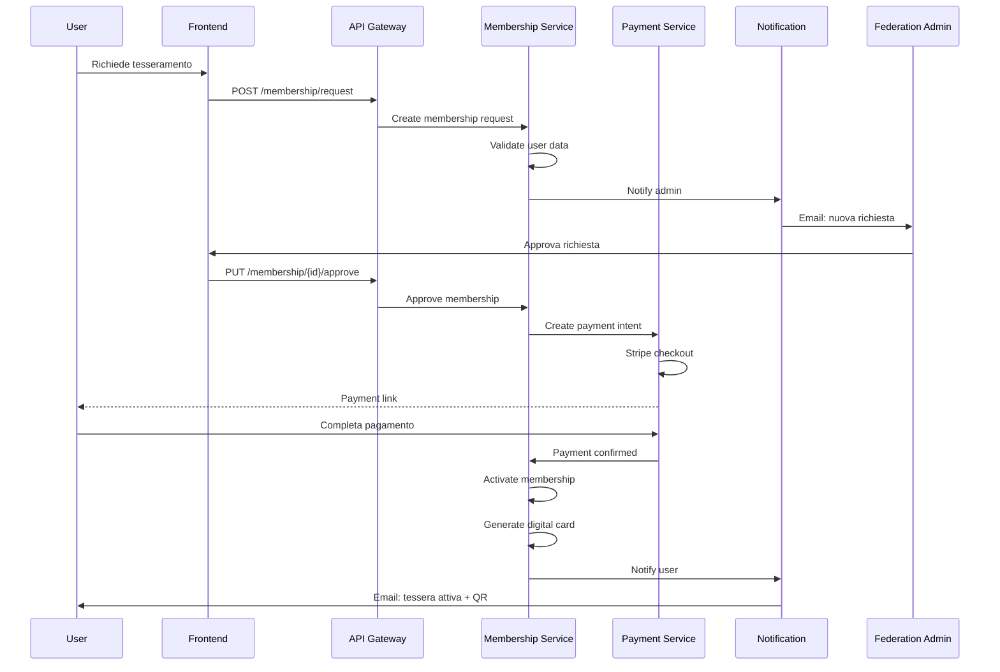

### 7.2 Flusso Evento con Pagamento

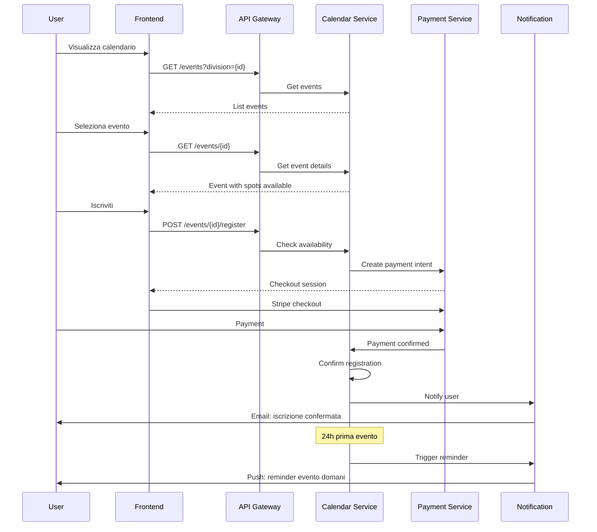

### 7.3 Flusso Match Live con IoT

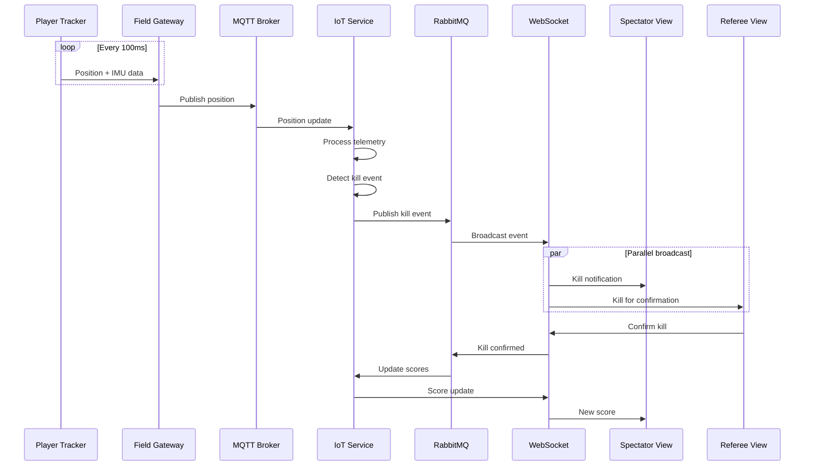

### 7.4 Flusso Shop Inventory

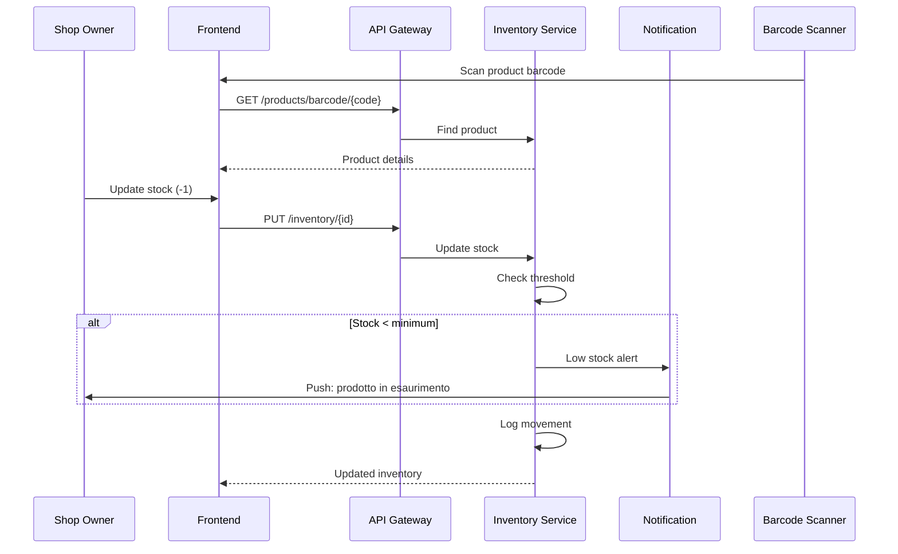

### 7.5 Flusso Admin Multi-Org

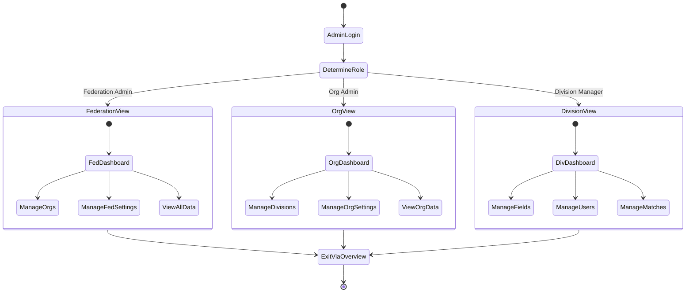

---

## 8. Stack Tecnico

### 8.1 Frontend

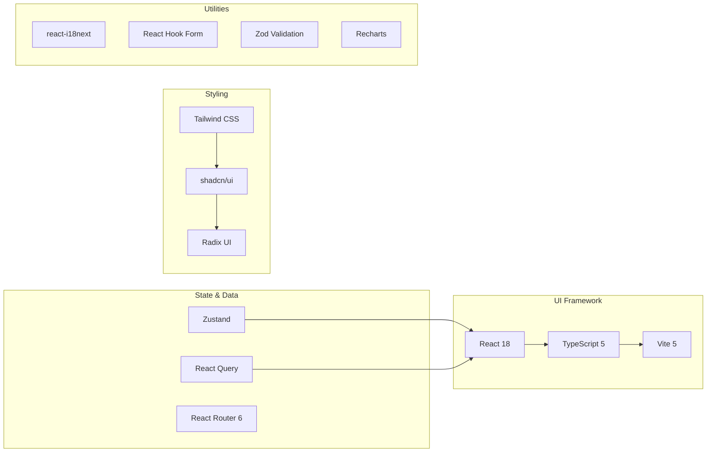

### 8.2 Backend

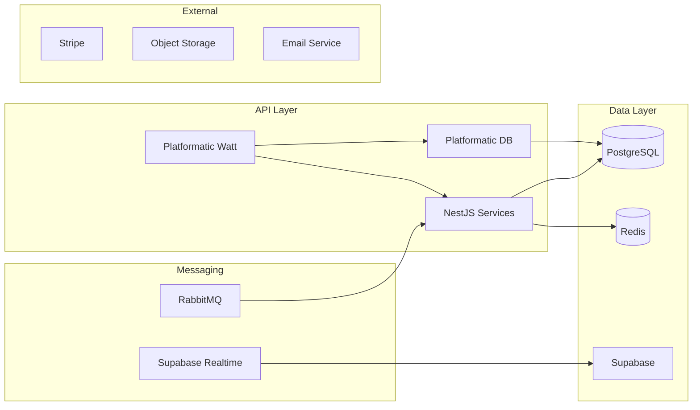

### 8.3 DevOps

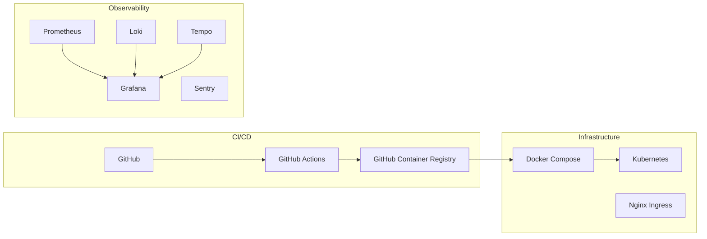

---

## Appendice: Metriche e KPI

### Development Metrics

| Metrica | Target | Note |
|---------|--------|------|
| Sprint Velocity | 60-80h/sprint | Per 1-2 dev |
| Lead Time | < 3 giorni | Feature → Produzione |
| Test Coverage | > 70% | Unit + Integration |
| Build Time | < 5 min | CI pipeline |

### Product Metrics

| Metrica | Target | Note |
|---------|--------|------|
| Uptime | 99.9% | SLA |
| P95 Latency | < 200ms | API response |
| Error Rate | < 0.1% | 5xx errors |
| MAU Growth | 20% m/m | Monthly Active Users |

### Business Metrics

| Metrica | Target | Note |
|---------|--------|------|
| Federations Onboarded | 5 | Anno 1 |
| Organizations | 50 | Anno 1 |
| Registered Players | 5000 | Anno 1 |
| IoT Kits Sold | 100 | Anno 2 |

---

**Documento mantenuto da**: TicOps Development Team  
**Ultima revisione**: 26 Dicembre 2024  
**Prossima revisione**: Fine Sprint 2 (Gennaio 2025)
