# TicOps IoT Ecosystem - Technical Design Document

**Versione**: 1.0  
**Data**: 26 Dicembre 2024  
**Stato**: Design Specification  
**Target Release**: Q2-Q3 2026

---

## Executive Summary

Questo documento definisce l'architettura completa dell'ecosistema IoT di TicOps, progettato per operare in ambienti outdoor con connettività limitata o assente. Il sistema utilizza una combinazione di tecnologie LoRa (Long Range) per la comunicazione a lungo raggio, BLE (Bluetooth Low Energy) per il positioning indoor, e un'architettura offline-first che garantisce il funzionamento completo della partita anche senza connessione Internet.

Il cuore del sistema è il **Match Tablet**, un dispositivo dedicato che funge da hub centrale per ogni partita, gestendo tutti i dispositivi sul campo e sincronizzando i dati con il cloud quando la connettività è disponibile.

---

## 1. Panoramica dell'Ecosistema

### 1.1 Dispositivi dell'Ecosistema

```
┌─────────────────────────────────────────────────────────────────────────────────────────┐
│                           TICOPS IOT ECOSYSTEM                                           │
├─────────────────────────────────────────────────────────────────────────────────────────┤
│                                                                                          │
│  ┌─────────────────────────────────────────────────────────────────────────────────┐   │
│  │                         WEARABLE DEVICES (Per Giocatore)                         │   │
│  │                                                                                  │   │
│  │   ┌─────────────┐    ┌─────────────┐    ┌─────────────┐    ┌─────────────┐     │   │
│  │   │   PLAYER    │    │    HIT      │    │   SMART     │    │   CAPTAIN   │     │   │
│  │   │   TRACKER   │    │  DETECTOR   │    │   ARMBAND   │    │   DISPLAY   │     │   │
│  │   │             │    │             │    │             │    │             │     │   │
│  │   │ • GPS/GNSS  │    │ • Vest Sen- │    │ • Team LED  │    │ • e-Paper   │     │   │
│  │   │ • LoRa TX   │    │   sors      │    │ • Vibration │    │ • Squad map │     │   │
│  │   │ • IMU 9-axis│    │ • IR Detect │    │ • BLE       │    │ • Orders TX │     │   │
│  │   │ • Battery   │    │ • Piezo     │    │ • Haptic    │    │ • LoRa      │     │   │
│  │   └─────────────┘    └─────────────┘    └─────────────┘    └─────────────┘     │   │
│  └─────────────────────────────────────────────────────────────────────────────────┘   │
│                                                                                          │
│  ┌─────────────────────────────────────────────────────────────────────────────────┐   │
│  │                         FIELD INFRASTRUCTURE                                      │   │
│  │                                                                                  │   │
│  │   ┌─────────────┐    ┌─────────────┐    ┌─────────────┐    ┌─────────────┐     │   │
│  │   │   MATCH     │    │    LORA     │    │    BLE      │    │   SMART     │     │   │
│  │   │   TABLET    │    │   GATEWAY   │    │   BEACON    │    │   TARGET    │     │   │
│  │   │             │    │             │    │             │    │             │     │   │
│  │   │ • Android   │    │ • Multi-ch  │    │ • Indoor    │    │ • CTF Flag  │     │   │
│  │   │ • Hub ctrl  │    │ • Range 5km │    │ • Position  │    │ • Domination│     │   │
│  │   │ • Offline   │    │ • Backhaul  │    │ • Mesh net  │    │ • Sensors   │     │   │
│  │   │ • 4G failov │    │ • Solar opt │    │ • Battery   │    │ • LED/Sound │     │   │
│  │   └─────────────┘    └─────────────┘    └─────────────┘    └─────────────┘     │   │
│  └─────────────────────────────────────────────────────────────────────────────────┘   │
│                                                                                          │
│  ┌─────────────────────────────────────────────────────────────────────────────────┐   │
│  │                         REFEREE & SPECTATOR                                       │   │
│  │                                                                                  │   │
│  │   ┌─────────────┐    ┌─────────────┐    ┌─────────────┐                         │   │
│  │   │  REFEREE    │    │  SPECTATOR  │    │   FIELD     │                         │   │
│  │   │   DEVICE    │    │   SCREEN    │    │   SPEAKER   │                         │   │
│  │   │             │    │             │    │             │                         │   │
│  │   │ • Rugged    │    │ • Live map  │    │ • Announcer │                         │   │
│  │   │ • Kill conf │    │ • Scores    │    │ • Sirens    │                         │   │
│  │   │ • Whistle   │    │ • Events    │    │ • Countdown │                         │   │
│  │   └─────────────┘    └─────────────┘    └─────────────┘                         │   │
│  └─────────────────────────────────────────────────────────────────────────────────┘   │
│                                                                                          │
└─────────────────────────────────────────────────────────────────────────────────────────┘
```

### 1.2 Gerarchia di Comunicazione

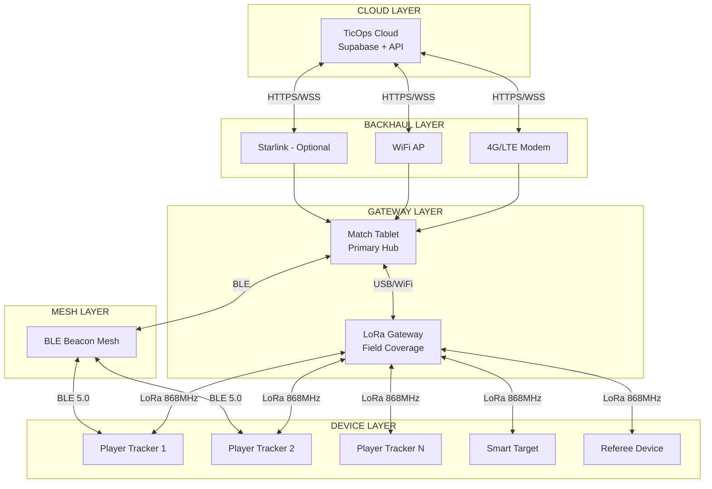

---

## 2. Match Tablet - Hub Centrale di Partita

Il Match Tablet è il dispositivo centrale che gestisce ogni partita. È progettato per funzionare completamente offline, memorizzando tutti i dati localmente e sincronizzandoli con il cloud quando la connettività è disponibile.

### 2.1 Specifiche Hardware

```
┌─────────────────────────────────────────────────────────────────────────────┐
│                         MATCH TABLET SPECIFICATIONS                          │
├─────────────────────────────────────────────────────────────────────────────┤
│                                                                              │
│  FORM FACTOR                           DISPLAY                               │
│  ─────────────                         ───────                               │
│  • 10.1" Rugged Tablet                 • 1920x1200 IPS                       │
│  • IP67 (dust/water)                   • 1000 nits (outdoor visible)         │
│  • MIL-STD-810G (shock)                • Gorilla Glass 5                     │
│  • Operating temp: -20°C to +50°C      • Glove-compatible touch              │
│                                                                              │
│  PROCESSOR                             MEMORY & STORAGE                      │
│  ─────────                             ────────────────                      │
│  • Qualcomm QCM6490                    • 8GB RAM LPDDR5                      │
│  • Octa-core 2.7GHz                    • 128GB eMMC                          │
│  • Adreno 643 GPU                      • microSD slot (up to 1TB)            │
│  • AI Engine for edge inference        • Encrypted storage                   │
│                                                                              │
│  CONNECTIVITY                          POWER                                 │
│  ────────────                          ─────                                 │
│  • WiFi 6E (802.11ax)                  • 10,000 mAh battery                  │
│  • Bluetooth 5.2                       • 12+ hours operation                 │
│  • 4G LTE Cat 12                       • USB-C PD 45W charging               │
│  • USB-C 3.1 (LoRa gateway)            • Hot-swap battery option             │
│  • Optional: Starlink dongle           • Solar charging compatible           │
│                                                                              │
│  SENSORS                               SOFTWARE                              │
│  ───────                               ────────                              │
│  • GPS/GLONASS/Galileo                 • Android 14 (AOSP)                   │
│  • Accelerometer                       • TicOps Match App                    │
│  • Barometer                           • SQLite local DB                     │
│  • Ambient light sensor                • Background sync service             │
│                                                                              │
│  PORTS & EXPANSION                                                           │
│  ─────────────────                                                           │
│  • 2x USB-C 3.1 (data + power)                                               │
│  • 1x USB-A 3.0 (LoRa gateway)                                               │
│  • 3.5mm audio jack                                                          │
│  • Pogo pins for dock station                                                │
│                                                                              │
└─────────────────────────────────────────────────────────────────────────────┘
```

### 2.2 Architettura Software del Tablet

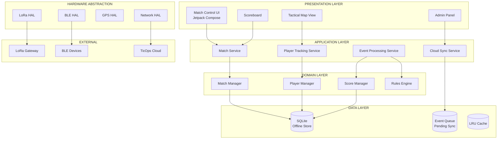

### 2.3 Stati Operativi del Tablet

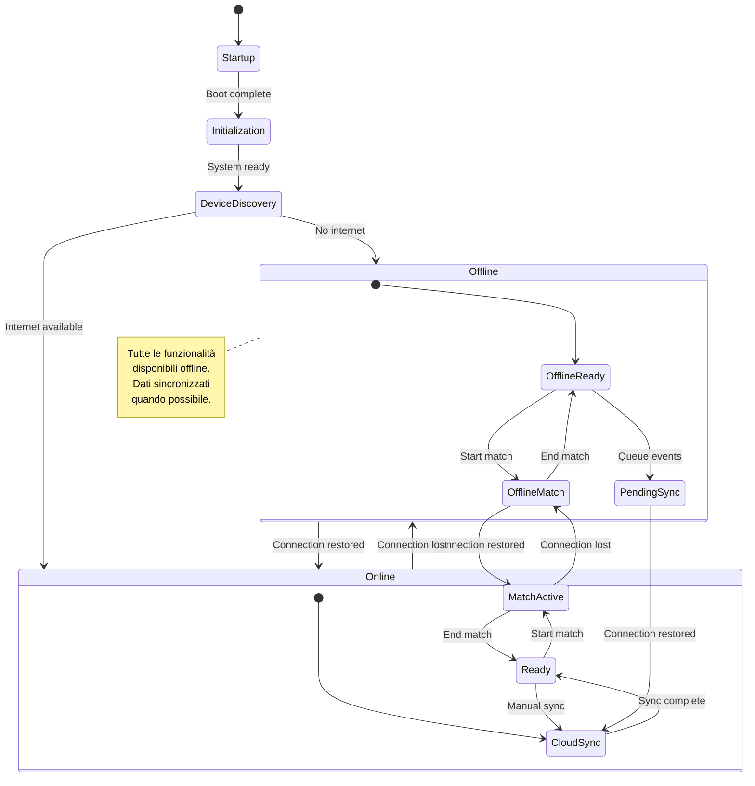

---

## 3. LoRa Communication System

LoRa (Long Range) è scelto come tecnologia primaria di comunicazione per la sua capacità di coprire grandi distanze (fino a 5km in campo aperto) con basso consumo energetico, ideale per campi outdoor senza infrastruttura.

### 3.1 Architettura LoRa

```
┌─────────────────────────────────────────────────────────────────────────────┐
│                         LORA NETWORK TOPOLOGY                                │
├─────────────────────────────────────────────────────────────────────────────┤
│                                                                              │
│                           ┌─────────────────┐                                │
│                           │   MATCH TABLET  │                                │
│                           │   (Controller)  │                                │
│                           └────────┬────────┘                                │
│                                    │ USB-C                                   │
│                                    │                                         │
│                           ┌────────▼────────┐                                │
│                           │  LORA GATEWAY   │                                │
│                           │  (Concentrator) │                                │
│                           │                 │                                │
│                           │  • 8 channels   │                                │
│                           │  • SF7-SF12     │                                │
│                           │  • 868 MHz EU   │                                │
│                           └────────┬────────┘                                │
│                                    │                                         │
│              ┌─────────────────────┼─────────────────────┐                  │
│              │                     │                     │                  │
│              │ 868 MHz             │ 868 MHz             │ 868 MHz          │
│              │ SF7 (fast)          │ SF9 (balanced)      │ SF12 (long)      │
│              │                     │                     │                  │
│    ┌─────────▼───────┐   ┌─────────▼───────┐   ┌────────▼────────┐         │
│    │ PLAYER TRACKERS │   │  SMART TARGETS  │   │ REFEREE DEVICE  │         │
│    │ (up to 50)      │   │  (up to 20)     │   │ (up to 5)       │         │
│    │                 │   │                 │   │                 │         │
│    │ • Position TX   │   │ • Capture event │   │ • Kill confirm  │         │
│    │ • Status        │   │ • Status        │   │ • Commands      │         │
│    │ • Battery       │   │ • LED control   │   │ • Override      │         │
│    └─────────────────┘   └─────────────────┘   └─────────────────┘         │
│                                                                              │
│    COVERAGE ZONES (based on Spreading Factor)                               │
│    ───────────────────────────────────────────                              │
│    • SF7:  ~1 km  - High data rate, low range  - Player updates            │
│    • SF9:  ~3 km  - Balanced                   - Targets, events           │
│    • SF12: ~5 km  - Low data rate, max range   - Emergency, referee        │
│                                                                              │
└─────────────────────────────────────────────────────────────────────────────┘
```

### 3.2 LoRa Gateway Specifications

```
┌─────────────────────────────────────────────────────────────────────────────┐
│                         LORA GATEWAY SPECIFICATIONS                          │
├─────────────────────────────────────────────────────────────────────────────┤
│                                                                              │
│  HARDWARE                              RADIO                                 │
│  ────────                              ─────                                 │
│  • Semtech SX1302 concentrator         • Frequency: 863-870 MHz (EU)        │
│  • STM32L4 MCU                         • Channels: 8 simultaneous           │
│  • USB-C interface to tablet           • Spreading Factor: SF7-SF12         │
│  • IP65 enclosure                      • Bandwidth: 125/250/500 kHz         │
│  • -40°C to +85°C operating            • TX Power: up to 27 dBm             │
│                                        • Sensitivity: -141 dBm @SF12        │
│                                                                              │
│  ANTENNA                               POWER                                 │
│  ───────                               ─────                                 │
│  • Omnidirectional 5 dBi               • USB-C powered (5V 2A)              │
│  • Fiberglass, weatherproof            • Optional: PoE adapter              │
│  • SMA connector                       • Optional: Solar + battery          │
│  • Optional: Directional 9 dBi         • Consumption: ~2W active            │
│                                                                              │
│  CAPACITY                                                                    │
│  ────────                                                                    │
│  • Up to 100 end devices                                                     │
│  • 1000+ messages/second                                                     │
│  • Concurrent multi-SF reception                                             │
│  • RSSI and SNR per packet                                                   │
│                                                                              │
│  PHYSICAL                                                                    │
│  ────────                                                                    │
│  • Dimensions: 120 x 80 x 40 mm                                              │
│  • Weight: 250g (without antenna)                                            │
│  • Mounting: Tripod, pole, or wall                                           │
│  • Cable length to tablet: up to 5m                                          │
│                                                                              │
└─────────────────────────────────────────────────────────────────────────────┘
```

### 3.3 LoRa Protocol Stack

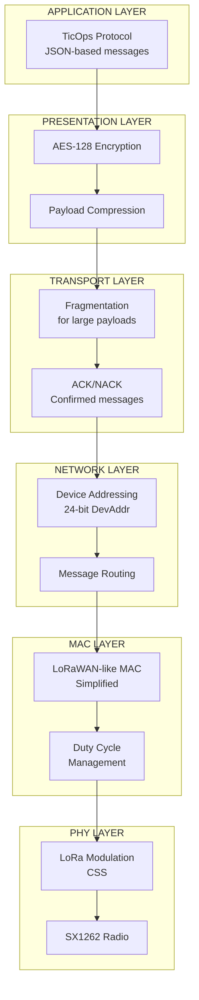

### 3.4 Message Types e Priorità

```
┌─────────────────────────────────────────────────────────────────────────────┐
│                         LORA MESSAGE TYPES                                   │
├─────────────────────────────────────────────────────────────────────────────┤
│                                                                              │
│  PRIORITY 0 - EMERGENCY (SF12, Confirmed)                                    │
│  ─────────────────────────────────────────                                  │
│  • MATCH_STOP          : Ferma partita immediato                            │
│  • MEDICAL_EMERGENCY   : Richiesta intervento medico                        │
│  • DEVICE_LOST         : Giocatore fuori area sicura                        │
│                                                                              │
│  PRIORITY 1 - CRITICAL (SF9, Confirmed)                                      │
│  ────────────────────────────────────────                                   │
│  • KILL_EVENT          : Eliminazione giocatore                             │
│  • OBJECTIVE_CAPTURE   : Cattura bandiera/zona                              │
│  • MATCH_START/END     : Controllo partita                                  │
│  • REFEREE_COMMAND     : Comandi arbitro                                    │
│                                                                              │
│  PRIORITY 2 - NORMAL (SF7, Unconfirmed)                                      │
│  ───────────────────────────────────────                                    │
│  • POSITION_UPDATE     : Posizione giocatore (ogni 2-5 sec)                 │
│  • HEARTBEAT           : Status dispositivo (ogni 30 sec)                   │
│  • BATTERY_STATUS      : Livello batteria                                   │
│                                                                              │
│  PRIORITY 3 - LOW (SF7, Unconfirmed, Batched)                               │
│  ─────────────────────────────────────────────                              │
│  • TELEMETRY_BULK      : Dati sensori aggregati                             │
│  • STATS_UPDATE        : Statistiche periodiche                             │
│                                                                              │
│  MESSAGE STRUCTURE                                                           │
│  ─────────────────                                                          │
│  ┌──────┬──────┬────────┬─────────┬──────────┬───────┐                     │
│  │ SYNC │ HDR  │ DevAddr│ MsgType │ Payload  │  MIC  │                     │
│  │ 2B   │ 1B   │ 3B     │ 1B      │ 0-200B   │  4B   │                     │
│  └──────┴──────┴────────┴─────────┴──────────┴───────┘                     │
│                                                                              │
└─────────────────────────────────────────────────────────────────────────────┘
```

---

## 4. Player Tracker Device

Il Player Tracker è il dispositivo indossabile da ogni giocatore, responsabile del tracking posizione e della rilevazione eventi di gioco.

### 4.1 Specifiche Hardware

```
┌─────────────────────────────────────────────────────────────────────────────┐
│                         PLAYER TRACKER SPECIFICATIONS                        │
├─────────────────────────────────────────────────────────────────────────────┤
│                                                                              │
│  ┌─────────────────────────────────────────────────────────────────────┐   │
│  │                                                                      │   │
│  │                    ┌─────────────────────┐                          │   │
│  │                    │    PLAYER TRACKER   │                          │   │
│  │                    │                     │                          │   │
│  │                    │   ┌─────────────┐   │                          │   │
│  │                    │   │   STATUS    │   │                          │   │
│  │                    │   │   LED RGB   │   │                          │   │
│  │                    │   └─────────────┘   │                          │   │
│  │                    │                     │                          │   │
│  │                    │   ┌─────────────┐   │                          │   │
│  │                    │   │   BUTTON    │   │                          │   │
│  │                    │   │  (confirm)  │   │                          │   │
│  │                    │   └─────────────┘   │                          │   │
│  │                    │                     │                          │   │
│  │                    │   56 x 42 x 18 mm   │                          │   │
│  │                    │       ~45g          │                          │   │
│  │                    └─────────────────────┘                          │   │
│  │                                                                      │   │
│  │  MOUNTING OPTIONS:                                                  │   │
│  │  • Chest harness (primary)                                          │   │
│  │  • Belt clip                                                        │   │
│  │  • Armband                                                          │   │
│  │  • Helmet mount                                                     │   │
│  │                                                                      │   │
│  └─────────────────────────────────────────────────────────────────────┘   │
│                                                                              │
│  ELECTRONICS                                                                 │
│  ───────────                                                                │
│  • MCU: Nordic nRF52840 (ARM Cortex-M4F, 64MHz)                             │
│  • LoRa: Semtech SX1262 (868 MHz EU)                                        │
│  • GNSS: u-blox MAX-M10S (GPS, GLONASS, Galileo, BeiDou)                   │
│  • IMU: Bosch BMI270 (6-axis accel + gyro)                                 │
│  • Magnetometer: Bosch BMM150 (3-axis)                                      │
│  • Barometer: Bosch BMP390 (altitude)                                       │
│                                                                              │
│  CONNECTIVITY                                                                │
│  ────────────                                                               │
│  • LoRa: 868 MHz, SF7-SF12, up to 5km range                                │
│  • BLE 5.0: For indoor positioning, config, firmware update                │
│  • NFC: For player ID pairing                                               │
│                                                                              │
│  POWER                                                                       │
│  ─────                                                                      │
│  • Battery: 1200 mAh LiPo                                                   │
│  • Runtime: 12+ hours (2 sec GPS interval)                                  │
│  • Charging: USB-C, 1 hour full charge                                      │
│  • Low power mode: 48+ hours (heartbeat only)                               │
│                                                                              │
│  SENSORS & OUTPUT                                                            │
│  ───────────────                                                            │
│  • LED RGB: Status, team color, hit feedback                                │
│  • Vibration motor: Haptic feedback                                         │
│  • Buzzer: Audio alerts                                                     │
│  • Button: Hit confirmation, SOS                                            │
│                                                                              │
│  ENVIRONMENTAL                                                               │
│  ─────────────                                                              │
│  • IP67 rated (waterproof 1m/30min)                                         │
│  • Operating temp: -10°C to +45°C                                           │
│  • Shock resistant: 2m drop                                                 │
│                                                                              │
└─────────────────────────────────────────────────────────────────────────────┘
```

### 4.2 Firmware State Machine

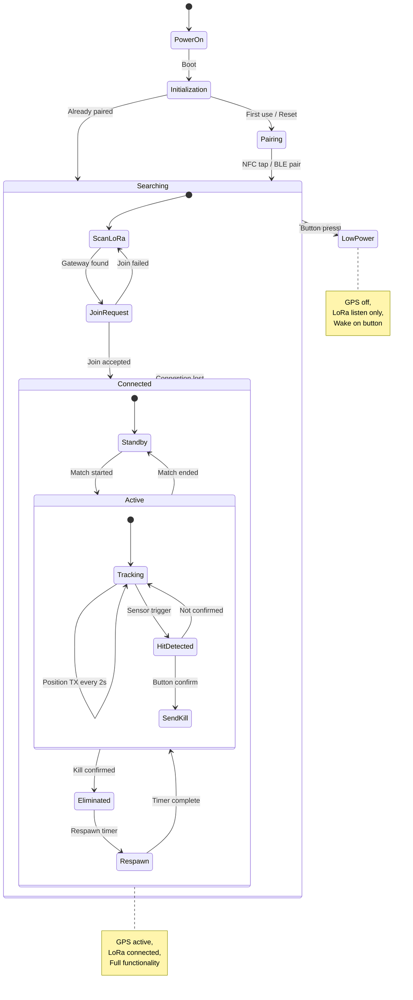

### 4.3 Data Flow - Position Update

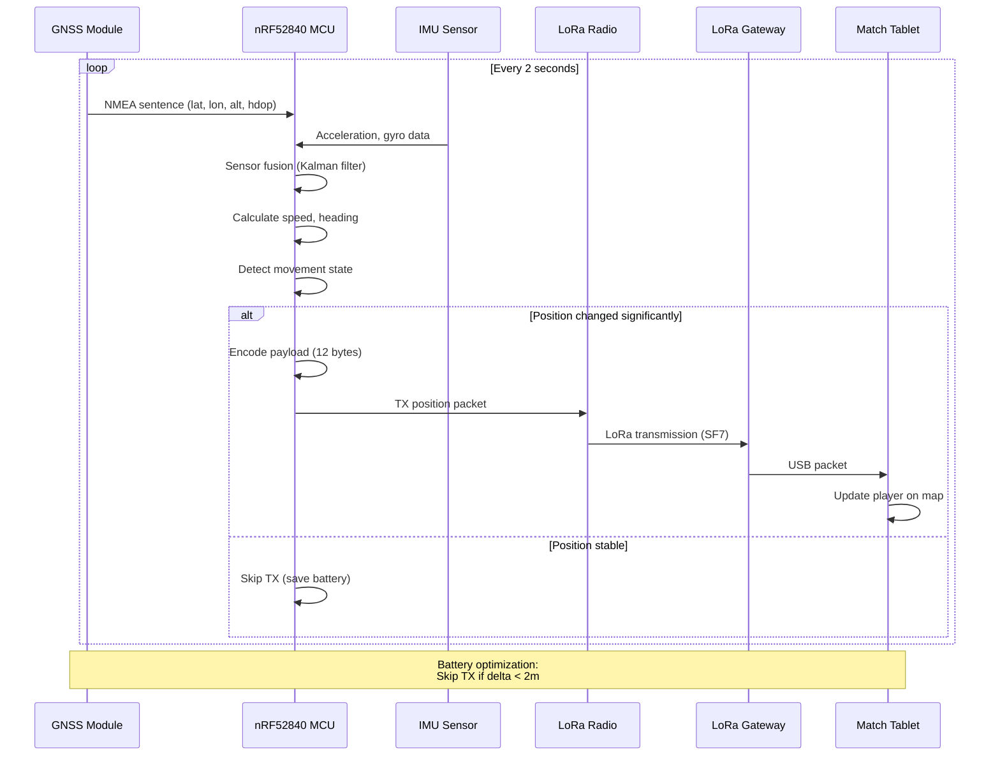

---

## 5. Smart Target System

Gli Smart Target sono obiettivi IoT per modalità di gioco come Capture The Flag (CTF) e Domination.

### 5.1 Target Types

```
┌─────────────────────────────────────────────────────────────────────────────┐
│                         SMART TARGET TYPES                                   │
├─────────────────────────────────────────────────────────────────────────────┤
│                                                                              │
│  ┌─────────────────────┐   ┌─────────────────────┐   ┌─────────────────────┐│
│  │    CTF FLAG POST    │   │  DOMINATION ZONE    │   │   BOMB OBJECTIVE    ││
│  │                     │   │                     │   │                     ││
│  │  ┌───────────────┐  │   │  ┌───────────────┐  │   │  ┌───────────────┐  ││
│  │  │      ▲        │  │   │  │  ┌─────────┐  │  │   │  │   ╔═════╗     │  ││
│  │  │     /█\       │  │   │  │  │  ZONE   │  │  │   │  │   ║BOMB ║     │  ││
│  │  │    / █ \      │  │   │  │  │ CONTROL │  │  │   │  │   ║ 💣  ║     │  ││
│  │  │   /__█__\     │  │   │  │  │  PANEL  │  │  │   │  │   ╚═════╝     │  ││
│  │  │      │        │  │   │  │  └─────────┘  │  │   │  │   [DEFUSE]    │  ││
│  │  │      │        │  │   │  │               │  │   │  │               │  ││
│  │  └───────────────┘  │   │  └───────────────┘  │   │  └───────────────┘  ││
│  │                     │   │                     │   │                     ││
│  │  • NFC flag pickup  │   │  • Pressure sensor  │   │  • Keypad input    ││
│  │  • Team LED color   │   │  • Proximity detect │   │  • Timer display   ││
│  │  • Capture sound    │   │  • Progress LEDs    │   │  • Defuse sequence ││
│  │  • LoRa status TX   │   │  • Zone state TX    │   │  • Explosion FX    ││
│  │                     │   │                     │   │                     ││
│  └─────────────────────┘   └─────────────────────┘   └─────────────────────┘│
│                                                                              │
│  COMMON HARDWARE                                                             │
│  ───────────────                                                            │
│  • MCU: ESP32-S3 (dual-core 240MHz)                                         │
│  • LoRa: SX1262 module                                                      │
│  • Power: 18650 cells (swappable) or 12V DC                                 │
│  • LED: WS2812B strip (addressable RGB)                                     │
│  • Speaker: 3W weatherproof                                                 │
│  • Enclosure: IP65, vandal-resistant                                        │
│                                                                              │
└─────────────────────────────────────────────────────────────────────────────┘
```

### 5.2 Domination Zone State Machine

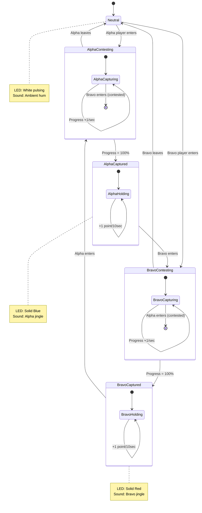

---

## 6. BLE Beacon Mesh Network

I beacon BLE forniscono positioning indoor e aumentano la precisione GPS in aree con copertura satellite limitata.

### 6.1 Beacon Placement Strategy

```
┌─────────────────────────────────────────────────────────────────────────────┐
│                         BLE BEACON MESH TOPOLOGY                             │
├─────────────────────────────────────────────────────────────────────────────┤
│                                                                              │
│                              FIELD MAP (100m x 80m)                          │
│                                                                              │
│    ┌────────────────────────────────────────────────────────────────────┐   │
│    │                                                                    │   │
│    │    [B01]────────────[B02]────────────[B03]────────────[B04]       │   │
│    │      │                 │                 │                │        │   │
│    │      │    ┌───────┐    │    ┌───────┐    │    ┌───────┐   │        │   │
│    │      │    │BUILDING│   │    │BUILDING│   │    │BUILDING│  │        │   │
│    │      │    │  [B05]│    │    │  [B06]│    │    │  [B07]│   │        │   │
│    │      │    └───────┘    │    └───────┘    │    └───────┘   │        │   │
│    │      │                 │                 │                │        │   │
│    │    [B08]────────────[B09]────────────[B10]────────────[B11]       │   │
│    │      │                 │                 │                │        │   │
│    │      │                 │   ┌───────┐     │                │        │   │
│    │      │                 │   │ SPAWN │     │                │        │   │
│    │      │                 │   │ ALPHA │     │                │        │   │
│    │      │                 │   │ [B12] │     │                │        │   │
│    │      │                 │   └───────┘     │                │        │   │
│    │      │                 │                 │                │        │   │
│    │    [B13]────────────[B14]────────────[B15]────────────[B16]       │   │
│    │                                                                    │   │
│    └────────────────────────────────────────────────────────────────────┘   │
│                                                                              │
│    BEACON SPECS                          MESH CONFIGURATION                  │
│    ────────────                          ──────────────────                  │
│    • BLE 5.0 Long Range                  • Triangulation enabled             │
│    • TX Power: -20 to +8 dBm             • Min 3 beacons for position        │
│    • Coverage radius: ~30m               • Update rate: 1 Hz                 │
│    • Battery: CR2477 (2 years)           • Accuracy: < 2m indoor             │
│    • iBeacon + Eddystone                 • Fallback to GPS outdoor           │
│                                                                              │
└─────────────────────────────────────────────────────────────────────────────┘
```

### 6.2 Indoor Positioning Algorithm

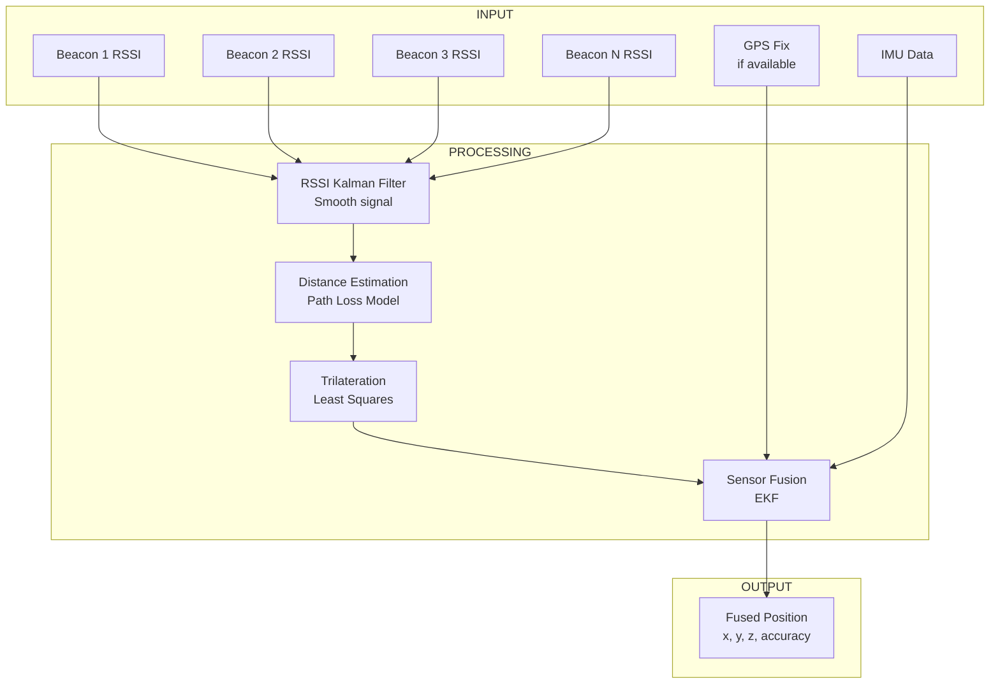

---

## 7. Offline-First Architecture

L'architettura offline-first garantisce che il sistema funzioni completamente senza connessione Internet, sincronizzando i dati quando la connettività diventa disponibile.

### 7.1 Data Sync Strategy

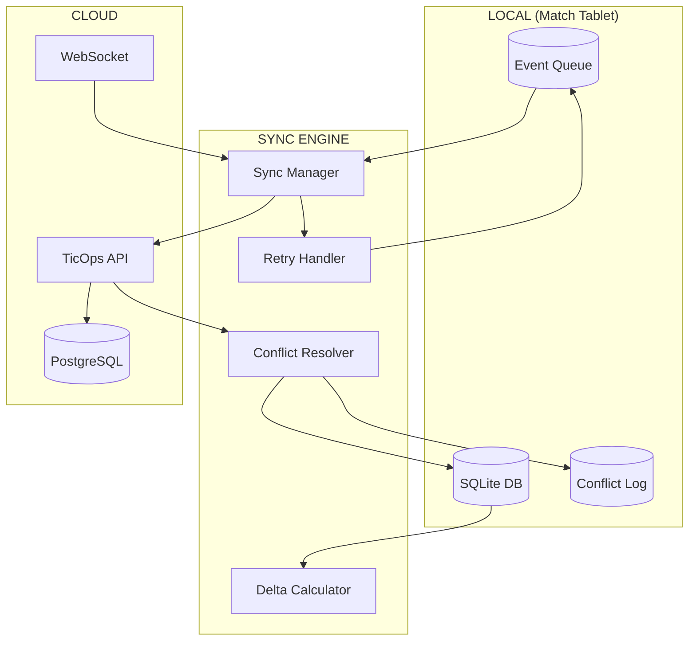

### 7.2 Conflict Resolution Strategy

```
┌─────────────────────────────────────────────────────────────────────────────┐
│                         CONFLICT RESOLUTION RULES                            │
├─────────────────────────────────────────────────────────────────────────────┤
│                                                                              │
│  STRATEGY: "Last Write Wins" with Domain-Specific Overrides                 │
│                                                                              │
│  ┌───────────────────────────────────────────────────────────────────────┐ │
│  │ DATA TYPE              │ RESOLUTION RULE                              │ │
│  ├───────────────────────────────────────────────────────────────────────┤ │
│  │ Match Status           │ Highest authority wins (Referee > System)    │ │
│  │ Player Positions       │ Latest timestamp wins (append-only log)      │ │
│  │ Kill Events            │ Referee confirmation is authoritative        │ │
│  │ Scores                 │ Recalculate from confirmed events            │ │
│  │ Player Status          │ Latest valid state                           │ │
│  │ Device Telemetry       │ Append-only (no conflicts possible)          │ │
│  └───────────────────────────────────────────────────────────────────────┘ │
│                                                                              │
│  SYNC PRIORITY                                                               │
│  ─────────────                                                              │
│  1. CRITICAL  : Match start/stop, emergencies                               │
│  2. HIGH      : Kill events, score changes, referee commands                │
│  3. NORMAL    : Player status changes, objective states                     │
│  4. LOW       : Position history, telemetry bulk                            │
│  5. DEFERRED  : Statistics, analytics data                                  │
│                                                                              │
│  OFFLINE QUEUE LIMITS                                                        │
│  ────────────────────                                                       │
│  • Max queue size: 10,000 events                                            │
│  • Max age: 7 days                                                          │
│  • Priority eviction: LOW items first                                       │
│  • Compressed storage: ~100KB per match                                     │
│                                                                              │
└─────────────────────────────────────────────────────────────────────────────┘
```

### 7.3 Sync Flow Diagram

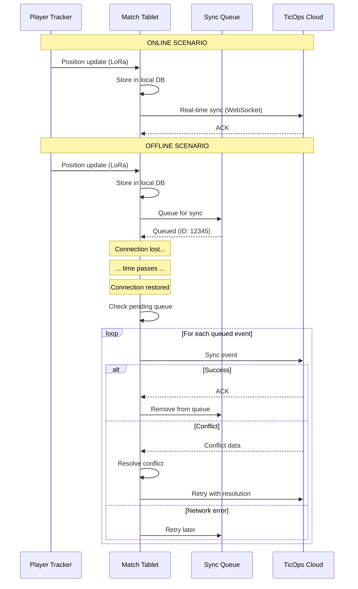

### 7.4 Local Database Schema (SQLite)

```
┌─────────────────────────────────────────────────────────────────────────────┐
│                         LOCAL DATABASE SCHEMA                                │
├─────────────────────────────────────────────────────────────────────────────┤
│                                                                              │
│  ┌─────────────────────────────────────────────────────────────────────┐   │
│  │                           matches                                    │   │
│  ├─────────────────────────────────────────────────────────────────────┤   │
│  │ id              TEXT PRIMARY KEY                                     │   │
│  │ cloud_id        TEXT NULLABLE (null until synced)                   │   │
│  │ status          TEXT (scheduled/active/paused/completed)            │   │
│  │ field_id        TEXT                                                 │   │
│  │ game_mode       TEXT                                                 │   │
│  │ started_at      DATETIME                                             │   │
│  │ ended_at        DATETIME NULLABLE                                    │   │
│  │ score_alpha     INTEGER DEFAULT 0                                    │   │
│  │ score_bravo     INTEGER DEFAULT 0                                    │   │
│  │ settings        TEXT (JSON)                                          │   │
│  │ sync_status     TEXT (pending/synced/conflict)                      │   │
│  │ updated_at      DATETIME                                             │   │
│  └─────────────────────────────────────────────────────────────────────┘   │
│                                                                              │
│  ┌─────────────────────────────────────────────────────────────────────┐   │
│  │                          match_players                               │   │
│  ├─────────────────────────────────────────────────────────────────────┤   │
│  │ id              TEXT PRIMARY KEY                                     │   │
│  │ match_id        TEXT REFERENCES matches(id)                         │   │
│  │ player_id       TEXT                                                 │   │
│  │ device_id       TEXT (tracker ID)                                   │   │
│  │ team            TEXT (alpha/bravo)                                  │   │
│  │ status          TEXT (alive/eliminated/respawning)                  │   │
│  │ kills           INTEGER DEFAULT 0                                    │   │
│  │ deaths          INTEGER DEFAULT 0                                    │   │
│  │ sync_status     TEXT                                                 │   │
│  └─────────────────────────────────────────────────────────────────────┘   │
│                                                                              │
│  ┌─────────────────────────────────────────────────────────────────────┐   │
│  │                          position_log                                │   │
│  ├─────────────────────────────────────────────────────────────────────┤   │
│  │ id              INTEGER PRIMARY KEY AUTOINCREMENT                    │   │
│  │ match_id        TEXT REFERENCES matches(id)                         │   │
│  │ player_id       TEXT                                                 │   │
│  │ timestamp       DATETIME                                             │   │
│  │ latitude        REAL                                                 │   │
│  │ longitude       REAL                                                 │   │
│  │ altitude        REAL                                                 │   │
│  │ accuracy        REAL                                                 │   │
│  │ speed           REAL                                                 │   │
│  │ heading         REAL                                                 │   │
│  │ source          TEXT (gps/ble/fused)                                │   │
│  │ synced          INTEGER DEFAULT 0                                    │   │
│  └─────────────────────────────────────────────────────────────────────┘   │
│                                                                              │
│  ┌─────────────────────────────────────────────────────────────────────┐   │
│  │                          game_events                                 │   │
│  ├─────────────────────────────────────────────────────────────────────┤   │
│  │ id              TEXT PRIMARY KEY                                     │   │
│  │ match_id        TEXT REFERENCES matches(id)                         │   │
│  │ event_type      TEXT (kill/capture/respawn/pause/...)               │   │
│  │ timestamp       DATETIME                                             │   │
│  │ player_id       TEXT NULLABLE                                        │   │
│  │ target_id       TEXT NULLABLE                                        │   │
│  │ payload         TEXT (JSON)                                          │   │
│  │ confirmed_by    TEXT NULLABLE (referee ID)                          │   │
│  │ sync_status     TEXT                                                 │   │
│  │ sync_priority   INTEGER                                              │   │
│  └─────────────────────────────────────────────────────────────────────┘   │
│                                                                              │
│  ┌─────────────────────────────────────────────────────────────────────┐   │
│  │                          sync_queue                                  │   │
│  ├─────────────────────────────────────────────────────────────────────┤   │
│  │ id              INTEGER PRIMARY KEY AUTOINCREMENT                    │   │
│  │ entity_type     TEXT (match/player/event/position)                  │   │
│  │ entity_id       TEXT                                                 │   │
│  │ operation       TEXT (create/update/delete)                         │   │
│  │ payload         TEXT (JSON)                                          │   │
│  │ priority        INTEGER                                              │   │
│  │ retry_count     INTEGER DEFAULT 0                                    │   │
│  │ created_at      DATETIME                                             │   │
│  │ last_attempt    DATETIME NULLABLE                                    │   │
│  │ error           TEXT NULLABLE                                        │   │
│  └─────────────────────────────────────────────────────────────────────┘   │
│                                                                              │
│  INDEXES                                                                     │
│  ───────                                                                    │
│  CREATE INDEX idx_position_match ON position_log(match_id, timestamp);     │
│  CREATE INDEX idx_events_match ON game_events(match_id, timestamp);        │
│  CREATE INDEX idx_sync_priority ON sync_queue(priority, created_at);       │
│  CREATE INDEX idx_events_sync ON game_events(sync_status);                 │
│                                                                              │
└─────────────────────────────────────────────────────────────────────────────┘
```

---

## 8. End-to-End Match Flow

Questo diagramma mostra il flusso completo di una partita, dall'inizio alla fine, includendo tutti i dispositivi e i sistemi coinvolti.

### 8.1 Pre-Match Setup

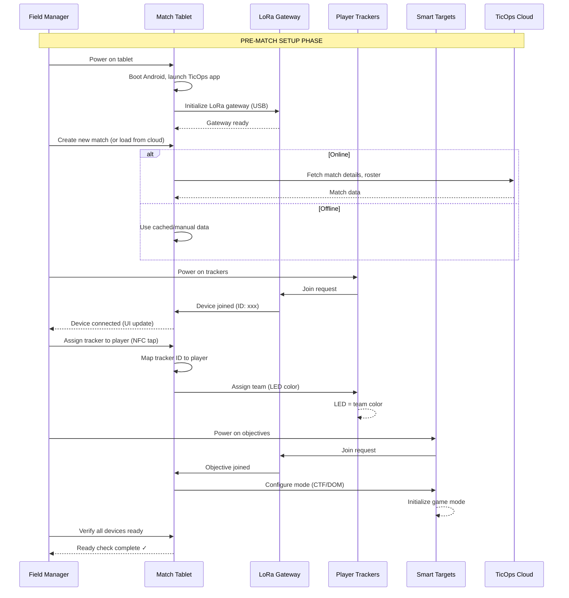

### 8.2 Match Execution

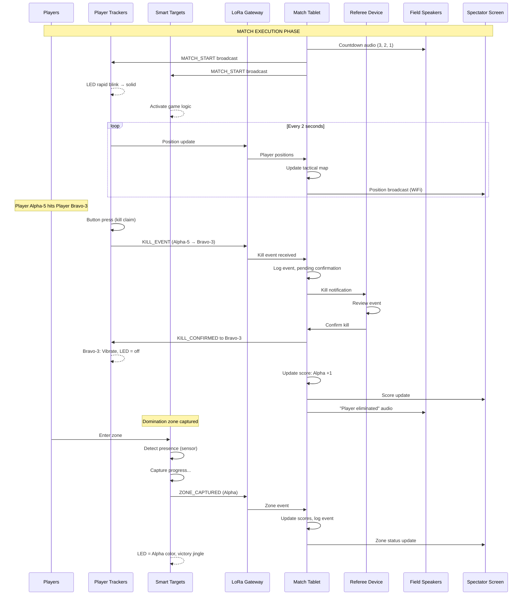

### 8.3 Post-Match & Sync

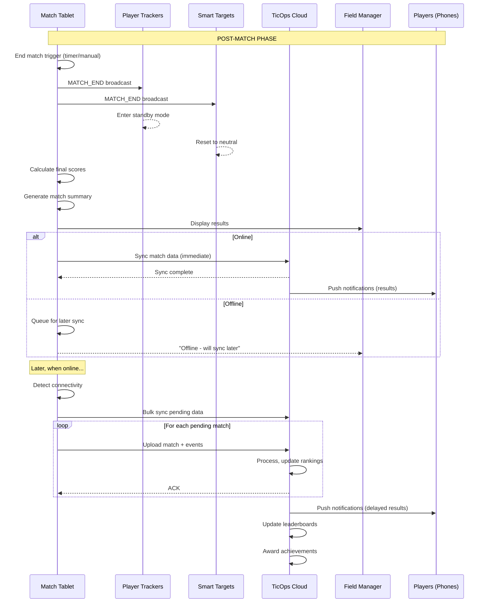

---

## 9. Hardware Cost Estimation

```
┌─────────────────────────────────────────────────────────────────────────────┐
│                         HARDWARE COST BREAKDOWN                              │
├─────────────────────────────────────────────────────────────────────────────┤
│                                                                              │
│  PER-MATCH KIT (Minimum Viable Setup)                                        │
│  ─────────────────────────────────────                                      │
│  │ Item                              │ Qty │ Unit Cost │ Total    │        │
│  ├───────────────────────────────────┼─────┼───────────┼──────────┤        │
│  │ Match Tablet (rugged Android)     │  1  │ €800      │ €800     │        │
│  │ LoRa Gateway (USB)                │  1  │ €150      │ €150     │        │
│  │ Gateway Antenna (5dBi)            │  1  │ €30       │ €30      │        │
│  │ Gateway Tripod Mount              │  1  │ €50       │ €50      │        │
│  │ Carrying Case                     │  1  │ €80       │ €80      │        │
│  ├───────────────────────────────────┼─────┼───────────┼──────────┤        │
│  │ SUBTOTAL CORE KIT                 │     │           │ €1,110   │        │
│  └───────────────────────────────────┴─────┴───────────┴──────────┘        │
│                                                                              │
│  PLAYER TRACKING (per player)                                                │
│  ────────────────────────────                                               │
│  │ Item                              │ Qty │ Unit Cost │ Total    │        │
│  ├───────────────────────────────────┼─────┼───────────┼──────────┤        │
│  │ Player Tracker Device             │  1  │ €85       │ €85      │        │
│  │ Chest Harness                     │  1  │ €15       │ €15      │        │
│  │ Charging Cable                    │  1  │ €5        │ €5       │        │
│  ├───────────────────────────────────┼─────┼───────────┼──────────┤        │
│  │ SUBTOTAL PER PLAYER               │     │           │ €105     │        │
│  └───────────────────────────────────┴─────┴───────────┴──────────┘        │
│                                                                              │
│  OBJECTIVES (optional)                                                       │
│  ─────────────────────                                                      │
│  │ Item                              │ Qty │ Unit Cost │ Total    │        │
│  ├───────────────────────────────────┼─────┼───────────┼──────────┤        │
│  │ CTF Flag Post                     │  2  │ €120      │ €240     │        │
│  │ Domination Zone Controller        │  3  │ €150      │ €450     │        │
│  │ Bomb Objective Unit               │  1  │ €180      │ €180     │        │
│  ├───────────────────────────────────┼─────┼───────────┼──────────┤        │
│  │ SUBTOTAL OBJECTIVES               │     │           │ €870     │        │
│  └───────────────────────────────────┴─────┴───────────┴──────────┘        │
│                                                                              │
│  INDOOR POSITIONING (optional)                                               │
│  ──────────────────────────────                                             │
│  │ Item                              │ Qty │ Unit Cost │ Total    │        │
│  ├───────────────────────────────────┼─────┼───────────┼──────────┤        │
│  │ BLE Beacon                        │ 16  │ €25       │ €400     │        │
│  │ Beacon Mounts                     │ 16  │ €5        │ €80      │        │
│  ├───────────────────────────────────┼─────┼───────────┼──────────┤        │
│  │ SUBTOTAL BEACONS                  │     │           │ €480     │        │
│  └───────────────────────────────────┴─────┴───────────┴──────────┘        │
│                                                                              │
│  EXAMPLE CONFIGURATIONS                                                      │
│  ──────────────────────                                                     │
│  • STARTER (10 players, core only):     €1,110 + 10×€105 = €2,160          │
│  • STANDARD (20 players + CTF):         €1,110 + 20×€105 + €240 = €3,450   │
│  • PRO (30 players + full objectives):  €1,110 + 30×€105 + €870 = €5,130   │
│  • INDOOR (+ beacon mesh):              Add €480 to any config              │
│                                                                              │
└─────────────────────────────────────────────────────────────────────────────┘
```

---

## 10. Development Roadmap

### 10.1 Phase Breakdown

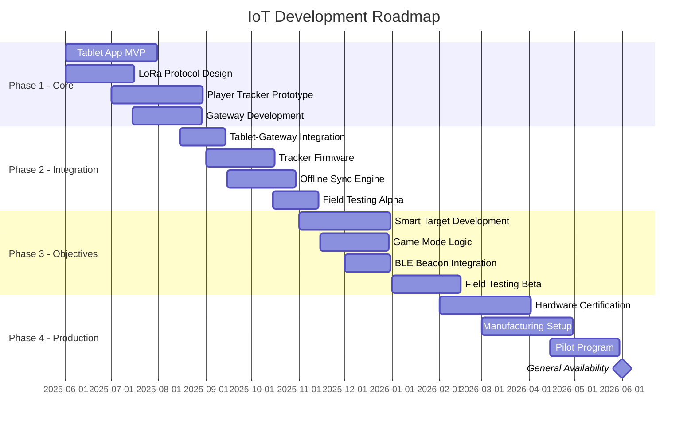

### 10.2 Technical Milestones

```
┌─────────────────────────────────────────────────────────────────────────────┐
│                         IOT DEVELOPMENT MILESTONES                           │
├─────────────────────────────────────────────────────────────────────────────┤
│                                                                              │
│  M1: PROOF OF CONCEPT (Q2 2025)                                              │
│  ─────────────────────────────                                              │
│  □ LoRa communication working between dev boards                            │
│  □ Basic position transmission (GPS → Gateway → Tablet)                     │
│  □ Tablet app displays positions on map                                     │
│  □ Battery life > 4 hours                                                   │
│                                                                              │
│  M2: ALPHA PROTOTYPE (Q3 2025)                                               │
│  ────────────────────────────                                               │
│  □ Custom PCB design complete                                               │
│  □ 3D printed enclosures                                                    │
│  □ Full match lifecycle (start → play → end)                               │
│  □ Kill events with confirmation                                            │
│  □ Offline operation validated                                              │
│                                                                              │
│  M3: BETA HARDWARE (Q4 2025)                                                 │
│  ──────────────────────────                                                 │
│  □ Injection molded enclosures                                              │
│  □ IP67 certification testing                                               │
│  □ 50+ device stress test                                                   │
│  □ Smart targets integrated                                                 │
│  □ BLE beacon mesh operational                                              │
│                                                                              │
│  M4: PRODUCTION READY (Q1 2026)                                              │
│  ───────────────────────────                                                │
│  □ CE/FCC certification                                                     │
│  □ Manufacturing partner selected                                           │
│  □ QA process defined                                                       │
│  □ Firmware OTA update system                                               │
│  □ Field documentation complete                                             │
│                                                                              │
│  M5: GENERAL AVAILABILITY (Q2 2026)                                          │
│  ──────────────────────────────────                                         │
│  □ First production batch (100 units)                                       │
│  □ Pilot program with 5 fields                                              │
│  □ Support & training materials                                             │
│  □ E-commerce integration                                                   │
│  □ Warranty & RMA process                                                   │
│                                                                              │
└─────────────────────────────────────────────────────────────────────────────┘
```

---

## 11. Security Considerations

```
┌─────────────────────────────────────────────────────────────────────────────┐
│                         SECURITY ARCHITECTURE                                │
├─────────────────────────────────────────────────────────────────────────────┤
│                                                                              │
│  COMMUNICATION SECURITY                                                      │
│  ──────────────────────                                                     │
│  • LoRa: AES-128 encryption (per-device keys)                               │
│  • BLE: Secure pairing with PIN                                             │
│  • WiFi: WPA3 Enterprise                                                    │
│  • Cloud: TLS 1.3, certificate pinning                                      │
│                                                                              │
│  DEVICE SECURITY                                                             │
│  ───────────────                                                            │
│  • Secure boot (signed firmware)                                            │
│  • Hardware crypto (AES, ECDSA)                                             │
│  • Tamper detection (optional)                                              │
│  • Remote wipe capability                                                   │
│                                                                              │
│  DATA SECURITY                                                               │
│  ─────────────                                                              │
│  • Local DB encryption (SQLCipher)                                          │
│  • No PII stored on trackers                                                │
│  • Anonymized telemetry                                                     │
│  • GDPR compliant data handling                                             │
│                                                                              │
│  KEY MANAGEMENT                                                              │
│  ──────────────                                                             │
│  ┌─────────────────────────────────────────────────────────────────────┐   │
│  │                                                                      │   │
│  │  CLOUD                                                               │   │
│  │    │                                                                 │   │
│  │    │ AppKey (per device)                                            │   │
│  │    │ NwkKey (per organization)                                      │   │
│  │    ▼                                                                 │   │
│  │  TABLET                                                              │   │
│  │    │                                                                 │   │
│  │    │ SessionKey (per match)                                         │   │
│  │    ▼                                                                 │   │
│  │  DEVICES                                                             │   │
│  │    DevAddr + SessionKey = Encrypted comms                           │   │
│  │                                                                      │   │
│  └─────────────────────────────────────────────────────────────────────┘   │
│                                                                              │
│  ANTI-CHEAT MEASURES                                                         │
│  ───────────────────                                                        │
│  • Position plausibility check (max speed validation)                       │
│  • Referee confirmation for kills                                           │
│  • Device binding (NFC player ID)                                           │
│  • Anomaly detection on server                                              │
│                                                                              │
└─────────────────────────────────────────────────────────────────────────────┘
```

---

## Appendix A: Message Payload Specifications

```
┌─────────────────────────────────────────────────────────────────────────────┐
│                         LORA MESSAGE PAYLOADS                                │
├─────────────────────────────────────────────────────────────────────────────┤
│                                                                              │
│  POSITION_UPDATE (12 bytes)                                                  │
│  ──────────────────────────                                                 │
│  ┌────────┬────────┬────────┬────────┬────────┬────────┐                   │
│  │ Lat    │ Lon    │ Alt    │ Speed  │ Heading│ Status │                   │
│  │ 4B     │ 4B     │ 2B     │ 1B     │ 1B     │ 1B     │                   │
│  │ int32  │ int32  │ uint16 │ uint8  │ uint8  │ bitmap │                   │
│  │ ×1e-7° │ ×1e-7° │ ×0.1m  │ km/h   │ ×1.41° │        │                   │
│  └────────┴────────┴────────┴────────┴────────┴────────┘                   │
│                                                                              │
│  Status bitmap: [7:GPS_fix][6:BLE_fix][5:moving][4:alarm][3:2:team][1:0:st] │
│                                                                              │
│  KILL_EVENT (8 bytes)                                                        │
│  ────────────────────                                                       │
│  ┌────────┬────────┬────────┬────────┐                                     │
│  │ Killer │ Target │ Weapon │ Time   │                                     │
│  │ 2B     │ 2B     │ 1B     │ 3B     │                                     │
│  │ DevAddr│ DevAddr│ enum   │ offset │                                     │
│  └────────┴────────┴────────┴────────┘                                     │
│                                                                              │
│  Weapon enum: 0=unknown, 1=primary, 2=secondary, 3=knife, 4=grenade        │
│  Time offset: seconds since match start (max ~194 days)                     │
│                                                                              │
│  OBJECTIVE_STATE (6 bytes)                                                   │
│  ─────────────────────────                                                  │
│  ┌────────┬────────┬────────┬────────┐                                     │
│  │ ObjID  │ State  │ Team   │ Progr  │                                     │
│  │ 2B     │ 1B     │ 1B     │ 2B     │                                     │
│  │ uint16 │ enum   │ enum   │ 0-1000 │                                     │
│  └────────┴────────┴────────┴────────┘                                     │
│                                                                              │
│  State enum: 0=neutral, 1=capturing, 2=captured, 3=contested               │
│                                                                              │
│  HEARTBEAT (4 bytes)                                                         │
│  ───────────────────                                                        │
│  ┌────────┬────────┬────────┬────────┐                                     │
│  │ Battery│ Temp   │ RSSI   │ Flags  │                                     │
│  │ 1B     │ 1B     │ 1B     │ 1B     │                                     │
│  │ 0-100% │ °C+40  │ dBm+137│ bitmap │                                     │
│  └────────┴────────┴────────┴────────┘                                     │
│                                                                              │
│  REFEREE_COMMAND (variable)                                                  │
│  ──────────────────────────                                                 │
│  ┌────────┬────────┬────────────────────┐                                  │
│  │ CmdType│ Target │ Payload            │                                  │
│  │ 1B     │ 2B     │ 0-20B              │                                  │
│  │ enum   │ DevAddr│ command-specific   │                                  │
│  └────────┴────────┴────────────────────┘                                  │
│                                                                              │
│  CmdType: 0=kill_confirm, 1=kill_reject, 2=respawn, 3=pause, 4=resume      │
│                                                                              │
└─────────────────────────────────────────────────────────────────────────────┘
```

---

## Appendix B: Regulatory Compliance

```
┌─────────────────────────────────────────────────────────────────────────────┐
│                         REGULATORY REQUIREMENTS                              │
├─────────────────────────────────────────────────────────────────────────────┤
│                                                                              │
│  EUROPE (EU)                                                                 │
│  ───────────                                                                │
│  • CE Marking (required for sale)                                           │
│  • RED (Radio Equipment Directive 2014/53/EU)                               │
│  • LoRa: 863-870 MHz, max 25 mW ERP, 1% duty cycle                         │
│  • RoHS (hazardous substances)                                              │
│  • WEEE (electronic waste)                                                  │
│  • GDPR (data protection)                                                   │
│                                                                              │
│  USA                                                                         │
│  ───                                                                        │
│  • FCC Part 15 (unlicensed radio)                                           │
│  • LoRa: 902-928 MHz, max 1W EIRP                                          │
│  • FCC ID required                                                          │
│                                                                              │
│  UK (Post-Brexit)                                                            │
│  ────────────────                                                           │
│  • UKCA Marking                                                             │
│  • Same technical requirements as EU                                        │
│                                                                              │
│  BATTERY SAFETY                                                              │
│  ──────────────                                                             │
│  • UN38.3 (lithium battery transport)                                       │
│  • IEC 62133 (battery safety)                                               │
│                                                                              │
│  ENVIRONMENTAL                                                               │
│  ─────────────                                                              │
│  • IP67 testing (IEC 60529)                                                 │
│  • Operating temperature testing                                            │
│  • Shock/vibration testing (MIL-STD-810G optional)                         │
│                                                                              │
└─────────────────────────────────────────────────────────────────────────────┘
```

---

**Document Version**: 1.0  
**Author**: TicOps Engineering Team  
**Last Updated**: 26 Dicembre 2024  
**Status**: Design Specification  
**Next Review**: Q1 2025 - Before Prototype Phase
