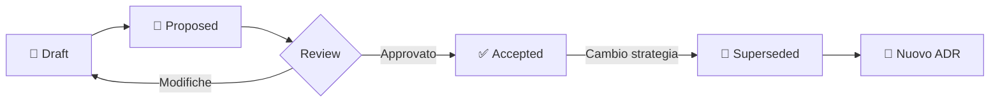

# ADR Appendix: Architecture Decision Records Explained

## Cosa sono gli ADR?

**ADR** = **Architecture Decision Record**

Un ADR è un documento che cattura una decisione architetturale importante, con:
- **Contesto**: perché questa decisione?
- **Decisione**: cosa abbiamo scelto?
- **Conseguenze**: impatti positivi e negativi
- **Alternative**: cosa abbiamo scartato e perché?

## Quando creare un ADR?

Crea un ADR per decisioni che impattano significativamente il sistema:

- ✅ **Scelte tecnologiche**: framework, database, linguaggi
- ✅ **Pattern architetturali**: esagonale, microservizi, monolite
- ✅ **Approcci di integrazione**: API, messaging, eventi
- ✅ **Pratiche di sviluppo** che influenzano l'architettura
- ✅ **Requisiti di sicurezza o compliance**

⚠️ **Applica Regola Zero**: Crea un ADR solo se la decisione ha impatto duraturo.

## Struttura Standard ADR

```markdown
# ADR-NNN: Titolo Breve

**Status**: Draft | Proposed | Accepted | Deprecated | Superseded by ADR-XXX  
**Date**: YYYY-MM-DD  
**Deciders**: Nome team/persona  
**Tags**: `categoria1`, `categoria2`

## Context
Qual è il problema che stiamo affrontando?

## Decision
Cosa abbiamo deciso di fare?

## Consequences
### Positive
- ✅ Cosa diventa più facile
### Negative
- ⚠️ Cosa diventa più difficile
### Neutral
- ℹ️ Trade-off neutri

## Alternatives Considered
Altre opzioni valutate e perché scartate

## References
Link a risorse, discussioni, docs
```

## Convenzione Naming

```
ADR-NNN-titolo-breve.md
```

Dove:
- `NNN` = numero sequenziale (001, 002, 003...)
- Titolo in kebab-case (tutto minuscolo, trattini)

**Esempi**:
- `ADR-001-choose-platformatic-watt.md`
- `ADR-002-adopt-hexagonal-architecture.md`
- `ADR-003-semantic-versioning-tool-choice.md`

## Processo ADR



1. **Draft**: Crea ADR usando template
2. **Propose**: Condividi per review
3. **Accept**: Decisione approvata e implementata
4. **Supersede**: Se cambia, crea nuovo ADR e marca il vecchio

## Quando NON creare un ADR?

❌ **Decisioni temporanee** (usare un workaround per 1 settimana)  
❌ **Scelte ovvie** per il team (convenzioni naming variabili)  
❌ **Implementazioni di dettaglio** (come strutturare un singolo file)  
❌ **Configurazioni standard** (porta del server)

Usa YAGNI: crea ADR solo se la decisione è **rilevante per il futuro del sistema**.

## Vantaggi degli ADR

- 📚 **Storicizzazione**: capire perché abbiamo fatto certe scelte
- 🤝 **Onboarding**: nuovi membri capiscono il contesto rapidamente
- 🔍 **Trasparenza**: decisioni documentate e tracciabili
- 🚫 **Evita regressioni**: motivi per NON tornare indietro sono chiari
- 📈 **Apprendimento**: pattern di decisione emergono nel tempo

## Template Location

```
docs/templates/ADR-TEMPLATE.md
```

## ADR Directory

```
docs/architecture/decisions/
├── README.md (questa guida)
├── ADR-001-choose-platformatic-watt.md
├── ADR-002-adopt-hexagonal-architecture.md
└── ADR-003-semantic-versioning-tool-choice.md
```

---

## Riferimenti

- [ADR GitHub Org](https://adr.github.io/)
- [Documenting Architecture Decisions - Michael Nygard](https://cognitect.com/blog/2011/11/15/documenting-architecture-decisions)
- Template: `docs/templates/ADR-TEMPLATE.md`
- Esempi: `docs/architecture/decisions/ADR-*.md`
