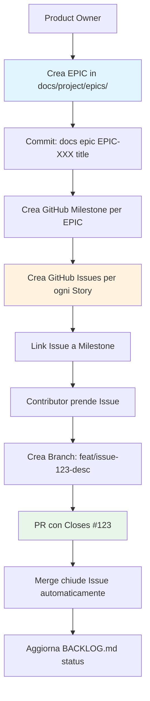
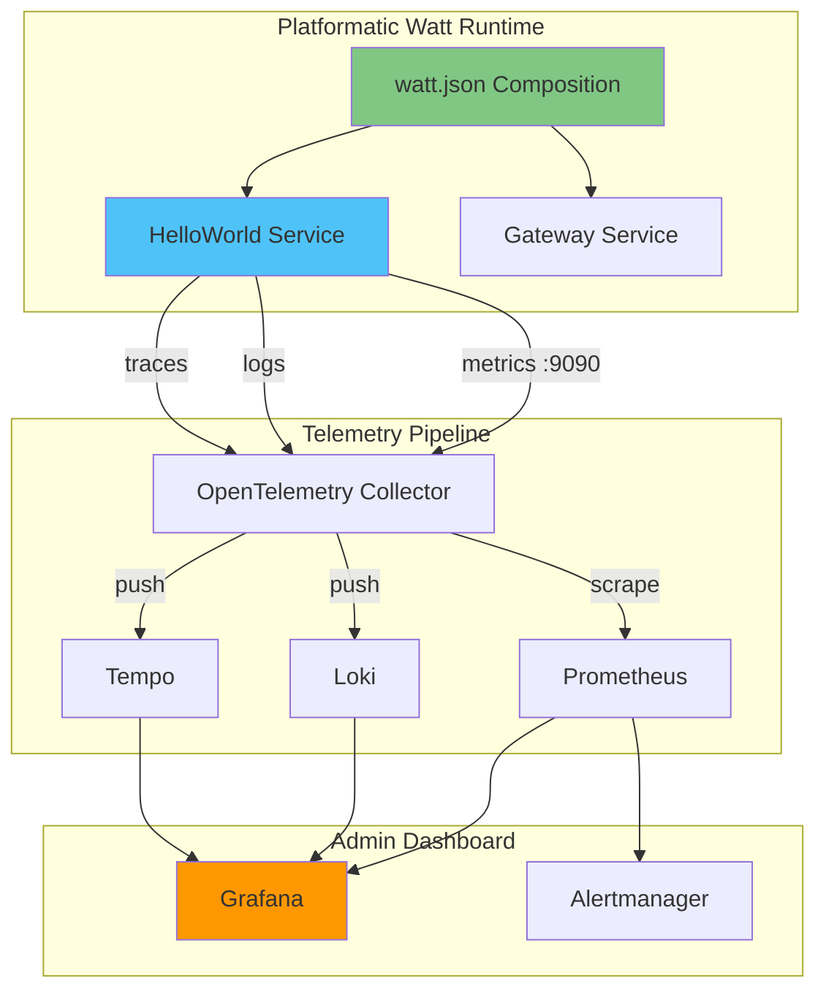
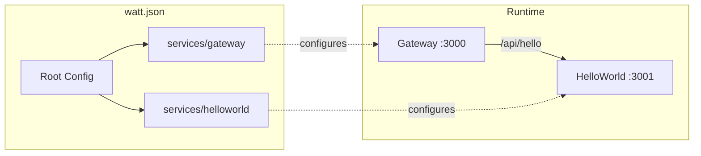
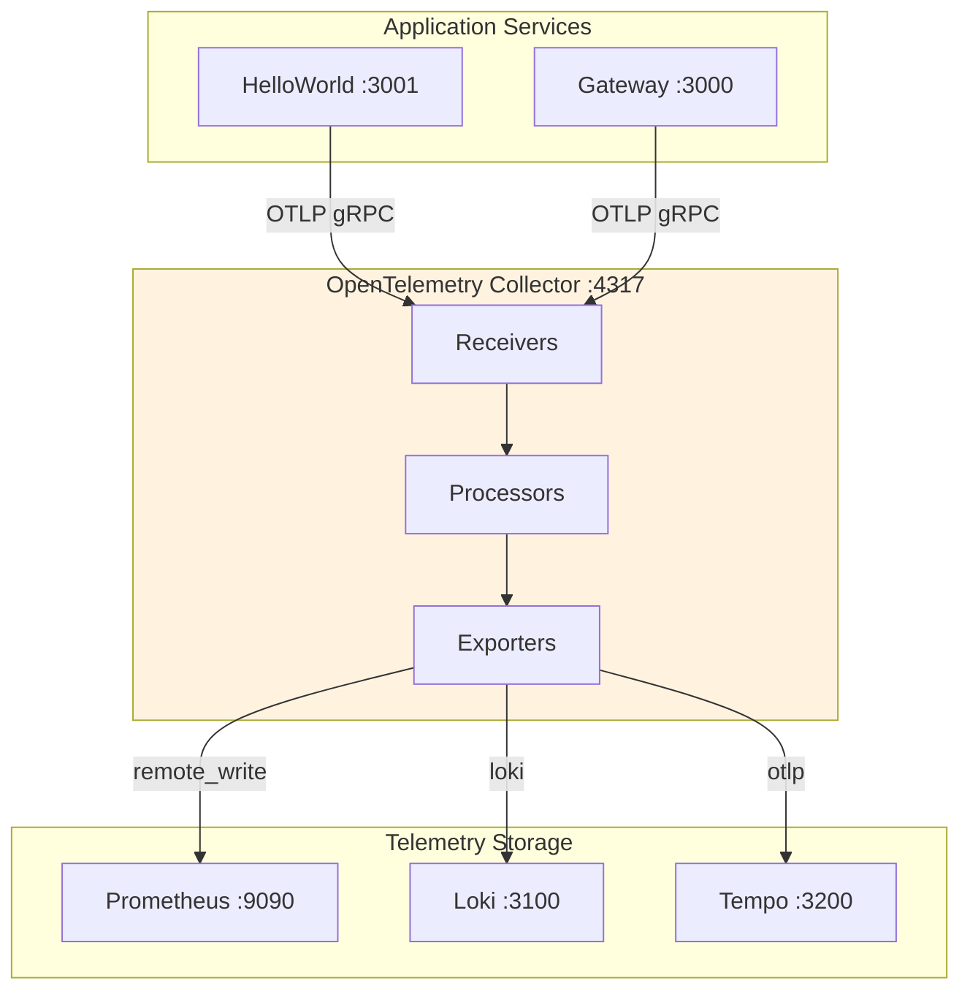
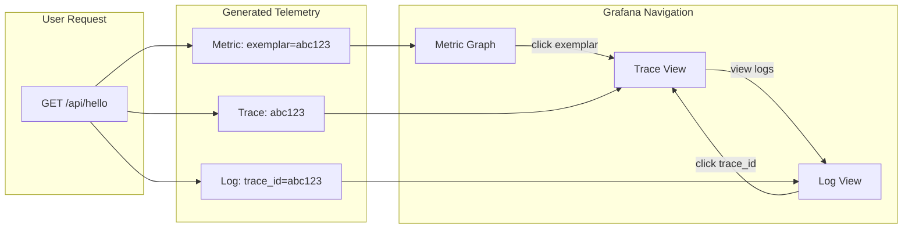
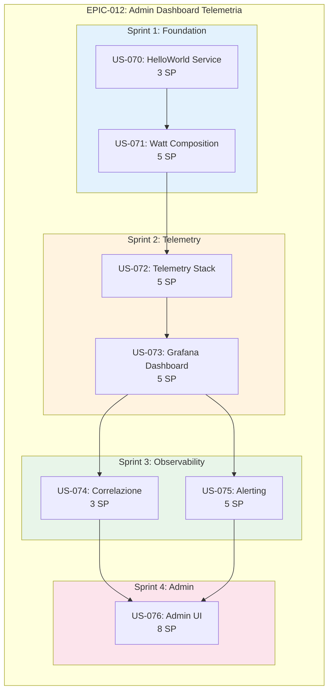

# Struttura di Progetto per Sviluppo Opensource-Oriented

**Progetto**: Tech Citizen SW Gateway  
**Versione**: 1.0  
**Data**: Dicembre 2025

---

## Parte 1: Valutazione Locale vs GitHub Sync

### Opzioni a Confronto

| Aspetto             | Solo Locale (Markdown)  | GitHub Issues + Projects  | Raccomandazione |
| ------------------- | ----------------------- | ------------------------- | --------------- |
| **Visibilità**      | Solo team interno       | Pubblico per contributors | GitHub ✅       |
| **Onboarding**      | Richiede clone repo     | Navigabile da browser     | GitHub ✅       |
| **Integrazione PR** | Manuale (ref in commit) | Automatica (closes #123)  | GitHub ✅       |
| **Kanban Board**    | No (o tool esterno)     | GitHub Projects nativo    | GitHub ✅       |
| **Offline Work**    | Sempre disponibile      | Richiede connessione      | Locale ✅       |
| **Versionamento**   | Git history             | Separato da code          | Locale ✅       |
| **Complessità**     | Zero setup              | Richiede configurazione   | Locale ✅       |
| **Community**       | Non standard            | Standard opensource       | GitHub ✅       |

### Raccomandazione: Approccio Ibrido

Per un'azienda **opensource-oriented**, la strategia ottimale combina entrambi gli approcci,
mantenendo la documentazione strategica in Markdown versionato e la gestione operativa su GitHub.

**Documenti in Repository (Markdown versionato)**:

- `docs/project/ROADMAP.md` contiene la vision a lungo termine e le milestone
- `docs/project/BACKLOG.md` contiene il product backlog prioritizzato
- `docs/project/epics/EPIC-XXX-*.md` contiene la specifica dettagliata di ogni epic
- `docs/architecture/decisions/ADR-*.md` contiene le decisioni architetturali

**Gestione su GitHub**:

- **GitHub Issues** per tracking operativo di bugs, tasks, stories
- **GitHub Projects** per board Kanban e sprint planning
- **Labels** per categorizzare (epic, story, task, bug, good-first-issue)
- **Milestones** per raggruppare issues per release

### Workflow di Sincronizzazione



### Setup GitHub per Opensource

**Labels da Creare**:

| Label              | Colore  | Descrizione               |
| ------------------ | ------- | ------------------------- |
| `epic`             | #7057ff | Large feature, multi-week |
| `story`            | #0e8a16 | User-facing functionality |
| `task`             | #1d76db | Implementation work       |
| `bug`              | #d73a4a | Something broken          |
| `good first issue` | #7057ff | Good for newcomers        |
| `help wanted`      | #008672 | Extra attention needed    |
| `documentation`    | #0075ca | Docs improvements         |
| `testing`          | #fbca04 | Test additions            |
| `blocked`          | #b60205 | Blocked by dependency     |
| `wontfix`          | #ffffff | Will not be worked on     |

**GitHub Project Board (Kanban)**:

| Backlog                  | Ready                          | In Progress           | Review       | Done       |
| ------------------------ | ------------------------------ | --------------------- | ------------ | ---------- |
| Issues non ancora pronti | Issues pronti per essere presi | Issues in lavorazione | PR in review | Completati |

---

## Parte 2: EPIC-012 - Admin Dashboard Telemetria

### Overview

**EPIC ID**: EPIC-012  
**Titolo**: Admin Dashboard per Monitoraggio Telemetria HelloWorld  
**Owner**: Antonio Cittadino  
**Durata Stimata**: 4 Sprint (4 settimane)  
**Story Points Totali**: 34 SP  
**Priorità**: Alta  
**Dipendenze**: EPIC-000 (Observability Stack) deve essere completato

### Goal

Costruire un'interfaccia di amministrazione web che permetta di monitorare in tempo reale metriche,
logs e traces di un servizio HelloWorld orchestrato tramite Platformatic Watt con configurazione
`watt.json`.

### Value Proposition

Come **operatore di sistema**, voglio una dashboard centralizzata per monitorare la salute e le
performance del servizio HelloWorld, così da poter identificare problemi prima che impattino gli
utenti e ottimizzare le risorse.

### Success Metrics

| Metrica                    | Target       | Misurazione                        |
| -------------------------- | ------------ | ---------------------------------- |
| Time to First Dashboard    | < 30 secondi | Dal deploy al primo dato visibile  |
| MTTD (Mean Time To Detect) | < 2 minuti   | Tempo per rilevare anomalie        |
| Dashboard Load Time        | < 3 secondi  | P95 page load                      |
| Data Freshness             | < 15 secondi | Delay tra evento e visualizzazione |

### Architectural Flow



---

## User Stories

### US-070: HelloWorld Service con Telemetria Built-in

**Come** sviluppatore  
**Voglio** un servizio HelloWorld minimale con telemetria abilitata via configurazione  
**Per** avere una baseline funzionante su cui costruire il monitoraggio

**Story Points**: 3 SP

**Acceptance Criteria**:

```gherkin
Feature: HelloWorld Service con Telemetria

  Scenario: Il servizio espone endpoint health
    Dato che il servizio HelloWorld è in esecuzione
    Quando chiamo GET /health
    Allora ricevo status 200
    E il body contiene { "status": "ok" }

  Scenario: Il servizio espone metriche Prometheus
    Dato che il servizio HelloWorld è in esecuzione
    Quando chiamo GET /metrics
    Allora ricevo metriche in formato Prometheus
    E le metriche includono http_request_duration_seconds

  Scenario: Il servizio genera traces OpenTelemetry
    Dato che il servizio HelloWorld è in esecuzione
    E OpenTelemetry Collector è configurato
    Quando chiamo GET /hello
    Allora un trace viene inviato al collector
    E il trace contiene span per la request HTTP
```

**Tasks**:

| Task    | Descrizione                               | SP  | Dipendenze |
| ------- | ----------------------------------------- | :-: | ---------- |
| T-070.1 | Scaffold servizio HelloWorld Platformatic |  1  | -          |
| T-070.2 | Configurare telemetry in watt.json        |  1  | T-070.1    |
| T-070.3 | Validare metriche e traces generati       |  1  | T-070.2    |

---

### US-071: Composition Watt.json Multi-Service

**Come** architetto  
**Voglio** una configurazione watt.json che componga Gateway + HelloWorld  
**Per** dimostrare il pattern di composition Platformatic

**Story Points**: 5 SP

**Acceptance Criteria**:

```gherkin
Feature: Watt Composition

  Scenario: Gateway proxya a HelloWorld
    Dato che watt.json definisce gateway e helloworld
    E entrambi i servizi sono avviati via watt start
    Quando chiamo GET /api/hello tramite gateway
    Allora la richiesta viene instradata a HelloWorld
    E ricevo la risposta dal servizio downstream

  Scenario: Telemetria propagata tra servizi
    Dato che gateway e helloworld hanno telemetry abilitata
    Quando una richiesta attraversa entrambi i servizi
    Allora il trace include span per gateway e helloworld
    E il trace-id è propagato correttamente
```

**Tasks**:

| Task    | Descrizione                                  | SP  | Dipendenze |
| ------- | -------------------------------------------- | :-: | ---------- |
| T-071.1 | Creare struttura directory multi-service     |  1  | US-070     |
| T-071.2 | Configurare watt.json root con composition   |  2  | T-071.1    |
| T-071.3 | Configurare routing gateway verso HelloWorld |  1  | T-071.2    |
| T-071.4 | Testare propagazione trace context           |  1  | T-071.3    |

**Diagramma Composition**:



---

### US-072: Stack Telemetria con Docker Compose

**Come** DevOps engineer  
**Voglio** uno stack di telemetria containerizzato  
**Per** raccogliere e persistere metriche, logs e traces

**Story Points**: 5 SP

**Acceptance Criteria**:

```gherkin
Feature: Telemetry Stack

  Scenario: Prometheus raccoglie metriche
    Dato che docker-compose.telemetry.yml è avviato
    E HelloWorld espone /metrics
    Quando Prometheus scrapa le metriche
    Allora le metriche sono visibili in Prometheus UI
    E la retention è configurata per 15 giorni

  Scenario: Loki raccoglie logs
    Dato che Loki è configurato in docker-compose
    E HelloWorld invia logs via OpenTelemetry
    Quando il servizio genera un log
    Allora il log è ricercabile in Loki
    E include labels per service_name e level

  Scenario: Tempo raccoglie traces
    Dato che Tempo è configurato in docker-compose
    Quando HelloWorld genera un trace
    Allora il trace è visibile in Tempo
    E posso navigare gli span correlati
```

**Tasks**:

| Task    | Descrizione                               | SP  | Dipendenze                |
| ------- | ----------------------------------------- | :-: | ------------------------- |
| T-072.1 | Creare docker-compose.telemetry.yml base  |  1  | -                         |
| T-072.2 | Configurare Prometheus con scrape targets |  1  | T-072.1                   |
| T-072.3 | Configurare Loki per log aggregation      |  1  | T-072.1                   |
| T-072.4 | Configurare Tempo per distributed tracing |  1  | T-072.1                   |
| T-072.5 | Configurare OpenTelemetry Collector       |  1  | T-072.2, T-072.3, T-072.4 |

**Architettura Stack**:



---

### US-073: Grafana Dashboard Base

**Come** operatore  
**Voglio** una dashboard Grafana pre-configurata  
**Per** visualizzare le metriche principali del servizio HelloWorld

**Story Points**: 5 SP

**Acceptance Criteria**:

```gherkin
Feature: Grafana Dashboard

  Scenario: Dashboard mostra metriche HTTP
    Dato che Grafana è connesso a Prometheus
    Quando accedo alla dashboard HelloWorld
    Allora vedo il pannello Request Rate (req/s)
    E vedo il pannello Error Rate (%)
    E vedo il pannello Latency P50/P95/P99

  Scenario: Dashboard mostra risorse sistema
    Dato che node_exporter è configurato
    Quando accedo alla dashboard
    Allora vedo CPU Usage
    E vedo Memory Usage
    E vedo Disk I/O

  Scenario: Dashboard aggiornata in real-time
    Dato che la dashboard ha refresh 5s
    Quando genero traffico verso HelloWorld
    Allora i grafici si aggiornano entro 5 secondi
```

**Tasks**:

| Task    | Descrizione                            | SP  | Dipendenze |
| ------- | -------------------------------------- | :-: | ---------- |
| T-073.1 | Configurare Grafana in docker-compose  |  1  | US-072     |
| T-073.2 | Aggiungere datasource Prometheus       | 0.5 | T-073.1    |
| T-073.3 | Aggiungere datasource Loki             | 0.5 | T-073.1    |
| T-073.4 | Aggiungere datasource Tempo            | 0.5 | T-073.1    |
| T-073.5 | Creare dashboard JSON con pannelli RED | 2.5 | T-073.2    |

**Layout Dashboard**:

```
┌─────────────────────────────────────────────────────────────────┐
│                    HelloWorld Service Dashboard                  │
├─────────────────────────────────────────────────────────────────┤
│  [Request Rate]    [Error Rate]     [P95 Latency]    [Uptime]   │
│      150/s            0.5%             45ms           99.9%      │
├─────────────────────────────────────────────────────────────────┤
│                                                                  │
│  ┌─────────────────────────────────────────────────────────┐    │
│  │              HTTP Request Duration (P50/P95/P99)         │    │
│  │  ▂▃▅▇█▇▅▃▂▁▂▃▅▇█▇▅▃▂▁▂▃▅▇█▇▅▃▂▁▂▃▅▇█▇▅▃▂▁ (graph)      │    │
│  └─────────────────────────────────────────────────────────┘    │
│                                                                  │
├──────────────────────────┬──────────────────────────────────────┤
│  ┌─────────────────────┐ │  ┌────────────────────────────────┐  │
│  │    CPU Usage        │ │  │         Memory Usage           │  │
│  │    ▓▓▓▓▓░░░ 62%    │ │  │    ▓▓▓▓▓▓▓░ 78%              │  │
│  └─────────────────────┘ │  └────────────────────────────────┘  │
├──────────────────────────┴──────────────────────────────────────┤
│                        Recent Logs (Loki)                        │
│  12:34:56 INFO  [helloworld] Request handled: GET /hello         │
│  12:34:55 INFO  [gateway] Proxying request to helloworld         │
│  12:34:54 WARN  [helloworld] Slow query detected: 150ms          │
└─────────────────────────────────────────────────────────────────┘
```

---

### US-074: Correlazione Logs-Traces-Metrics

**Come** operatore  
**Voglio** navigare da un log a trace correlati e viceversa  
**Per** fare troubleshooting efficace di problemi

**Story Points**: 3 SP

**Acceptance Criteria**:

```gherkin
Feature: Correlazione Telemetria

  Scenario: Da log a trace
    Dato che un log contiene trace_id
    Quando clicco sul trace_id nel pannello logs
    Allora Grafana apre la vista trace in Tempo
    E mostra tutti gli span del trace

  Scenario: Da trace a logs
    Dato che visualizzo un trace in Tempo
    Quando clicco su "View Logs"
    Allora Grafana filtra i logs per quel trace_id
    E mostra solo i logs correlati

  Scenario: Exemplars su metriche
    Dato che le metriche hanno exemplars abilitati
    Quando hover su un picco nel grafico latency
    Allora vedo link al trace che ha causato il picco
```

**Tasks**:

| Task    | Descrizione                                 | SP  | Dipendenze |
| ------- | ------------------------------------------- | :-: | ---------- |
| T-074.1 | Configurare trace_id nei logs               |  1  | US-072     |
| T-074.2 | Abilitare derived fields in Loki datasource |  1  | T-074.1    |
| T-074.3 | Configurare Tempo trace-to-logs             | 0.5 | T-074.2    |
| T-074.4 | Abilitare exemplars in Prometheus           | 0.5 | US-072     |

**Flow Correlazione**:



---

### US-075: Alerting Base

**Come** operatore  
**Voglio** ricevere alert quando il servizio degrada  
**Per** intervenire proattivamente prima che gli utenti siano impattati

**Story Points**: 5 SP

**Acceptance Criteria**:

```gherkin
Feature: Alerting

  Scenario: Alert per error rate elevato
    Dato che l'alert rule "HighErrorRate" è configurata
    E la soglia è error_rate > 5% per 2 minuti
    Quando il servizio genera errori sopra soglia
    Allora Alertmanager invia notifica
    E l'alert è visibile in Grafana

  Scenario: Alert per latenza elevata
    Dato che l'alert rule "HighLatency" è configurata
    E la soglia è p95_latency > 500ms per 5 minuti
    Quando la latenza supera la soglia
    Allora viene generato un alert

  Scenario: Alert per servizio down
    Dato che l'alert rule "ServiceDown" è configurata
    Quando il health check fallisce per 1 minuto
    Allora viene generato un alert critico
```

**Tasks**:

| Task    | Descrizione                                    | SP  | Dipendenze      |
| ------- | ---------------------------------------------- | :-: | --------------- |
| T-075.1 | Configurare Alertmanager in docker-compose     |  1  | US-072          |
| T-075.2 | Definire alert rules in Prometheus             |  2  | T-075.1         |
| T-075.3 | Configurare notification channel (Slack/Email) |  1  | T-075.1         |
| T-075.4 | Creare pannello Alert in dashboard             |  1  | US-073, T-075.2 |

**Alert Rules**:

```
┌─────────────────────────────────────────────────────────────────┐
│                        Alert Rules                               │
├─────────────────────┬───────────────┬───────────────┬───────────┤
│ Nome                │ Condizione    │ For           │ Severity  │
├─────────────────────┼───────────────┼───────────────┼───────────┤
│ ServiceDown         │ up == 0       │ 1m            │ critical  │
│ HighErrorRate       │ error_rate>5% │ 2m            │ warning   │
│ HighLatencyP95      │ p95 > 500ms   │ 5m            │ warning   │
│ HighLatencyP99      │ p99 > 1s      │ 5m            │ critical  │
│ HighMemoryUsage     │ mem > 85%     │ 10m           │ warning   │
│ HighCPUUsage        │ cpu > 90%     │ 5m            │ warning   │
└─────────────────────┴───────────────┴───────────────┴───────────┘
```

---

### US-076: Admin UI Custom (React)

**Come** amministratore  
**Voglio** un'interfaccia admin custom integrata nel gateway  
**Per** avere un punto di accesso unificato senza dipendere solo da Grafana

**Story Points**: 8 SP

**Acceptance Criteria**:

```gherkin
Feature: Admin UI

  Scenario: Accesso autenticato
    Dato che navigo a /admin
    Quando non sono autenticato
    Allora vengo rediretto al login
    E posso autenticarmi con credenziali admin

  Scenario: Dashboard overview
    Dato che sono autenticato come admin
    Quando accedo alla dashboard
    Allora vedo lo stato dei servizi (up/down)
    E vedo metriche aggregate in tempo reale
    E vedo gli ultimi alert attivi

  Scenario: Drill-down in Grafana
    Dato che sono nella Admin UI
    Quando clicco su "View Details" di un servizio
    Allora vengo rediretto alla dashboard Grafana specifica
    E il SSO mi autentica automaticamente
```

**Tasks**:

| Task    | Descrizione                          | SP  | Dipendenze |
| ------- | ------------------------------------ | :-: | ---------- |
| T-076.1 | Setup React app con Vite             |  1  | -          |
| T-076.2 | Implementare layout base con sidebar |  1  | T-076.1    |
| T-076.3 | Creare componente ServiceStatus      |  1  | T-076.2    |
| T-076.4 | Creare componente MetricsOverview    |  2  | T-076.2    |
| T-076.5 | Creare componente AlertList          |  1  | T-076.2    |
| T-076.6 | Integrare autenticazione con Gateway |  1  | T-076.2    |
| T-076.7 | Servire static files da Gateway      |  1  | T-076.6    |

**Wireframe Admin UI**:

```
┌─────────────────────────────────────────────────────────────────────┐
│  [Logo] Tech Citizen Admin                    [User] ▼  [Logout]    │
├─────────┬───────────────────────────────────────────────────────────┤
│         │                                                           │
│ ┌─────┐ │  Service Health                                           │
│ │ 📊  │ │  ┌─────────────┬─────────────┬─────────────┐              │
│ │Dash │ │  │ Gateway     │ HelloWorld  │ Telemetry   │              │
│ └─────┘ │  │   ✅ UP     │   ✅ UP     │   ✅ UP     │              │
│         │  │   45ms avg  │   23ms avg  │   12ms avg  │              │
│ ┌─────┐ │  └─────────────┴─────────────┴─────────────┘              │
│ │ 🔔  │ │                                                           │
│ │Alert│ │  Active Alerts (2)                                        │
│ └─────┘ │  ┌────────────────────────────────────────────────────┐   │
│         │  │ ⚠️  HighLatencyP95 - HelloWorld - 5 min ago        │   │
│ ┌─────┐ │  │ ⚠️  HighMemoryUsage - Gateway - 12 min ago         │   │
│ │ 📈  │ │  └────────────────────────────────────────────────────┘   │
│ │Metr │ │                                                           │
│ └─────┘ │  Quick Metrics                                            │
│         │  ┌──────────────────────────────────────────────────────┐ │
│ ┌─────┐ │  │  Requests/s    Error Rate    P95 Latency    Uptime   │ │
│ │ 📝  │ │  │     156           0.3%          48ms        99.97%   │ │
│ │Logs │ │  └──────────────────────────────────────────────────────┘ │
│ └─────┘ │                                                           │
│         │  [Open Grafana →]                                         │
│ ┌─────┐ │                                                           │
│ │ ⚙️  │ │                                                           │
│ │Sett │ │                                                           │
│ └─────┘ │                                                           │
└─────────┴───────────────────────────────────────────────────────────┘
```

---

## Sprint Planning

### Sprint 1: Foundation (Week 1)

**Goal**: HelloWorld funzionante con telemetria base

| Story                      |  SP   | Priority |
| -------------------------- | :---: | :------: |
| US-070: HelloWorld Service |   3   |    P0    |
| US-071: Watt Composition   |   5   |    P0    |
| **Sprint Total**           | **8** |          |

**Deliverable**: `watt start` avvia gateway + helloworld con metriche esposte

---

### Sprint 2: Telemetry Stack (Week 2)

**Goal**: Stack completo di telemetria operativo

| Story                          |   SP   | Priority |
| ------------------------------ | :----: | :------: |
| US-072: Telemetry Stack Docker |   5    |    P0    |
| US-073: Grafana Dashboard      |   5    |    P0    |
| **Sprint Total**               | **10** |          |

**Deliverable**: Dashboard Grafana visualizza metriche HelloWorld

---

### Sprint 3: Observability (Week 3)

**Goal**: Correlazione completa e alerting

| Story                            |  SP   | Priority |
| -------------------------------- | :---: | :------: |
| US-074: Correlazione Logs-Traces |   3   |    P1    |
| US-075: Alerting Base            |   5   |    P1    |
| **Sprint Total**                 | **8** |          |

**Deliverable**: Alert attivi quando servizio degrada, navigazione tra telemetry

---

### Sprint 4: Admin UI (Week 4)

**Goal**: Interfaccia admin unificata

| Story                  |  SP   | Priority |
| ---------------------- | :---: | :------: |
| US-076: Admin UI React |   8   |    P2    |
| **Sprint Total**       | **8** |          |

**Deliverable**: Admin UI accessibile da /admin con overview servizi

---

## Story Map



---

## Rischi e Mitigazioni

| Rischio                                | Probabilità | Impatto | Mitigazione                                       |
| -------------------------------------- | :---------: | :-----: | ------------------------------------------------- |
| Platformatic telemetry non sufficiente |    Media    |  Alto   | Fallback a instrumentazione manuale OpenTelemetry |
| Grafana resource-heavy                 |    Bassa    |  Medio  | Usare Grafana Cloud o ottimizzare queries         |
| Correlazione traces complessa          |    Media    |  Medio  | Iniziare con logs-traces, aggiungere metrics dopo |
| Admin UI scope creep                   |    Alta     |  Alto   | MVP minimo, iterare post-launch                   |

---

## Definition of Done (EPIC Level)

L'EPIC è considerata completata quando tutti i seguenti criteri sono soddisfatti:

- [ ] Tutti i 7 US completati e merged in main
- [ ] Dashboard Grafana accessibile e funzionante
- [ ] Admin UI servita dal Gateway
- [ ] Almeno 3 alert configurati e testati
- [ ] Documentazione aggiornata (README, ADR)
- [ ] Demo registrata (video o live)
- [ ] Performance validata (dashboard < 3s load time)

---

## GitHub Integration Checklist

Per sincronizzare questa EPIC con GitHub:

- [ ] Creare Milestone "EPIC-012: Admin Dashboard"
- [ ] Creare Issue per ogni US (US-070 → US-076)
- [ ] Applicare label `epic` alla milestone description
- [ ] Applicare label `story` a ogni issue
- [ ] Creare sub-issues per tasks se necessario
- [ ] Linkare issues alla milestone
- [ ] Aggiungere al GitHub Project board

**Issue Template per Story**:

```markdown
## User Story

**Come** [ruolo] **Voglio** [funzionalità] **Per** [beneficio]

## Story Points: X SP

## Acceptance Criteria

- [ ] Criterio 1
- [ ] Criterio 2
- [ ] Criterio 3

## Tasks

- [ ] Task 1
- [ ] Task 2

## Dependencies

- Dipende da: #XX
- Blocca: #YY

## Labels

epic, story, sprint-X
```

---

**Documento generato per tech-citizen-sw-gateway**  
**Autore**: Antonio Cittadino  
**Metodologia**: XP + Scrum ibrido  
**Tool**: GitHub Issues + Projects + Markdown versionato
