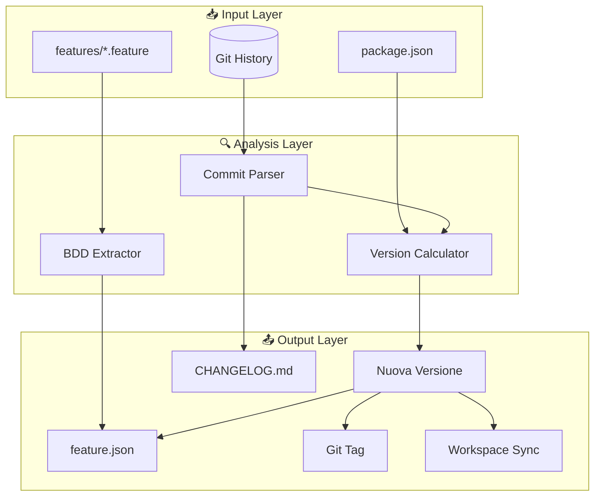
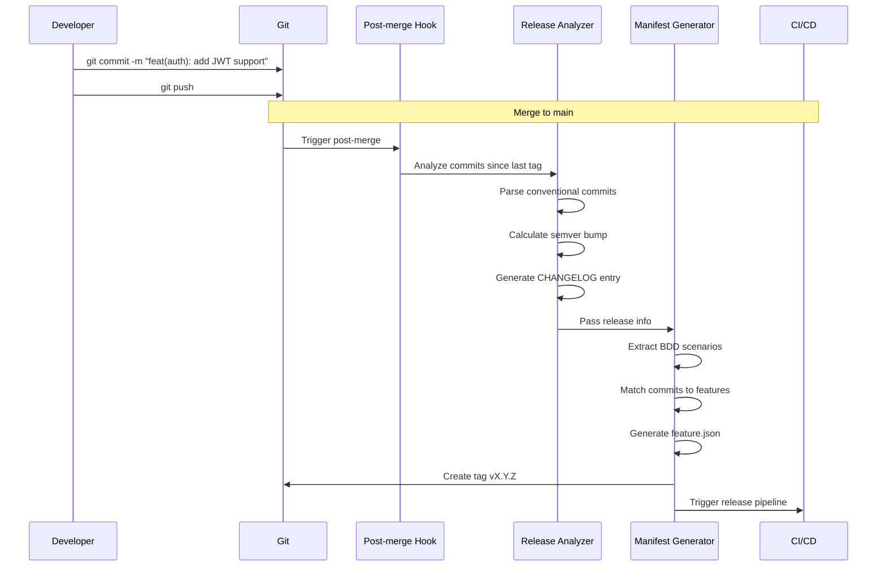
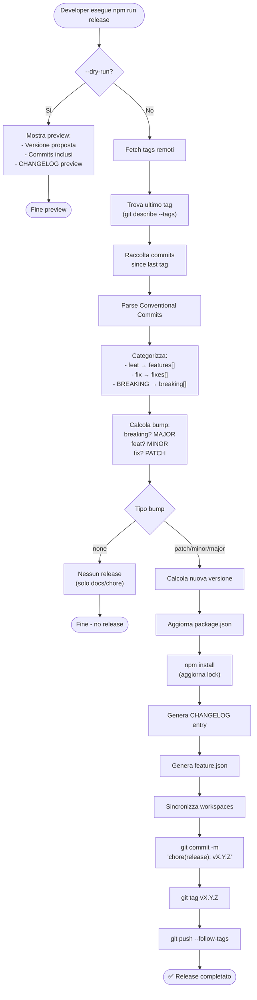
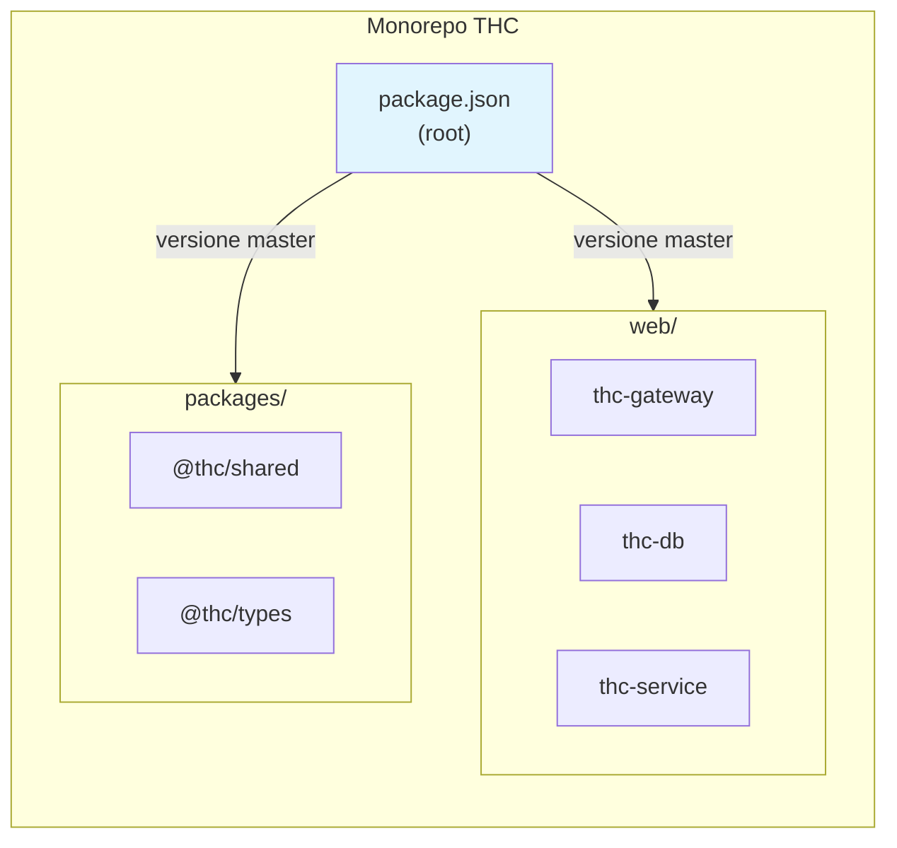
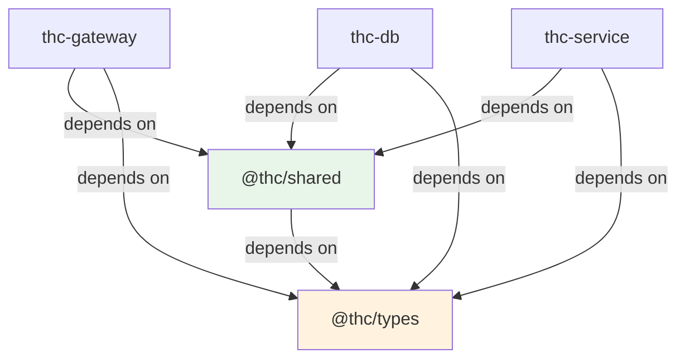
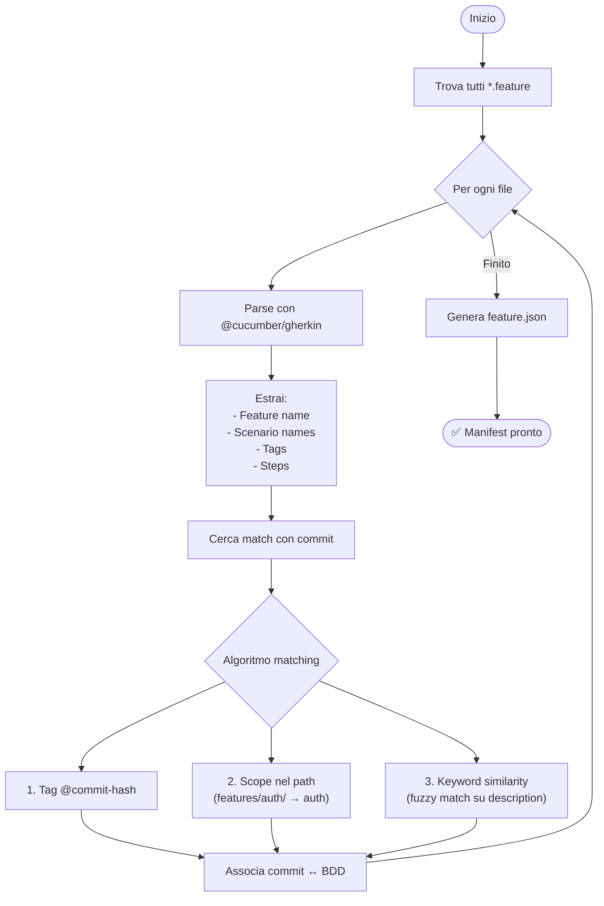
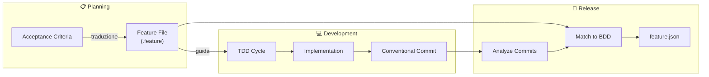
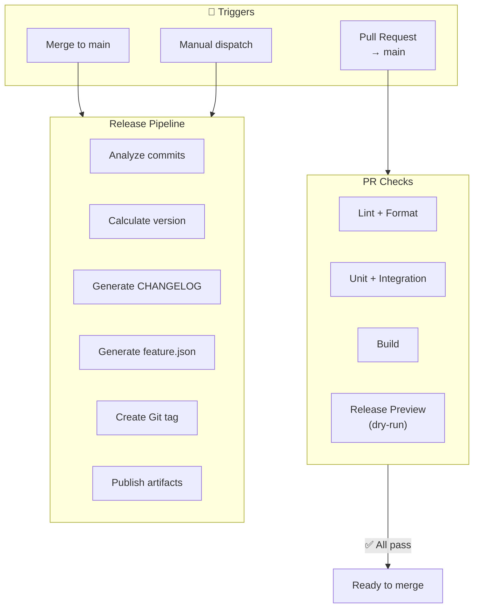
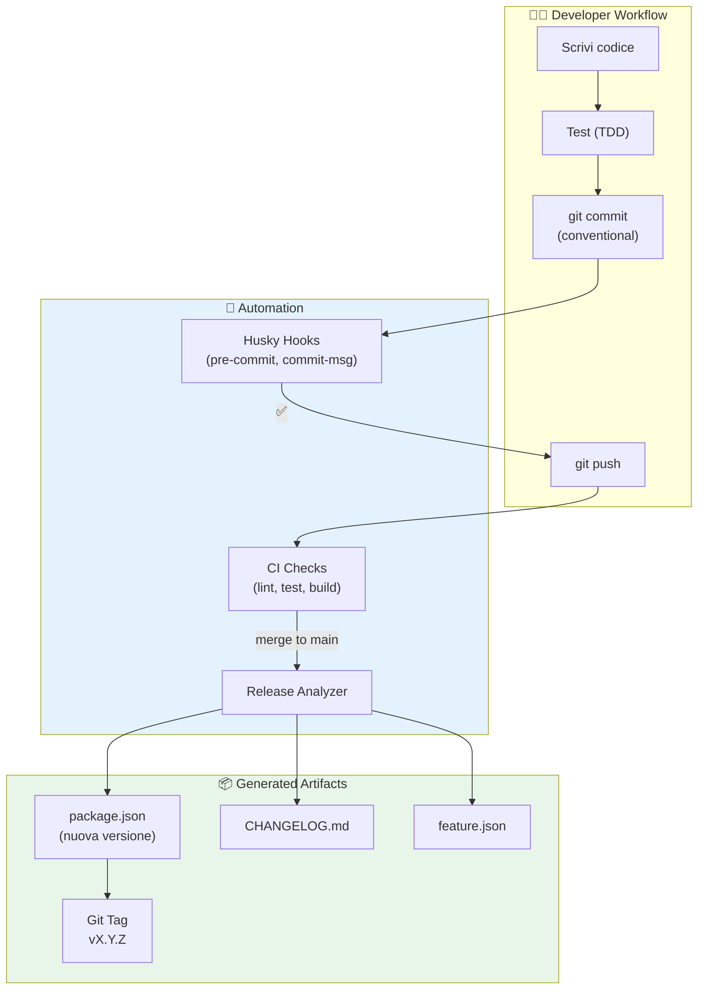

# Guida 09: Versionamento Automatico IaC-Oriented

> **Filosofia**: Il versionamento non è un'operazione manuale, è un **artefatto derivato** dai commit. La versione del software è l'output di una funzione deterministica applicata alla storia Git.

---

## Indice

1. [Principi Fondamentali](#1-principi-fondamentali)
2. [Architettura del Sistema](#2-architettura-del-sistema)
3. [Stack Tecnologico Consigliato](#3-stack-tecnologico-consigliato)
4. [Flusso di Versionamento](#4-flusso-di-versionamento)
5. [Gestione Monorepo con npm Workspaces](#5-gestione-monorepo-con-npm-workspaces)
6. [Generazione Automatica feature.json](#6-generazione-automatica-featurejson)
7. [Integrazione con BDD](#7-integrazione-con-bdd)
8. [Pipeline CI/CD](#8-pipeline-cicd)
9. [Struttura File e Convenzioni](#9-struttura-file-e-convenzioni)
10. [Checklist Implementazione](#10-checklist-implementazione)

---

## 1. Principi Fondamentali

### 1.1 Il Versionamento come Codice

Il versionamento IaC-oriented si basa su tre assiomi fondamentali. Prima di tutto, ogni versione deve essere **riproducibile**: dato lo stesso stato Git, lo script deve sempre produrre la stessa versione. In secondo luogo, il sistema deve essere **deterministico**, nel senso che nessun input umano è richiesto durante il calcolo della versione. Infine, tutto deve essere **tracciabile**: ogni numero di versione deve poter essere ricondotto ai commit che lo hanno generato.

### 1.2 Single Source of Truth

```
┌─────────────────────────────────────────────────────────────┐
│                    FONTE DI VERITÀ                         │
│                                                             │
│   Git History (Conventional Commits)                       │
│              │                                              │
│              ▼                                              │
│   ┌─────────────────────────────────────────┐              │
│   │         Script Deterministico           │              │
│   └─────────────────────────────────────────┘              │
│              │                                              │
│              ├──────────────┬──────────────┐               │
│              ▼              ▼              ▼               │
│      package.json    CHANGELOG.md    feature.json         │
│       (versione)      (storico)      (manifest)           │
│                                                             │
└─────────────────────────────────────────────────────────────┘
```

La storia Git è l'unica fonte di verità. Tutti gli altri artefatti (versione, changelog, manifest) sono **derivati** e possono essere rigenerati in qualsiasi momento.

### 1.3 Semantic Versioning come Contratto

| Tipo Commit | Impatto API | Bump Versione | Esempio |
|-------------|-------------|---------------|---------|
| `fix:` | Nessun cambiamento API | PATCH | 1.0.0 → 1.0.1 |
| `feat:` | Nuova funzionalità retrocompatibile | MINOR | 1.0.0 → 1.1.0 |
| `feat!:` o `BREAKING CHANGE:` | Cambiamento incompatibile | MAJOR | 1.0.0 → 2.0.0 |
| `docs:`, `style:`, `refactor:`, `test:`, `chore:` | Nessuno | Nessuno | - |

---

## 2. Architettura del Sistema

### 2.1 Diagramma dei Componenti



### 2.2 Flusso Dati



---

## 3. Stack Tecnologico Consigliato

### 3.1 Librerie Core (Pronte all'Uso)

| Funzione | Libreria | Motivazione |
|----------|----------|-------------|
| **Parsing Commit** | `conventional-changelog-parser` | Standard de facto, supporta tutti i tipi |
| **Calcolo Versione** | `semver` | Libreria ufficiale semver, battle-tested |
| **Generazione CHANGELOG** | `conventional-changelog` | Integrato con l'ecosistema |
| **Gestione Git** | `simple-git` | API Promise-based, no shell escaping |
| **Parsing Gherkin** | `@cucumber/gherkin` | Parser ufficiale Cucumber |
| **Glob Pattern** | `fast-glob` | Performante per monorepo grandi |
| **Validazione Schema** | `ajv` | Per validare feature.json |

### 3.2 Toolchain Alternativa (All-in-One)

Per chi preferisce una soluzione integrata invece di comporre librerie singole:

| Tool | Descrizione | Pro | Contro |
|------|-------------|-----|--------|
| **semantic-release** | Release automation completa | Zero config, plugin ecosystem | Meno flessibile, opinionated |
| **standard-version** | Versioning + CHANGELOG | Semplice, standalone | Manutenzione rallentata |
| **release-it** | Release toolkit configurabile | Molto flessibile, plugin | Curva apprendimento |
| **changesets** | Pensato per monorepo | Ottimo per workspaces | Workflow diverso |

### 3.3 Matrice Decisionale

```
                    Semplicità
                        ▲
                        │
     semantic-release   │   standard-version
           ●────────────┼────────────●
                        │
    ────────────────────┼──────────────────► Flessibilità
                        │
        changesets      │     release-it
           ●────────────┼────────────●
                        │
                        │
              Script Custom (questa guida)
                        ●
```

**Raccomandazione**: Per questo progetto, dato il requisito di `feature.json` con BDD integration, consiglio un **approccio ibrido**: usare `conventional-changelog` per il parsing e CHANGELOG, ma script custom per il manifest e la sincronizzazione workspaces.

---

## 4. Flusso di Versionamento

### 4.1 Processo Completo



### 4.2 Pseudocodice Algoritmo Core

```
FUNCTION analyzeRelease():
    lastTag ← getLastGitTag() OR "v0.0.0"
    commits ← getCommitsSince(lastTag)
    
    parsed ← []
    FOR EACH commit IN commits:
        match ← REGEX_MATCH(commit.message, CONVENTIONAL_PATTERN)
        IF match:
            parsed.APPEND({
                hash: commit.sha[0:7],
                type: match.type,
                scope: match.scope OR null,
                breaking: match.bang OR contains(commit.body, "BREAKING CHANGE"),
                description: match.description
            })
    
    RETURN {
        lastTag: lastTag,
        commits: parsed,
        features: FILTER(parsed, type = "feat"),
        fixes: FILTER(parsed, type = "fix"),
        breaking: FILTER(parsed, breaking = true),
        suggestedBump: calculateBump(parsed)
    }

FUNCTION calculateBump(commits):
    IF ANY(commits, breaking = true):
        RETURN "major"
    IF ANY(commits, type = "feat"):
        RETURN "minor"
    IF ANY(commits, type = "fix"):
        RETURN "patch"
    RETURN "none"

FUNCTION calculateNextVersion(currentVersion, bumpType):
    [major, minor, patch] ← PARSE_SEMVER(currentVersion)
    
    SWITCH bumpType:
        CASE "major": RETURN FORMAT("{major+1}.0.0")
        CASE "minor": RETURN FORMAT("{major}.{minor+1}.0")
        CASE "patch": RETURN FORMAT("{major}.{minor}.{patch+1}")
        DEFAULT: RETURN currentVersion
```

---

## 5. Gestione Monorepo con npm Workspaces

### 5.1 Strategia di Versionamento



**Modello Scelto: Versione Sincronizzata (Fixed)**

Tutti i package condividono la stessa versione. Questo semplifica la gestione e garantisce coerenza.

### 5.2 Struttura package.json Root

```
{
  workspaces: [
    "web/*",
    "packages/*"
  ],
  
  scripts: {
    "release:analyze"   → Analizza e propone versione
    "release:manifest"  → Genera feature.json
    "release:sync"      → Sincronizza versioni workspaces
    "release"           → Esegue tutto il workflow
  }
}
```

### 5.3 Algoritmo Sincronizzazione Workspaces

```
FUNCTION syncWorkspaceVersions(newVersion):
    workspaces ← GLOB(["web/*/package.json", "packages/*/package.json"])
    
    FOR EACH pkgPath IN workspaces:
        pkg ← READ_JSON(pkgPath)
        pkg.version ← newVersion
        
        // Aggiorna dipendenze interne
        FOR EACH depType IN [dependencies, devDependencies, peerDependencies]:
            IF pkg[depType] EXISTS:
                FOR EACH [name, version] IN pkg[depType]:
                    IF name STARTS_WITH "@thc/" OR "thc-":
                        pkg[depType][name] ← "^{newVersion}"
        
        WRITE_JSON(pkgPath, pkg)
    
    LOG("✅ Sincronizzati {COUNT(workspaces)} packages a v{newVersion}")
```

### 5.4 Dipendenze Interne



Quando si rilascia `v1.3.0`, tutte le dipendenze interne vengono aggiornate a `^1.3.0`.

---

## 6. Generazione Automatica feature.json

### 6.1 Struttura Target

```
{
  "$schema": "./feature.schema.json",
  "version": "1.3.0",
  "releaseDate": "2025-01-15T10:30:00.000Z",
  "previousVersion": "1.2.0",
  
  "summary": {
    "featuresCount": 3,
    "fixesCount": 5,
    "breakingChangesCount": 0
  },
  
  "features": [
    {
      "id": "gateway-a1b2c3d",
      "title": "add circuit breaker for patient-api",
      "scope": "gateway",
      "commit": "a1b2c3d",
      "bdd": {
        "feature": "Circuit Breaker Pattern",
        "scenario": "Service degrades gracefully under load",
        "source": "features/resilience/circuit-breaker.feature"
      }
    }
  ],
  
  "fixes": [...],
  
  "breakingChanges": [
    {
      "description": "Token format changed to JWT",
      "scope": "auth",
      "migrationGuide": "docs/migrations/v2-jwt.md"
    }
  ],
  
  "acceptanceCriteria": [
    {
      "feature": "User Authentication",
      "scenarios": ["Valid credentials", "Invalid credentials", "Token refresh"],
      "status": "implemented",
      "source": "features/auth/login.feature"
    }
  ]
}
```

### 6.2 Algoritmo Estrazione BDD



### 6.3 Pseudocodice Matching

```
FUNCTION matchCommitToBDD(commit, scenarios):
    // Strategia 1: Tag esplicito nel feature file
    FOR EACH scenario IN scenarios:
        IF scenario.tags CONTAINS "@{commit.hash}":
            RETURN scenario
    
    // Strategia 2: Match per scope
    IF commit.scope EXISTS:
        scopeMatches ← FILTER(scenarios, 
            scenario.sourcePath CONTAINS commit.scope)
        IF COUNT(scopeMatches) = 1:
            RETURN scopeMatches[0]
    
    // Strategia 3: Fuzzy match su keywords
    keywords ← TOKENIZE(commit.description)
    bestMatch ← null
    bestScore ← 0
    
    FOR EACH scenario IN scenarios:
        scenarioTokens ← TOKENIZE(scenario.name + scenario.steps)
        score ← JACCARD_SIMILARITY(keywords, scenarioTokens)
        IF score > bestScore AND score > 0.3:
            bestScore ← score
            bestMatch ← scenario
    
    RETURN bestMatch  // può essere null
```

### 6.4 Schema JSON per Validazione

Lo schema `feature.schema.json` garantisce che il manifest sia sempre valido:

```
{
  "$schema": "http://json-schema.org/draft-07/schema#",
  "type": "object",
  "required": ["version", "releaseDate", "features", "fixes"],
  
  "properties": {
    "version": {
      "type": "string",
      "pattern": "^\\d+\\.\\d+\\.\\d+$"
    },
    "features": {
      "type": "array",
      "items": {
        "type": "object",
        "required": ["id", "title", "commit"],
        "properties": {
          "bdd": {
            "type": "object",
            "properties": {
              "feature": { "type": "string" },
              "scenario": { "type": "string" },
              "source": { "type": "string" }
            }
          }
        }
      }
    }
  }
}
```

---

## 7. Integrazione con BDD

### 7.1 Flusso Completo AC → BDD → Release



### 7.2 Convenzione Tagging nei Feature Files

Per facilitare il matching automatico, i feature file possono includere tag di riferimento:

```gherkin
@epic-001 @story-1.2
Feature: Commit Validation
  Come sviluppatore
  Voglio che i miei commit siano validati
  Per mantenere una storia Git pulita

  @task-1.2.1 @implemented
  Scenario: Commit con formato valido
    Given un messaggio "feat(auth): add login"
    When il commit viene creato
    Then il commit deve essere accettato

  @task-1.2.2 @pending
  Scenario: Commit con formato invalido
    Given un messaggio "fixed stuff"
    When il commit viene creato
    Then il commit deve essere rifiutato
```

### 7.3 Mappatura Automatica

```
┌──────────────────────────────────────────────────────────────┐
│                    MAPPATURA AUTOMATICA                      │
├──────────────────────────────────────────────────────────────┤
│                                                              │
│  Commit: feat(auth): add JWT token validation                │
│           │     │                                            │
│           │     └──────► Cerca in: features/auth/*.feature   │
│           │                                                  │
│           └────────────► Keywords: "JWT", "token", "valid"   │
│                                    ↓                         │
│                          Fuzzy match su Scenario names       │
│                                    ↓                         │
│                          Match: "JWT token is validated"     │
│                                                              │
└──────────────────────────────────────────────────────────────┘
```

---

## 8. Pipeline CI/CD

### 8.1 Trigger e Fasi



### 8.2 Strategia di Release

| Evento | Azione | Versione |
|--------|--------|----------|
| PR aperta | Preview release (dry-run) | Proposta |
| Merge to main | Auto-release | Effettiva |
| Tag manuale | Skip automation | Come da tag |
| Hotfix branch | Patch release | x.y.Z+1 |

### 8.3 Workflow GitHub Actions (Schema)

```
name: Release

on:
  push:
    branches: [main]
  workflow_dispatch:
    inputs:
      dry_run:
        type: boolean
        default: false

jobs:
  release:
    steps:
      1. Checkout (fetch-depth: 0 per storia completa)
      2. Setup Node.js
      3. Install dependencies
      4. Run tests
      5. Analyze commits
      6. IF dry_run: mostra preview e termina
      7. Calculate new version
      8. Update package.json files
      9. Generate CHANGELOG
      10. Generate feature.json
      11. Sync workspace versions
      12. Commit changes
      13. Create and push tag
      14. Create GitHub Release
      15. Upload artifacts (feature.json, CHANGELOG)
```

---

## 9. Struttura File e Convenzioni

### 9.1 Albero Directory

```
thc-app/
├── .github/
│   └── workflows/
│       └── release.yml              # CI/CD pipeline
│
├── scripts/
│   ├── release/
│   │   ├── analyze.js               # Analisi commit
│   │   ├── version.js               # Calcolo versione
│   │   ├── changelog.js             # Generazione CHANGELOG
│   │   ├── manifest.js              # Generazione feature.json
│   │   ├── sync-workspaces.js       # Sincronizzazione versioni
│   │   └── index.js                 # Orchestratore
│   │
│   └── bdd/
│       └── extract-scenarios.js     # Parser Gherkin
│
├── features/                         # BDD scenarios
│   ├── auth/
│   │   └── login.feature
│   ├── gateway/
│   │   └── circuit-breaker.feature
│   └── ...
│
├── schemas/
│   └── feature.schema.json          # JSON Schema validazione
│
├── web/                              # Workspaces
│   ├── thc-gateway/
│   ├── thc-db/
│   └── ...
│
├── packages/
│   ├── @thc/shared/
│   └── @thc/types/
│
├── CHANGELOG.md                      # Generato automaticamente
├── feature.json                      # Manifest release (gitignored in dev)
└── package.json                      # Root con workspaces
```

### 9.2 Convenzioni di Naming

| Tipo | Pattern | Esempio |
|------|---------|---------|
| Tag Git | `v{MAJOR}.{MINOR}.{PATCH}` | `v1.3.0` |
| Branch release | `release/v{VERSION}` | `release/v1.3.0` |
| Branch hotfix | `hotfix/v{VERSION}` | `hotfix/v1.2.1` |
| Commit release | `chore(release): v{VERSION}` | `chore(release): v1.3.0` |
| Feature ID | `{scope}-{short-hash}` | `gateway-a1b2c3d` |

### 9.3 File Generati vs Committed

| File | Stato | Motivazione |
|------|-------|-------------|
| `CHANGELOG.md` | ✅ Committed | Storico permanente |
| `package.json` (versione) | ✅ Committed | Necessario per npm |
| `package-lock.json` | ✅ Committed | Riproducibilità |
| `feature.json` | ⚠️ Committed solo in release | Artefatto di release |
| `.release-info.json` | ❌ Gitignored | Cache temporanea |

---

## 10. Checklist Implementazione

### 10.1 Fase 1: Setup Base (Sprint 1)

| Task | Descrizione | Libreria/Tool |
|:----:|-------------|---------------|
| ☐ | Installare dipendenze release | `semver`, `simple-git`, `conventional-changelog-parser` |
| ☐ | Creare script `scripts/release/analyze.js` | - |
| ☐ | Creare script `scripts/release/version.js` | - |
| ☐ | Aggiungere npm script `release:analyze` | - |
| ☐ | Testare con `--dry-run` su commit esistenti | - |

### 10.2 Fase 2: CHANGELOG e Tag (Sprint 1)

| Task | Descrizione | Libreria/Tool |
|:----:|-------------|---------------|
| ☐ | Creare script `scripts/release/changelog.js` | `conventional-changelog` |
| ☐ | Configurare template CHANGELOG | - |
| ☐ | Implementare creazione tag Git | `simple-git` |
| ☐ | Aggiungere npm script `release` | - |
| ☐ | Testare ciclo completo (analyze → tag) | - |

### 10.3 Fase 3: Workspaces Sync (Sprint 2)

| Task | Descrizione | Libreria/Tool |
|:----:|-------------|---------------|
| ☐ | Creare script `scripts/release/sync-workspaces.js` | `fast-glob` |
| ☐ | Implementare aggiornamento dipendenze interne | - |
| ☐ | Testare con monorepo esistente | - |
| ☐ | Aggiungere npm script `release:sync` | - |

### 10.4 Fase 4: Feature Manifest (Sprint 2)

| Task | Descrizione | Libreria/Tool |
|:----:|-------------|---------------|
| ☐ | Creare script `scripts/bdd/extract-scenarios.js` | `@cucumber/gherkin` |
| ☐ | Creare script `scripts/release/manifest.js` | - |
| ☐ | Definire `schemas/feature.schema.json` | `ajv` |
| ☐ | Implementare algoritmo matching commit↔BDD | - |
| ☐ | Aggiungere npm script `release:manifest` | - |

### 10.5 Fase 5: CI/CD Integration (Sprint 3)

| Task | Descrizione | Libreria/Tool |
|:----:|-------------|---------------|
| ☐ | Creare `.github/workflows/release.yml` | GitHub Actions |
| ☐ | Configurare trigger su merge to main | - |
| ☐ | Aggiungere preview in PR | - |
| ☐ | Configurare GitHub Release automatico | - |
| ☐ | Testare pipeline end-to-end | - |

---

## Diagramma Riassuntivo Finale



---

## Riferimenti

| Risorsa | URL/Path |
|---------|----------|
| Conventional Commits | https://www.conventionalcommits.org/ |
| Semantic Versioning | https://semver.org/ |
| npm Workspaces | https://docs.npmjs.com/cli/using-npm/workspaces |
| Gherkin Reference | https://cucumber.io/docs/gherkin/reference/ |
| Guide Progetto | `docs/guides/DEVELOPMENT_PRATICAL_GUIDE.md` |
| Roadmap BDD Tasks | `ROADMAP.md` → Story 2.2 |

---

**Creato**: 2025-12-13  
**Autore**: AI Assistant  
**Stato**: Draft per revisione  
**Prossima revisione**: Fine Sprint 2
