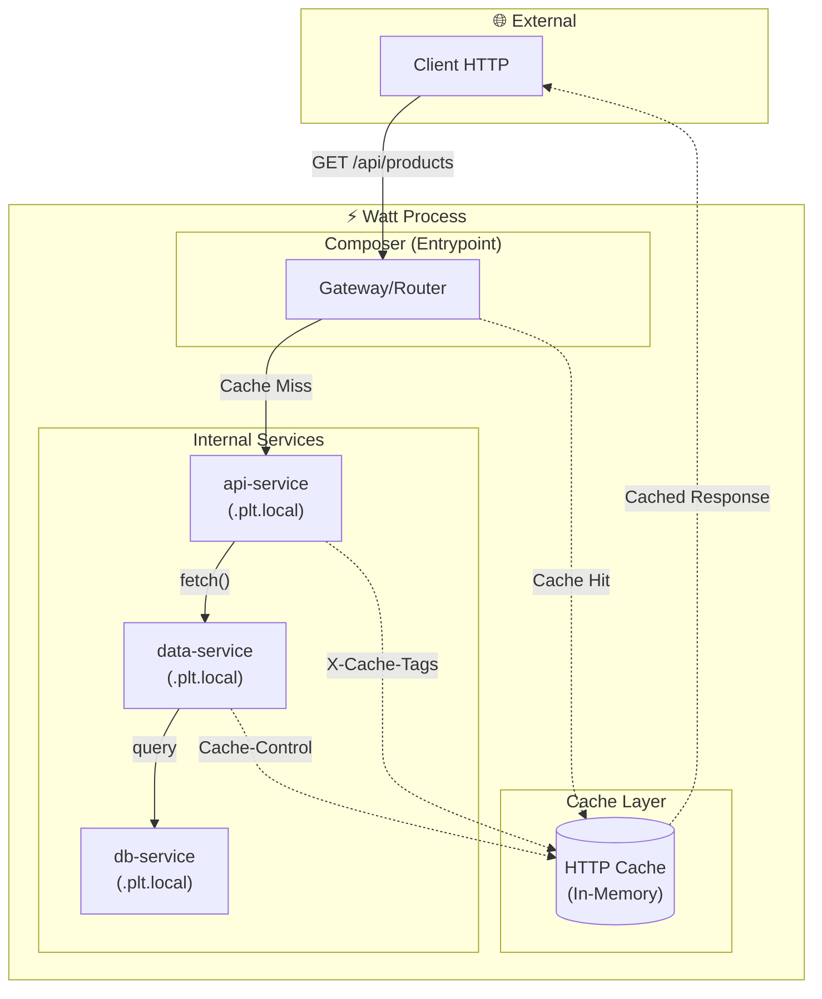
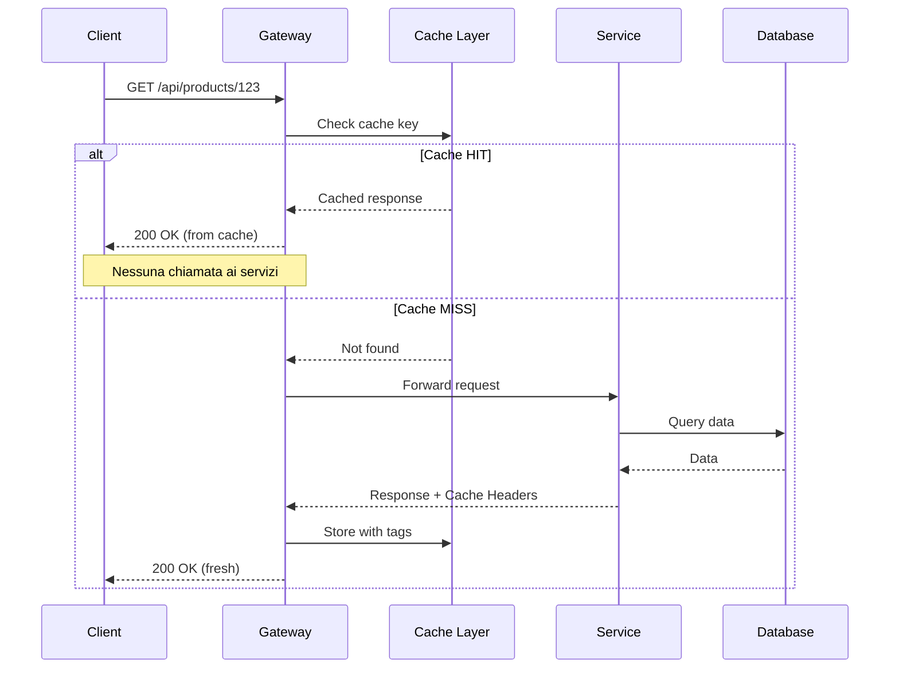
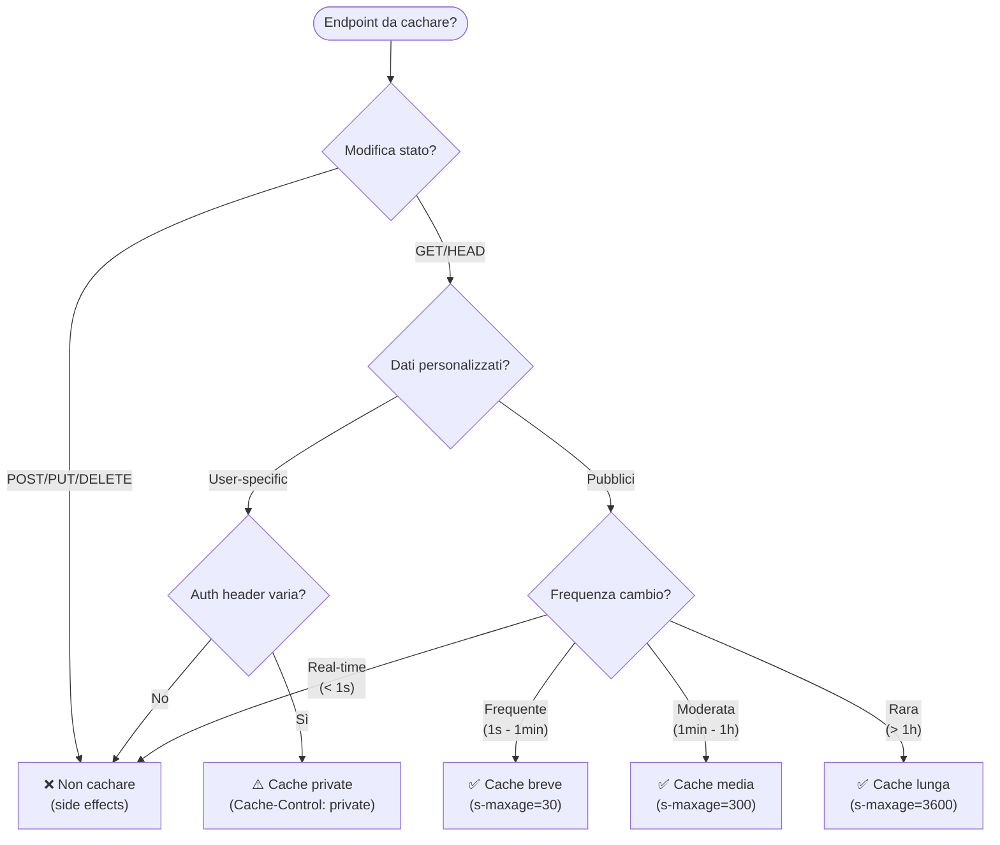
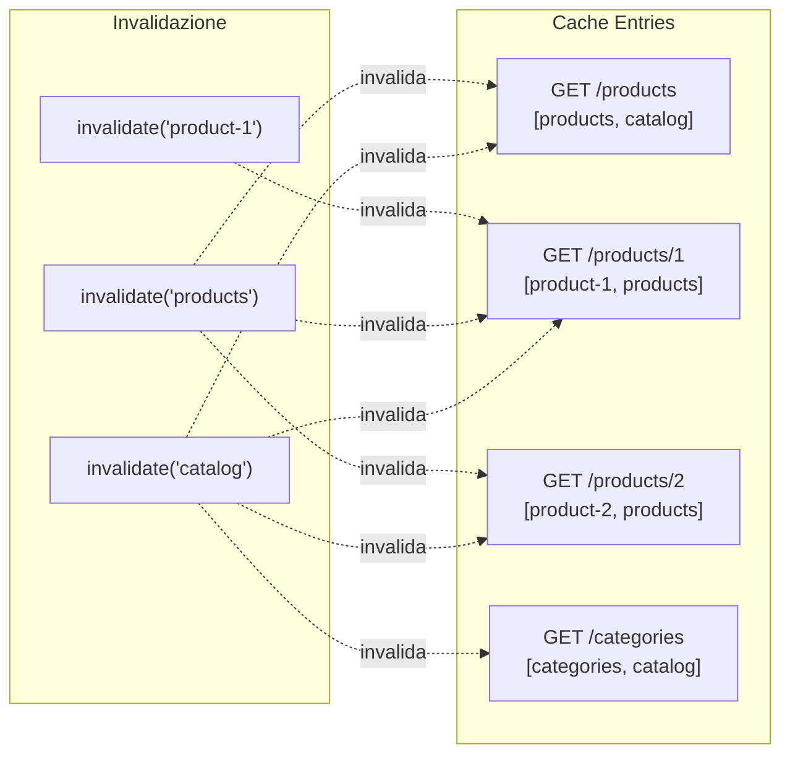
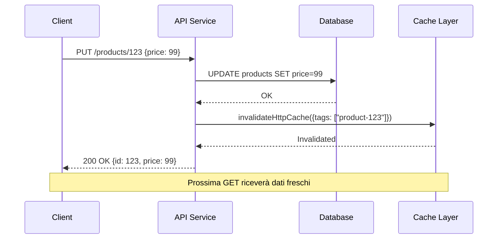
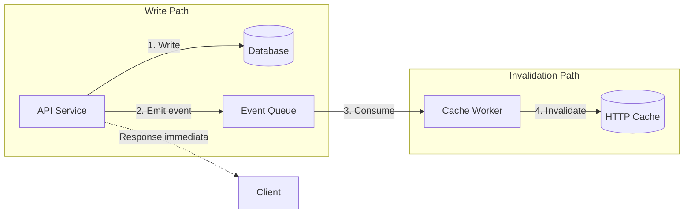
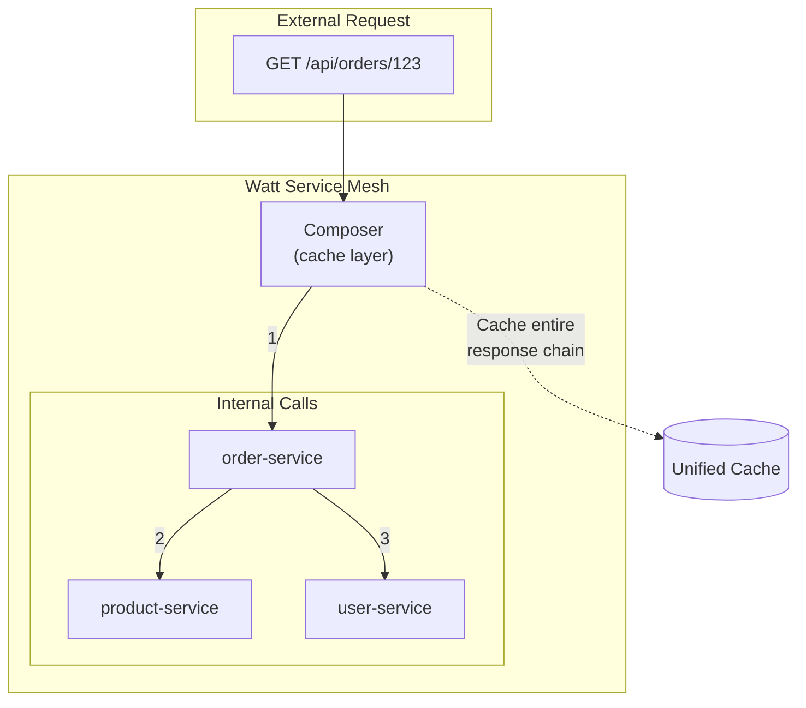
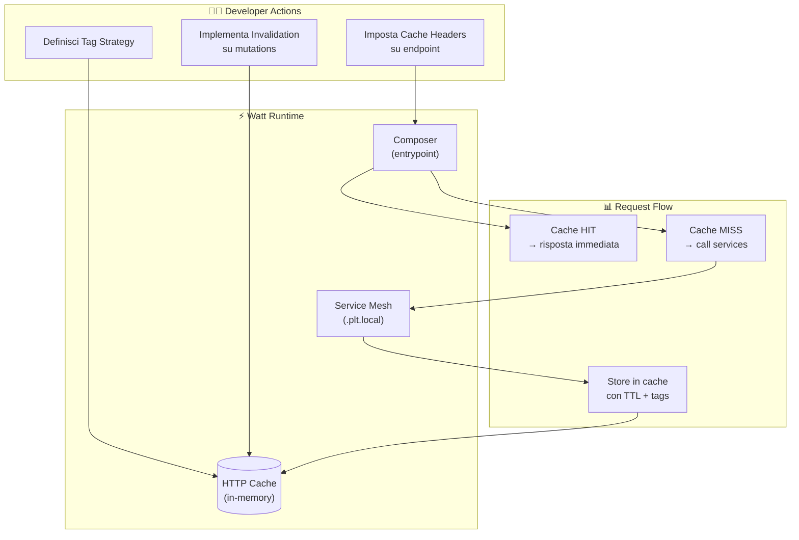

# Guida 10: HTTP Caching con Platformatic Watt

> **Filosofia**: Il caching non è un'ottimizzazione opzionale, è una **decisione architetturale** che influenza la scalabilità, la consistenza dei dati e l'esperienza utente. Watt implementa un caching **client-side unificato** che opera a livello HTTP, rendendo trasparente la cache attraverso l'intero service mesh.

---

## Indice

1. [Principi del Caching in Watt](#1-principi-del-caching-in-watt)
2. [Architettura del Sistema di Cache](#2-architettura-del-sistema-di-cache)
3. [Modello Decisionale: Quando Cachare](#3-modello-decisionale-quando-cachare)
4. [Pattern di Cache Headers](#4-pattern-di-cache-headers)
5. [Tag-Based Invalidation](#5-tag-based-invalidation)
6. [Flussi di Invalidazione](#6-flussi-di-invalidazione)
7. [Integrazione con Service Mesh](#7-integrazione-con-service-mesh)
8. [Configurazione Watt](#8-configurazione-watt)
9. [Anti-Pattern da Evitare](#9-anti-pattern-da-evitare)
10. [Checklist Implementazione](#10-checklist-implementazione)

---

## 1. Principi del Caching in Watt

### 1.1 Il Modello Client-Based

Watt implementa un **caching HTTP client-based** che differisce dai tradizionali cache server-side come Redis o Memcached. Il principio fondamentale è che la cache vive all'interno del processo Watt stesso, eliminando la latenza di rete verso servizi esterni.

```
┌─────────────────────────────────────────────────────────────┐
│                CONFRONTO MODELLI DI CACHE                   │
├─────────────────────────────────────────────────────────────┤
│                                                             │
│  TRADIZIONALE (Server-Side)          WATT (Client-Based)   │
│  ─────────────────────────          ───────────────────     │
│                                                             │
│  Client → Server → Redis → DB        Client → Watt Cache   │
│              ↑                                    ↓         │
│         Latenza rete                     In-Process         │
│         Single Point of Failure          Zero Network       │
│         Scaling separato                 Unified Layer      │
│                                                             │
└─────────────────────────────────────────────────────────────┘
```

### 1.2 Vantaggi Chiave

Il caching di Watt offre diversi vantaggi architetturali che lo distinguono dalle soluzioni tradizionali.

Il primo vantaggio è l'**assenza di dipendenze esterne**: non serve Redis, Memcached o altri servizi. Questo semplifica il deployment e riduce i punti di failure.

Il secondo vantaggio riguarda le **zero network calls**: le cache hit non attraversano mai lo stack di rete, anche per chiamate inter-servizio all'interno del mesh.

Il terzo vantaggio è la **propagazione automatica degli header**: quando il Service A chiama il Service B, gli header di cache del Service B vengono automaticamente propagati attraverso l'intera catena di richieste.

Infine, c'è l'**invalidazione unificata**: un singolo comando può invalidare cache entries attraverso tutti i servizi del mesh.

### 1.3 Trade-off da Considerare

Come ogni decisione architetturale, il caching client-based ha dei trade-off che vanno compresi.

```
┌────────────────────────────────────────────────────────────┐
│                    TRADE-OFF MATRIX                        │
├────────────────────────────────────────────────────────────┤
│                                                            │
│  ASPETTO           │ PRO                │ CONTRO           │
│  ─────────────────────────────────────────────────────     │
│  Memoria           │ Gestita da Watt    │ Limita RAM host  │
│  Persistenza       │ -                  │ Cache volatile   │
│  Scaling           │ Zero config        │ No shared cache  │
│  Consistenza       │ Forte per istanza  │ Eventuale tra    │
│                    │                    │ istanze multiple │
│  Complessità       │ Minima             │ -                │
│                                                            │
└────────────────────────────────────────────────────────────┘
```

**Implicazione pratica**: Se hai multiple istanze Watt in un cluster, ogni istanza ha la propria cache. L'invalidazione deve raggiungere tutte le istanze.

---

## 2. Architettura del Sistema di Cache

### 2.1 Posizionamento nel Service Mesh



### 2.2 Flusso di una Richiesta Cached

Il ciclo di vita di una richiesta attraverso il sistema di cache segue un percorso ben definito che possiamo rappresentare come una sequenza di decisioni e azioni.



### 2.3 Anatomia di una Cache Entry

Ogni entry nella cache è identificata da una combinazione di elementi che formano la **cache key**.

```
┌─────────────────────────────────────────────────────────────┐
│                     CACHE ENTRY STRUCTURE                   │
├─────────────────────────────────────────────────────────────┤
│                                                             │
│  CACHE KEY (identificatore univoco)                        │
│  ─────────────────────────────────                         │
│  {                                                         │
│    origin: "http://composer.plt.local",                    │
│    path: "/api/products/123",                              │
│    method: "GET",                                          │
│    vary: ["Accept", "Accept-Language"]  // se presente     │
│  }                                                         │
│                                                             │
│  CACHE VALUE                                                │
│  ───────────                                               │
│  {                                                         │
│    statusCode: 200,                                        │
│    headers: { ... },                                       │
│    body: Buffer<...>,                                      │
│    tags: ["product-123", "products", "catalog"],           │
│    ttl: 300,  // secondi rimanenti                         │
│    createdAt: 1705312800000                                │
│  }                                                         │
│                                                             │
└─────────────────────────────────────────────────────────────┘
```

---

## 3. Modello Decisionale: Quando Cachare

### 3.1 Albero Decisionale

Non tutte le risposte dovrebbero essere cached. Usa questo albero per decidere.



### 3.2 Matrice TTL per Tipo di Risorsa

La scelta del Time-To-Live dipende dalla natura dei dati e dal contesto applicativo.

| Tipo Risorsa | TTL Suggerito | Rationale |
|--------------|---------------|-----------|
| **Configurazioni statiche** | 3600s (1h) | Cambiano raramente, invalidazione manuale |
| **Catalogo prodotti** | 300s (5min) | Aggiornamenti periodici, tolleranza stale |
| **Profilo utente** | 60s (1min) | Cambiamenti moderati, privacy |
| **Dashboard metriche** | 30s | Refresh frequente, aggregazioni costose |
| **Search results** | 60s | Query costose, risultati semi-stabili |
| **Health check** | 0s | Mai cachare, deve essere real-time |
| **Auth tokens** | 0s | Mai cachare, security critical |

### 3.3 Pseudocodice Decisionale

```
FUNCTION shouldCache(request, response):
    // Rule 1: Solo metodi safe
    IF request.method NOT IN ["GET", "HEAD"]:
        RETURN { cache: false, reason: "unsafe method" }
    
    // Rule 2: Status code cacheable
    IF response.status NOT IN [200, 203, 204, 206, 300, 301, 404, 410]:
        RETURN { cache: false, reason: "non-cacheable status" }
    
    // Rule 3: Rispetta Cache-Control esplicito
    IF response.headers["Cache-Control"] CONTAINS "no-store":
        RETURN { cache: false, reason: "explicit no-store" }
    
    // Rule 4: Verifica presenza TTL
    IF NOT hasTTL(response.headers):
        RETURN { cache: false, reason: "no TTL specified" }
    
    // Rule 5: Estrai TTL e tags
    ttl ← extractTTL(response.headers["Cache-Control"])
    tags ← parseTagHeader(response.headers["X-Cache-Tags"])
    
    RETURN {
        cache: true,
        ttl: ttl,
        tags: tags,
        key: buildCacheKey(request)
    }

FUNCTION hasTTL(headers):
    RETURN headers["Cache-Control"] MATCHES /s-maxage=\d+/
        OR headers["Cache-Control"] MATCHES /max-age=\d+/
```

---

## 4. Pattern di Cache Headers

### 4.1 Header Essenziali

Watt utilizza header HTTP standard più un header custom per i tag.

```
┌─────────────────────────────────────────────────────────────┐
│                    CACHE HEADERS REFERENCE                  │
├─────────────────────────────────────────────────────────────┤
│                                                             │
│  HEADER               │ SCOPO              │ ESEMPIO        │
│  ─────────────────────────────────────────────────────────  │
│  Cache-Control        │ Direttive cache    │ public,        │
│                       │                    │ s-maxage=300   │
│  ─────────────────────────────────────────────────────────  │
│  X-Cache-Tags         │ Tag invalidazione  │ product-123,   │
│  (custom Watt)        │                    │ products       │
│  ─────────────────────────────────────────────────────────  │
│  Vary                 │ Varianti cache     │ Accept,        │
│                       │ per header         │ Accept-Encoding│
│  ─────────────────────────────────────────────────────────  │
│  ETag                 │ Validazione        │ "abc123"       │
│                       │ condizionale       │                │
│                                                             │
└─────────────────────────────────────────────────────────────┘
```

### 4.2 Direttive Cache-Control

Le direttive `Cache-Control` controllano il comportamento della cache a vari livelli.

| Direttiva | Significato | Uso in Watt |
|-----------|-------------|-------------|
| `public` | Cacheable da qualsiasi cache | ✅ Default per API pubbliche |
| `private` | Solo cache del browser | ⚠️ Dati user-specific |
| `s-maxage=N` | TTL per shared cache (proxy) | ✅ **Preferito in Watt** |
| `max-age=N` | TTL per tutte le cache | ⚠️ Meno controllo |
| `no-cache` | Valida sempre prima di usare | ⚠️ Performance hit |
| `no-store` | Mai memorizzare | ✅ Dati sensibili |
| `must-revalidate` | Dopo TTL, deve revalidare | ⚠️ Raramente necessario |

**Best Practice**: Usa sempre `s-maxage` invece di `max-age` per avere controllo preciso sulla shared cache di Watt, lasciando al browser la libertà di gestire la propria cache.

### 4.3 Strategia di Tagging

I tag permettono invalidazione granulare. Una buona strategia di tagging segue una gerarchia.

```
┌─────────────────────────────────────────────────────────────┐
│                    TAGGING HIERARCHY                        │
├─────────────────────────────────────────────────────────────┤
│                                                             │
│  Livello 1: ENTITÀ SPECIFICA                               │
│  └── product-{id}, user-{id}, order-{id}                   │
│      Invalida: singola risorsa                             │
│                                                             │
│  Livello 2: COLLEZIONE                                      │
│  └── products, users, orders                               │
│      Invalida: tutte le risorse del tipo                   │
│                                                             │
│  Livello 3: DOMINIO                                         │
│  └── catalog, auth, checkout                               │
│      Invalida: intero bounded context                      │
│                                                             │
│  Livello 4: GLOBALE                                         │
│  └── all-cache (usare con cautela!)                        │
│      Invalida: tutto                                        │
│                                                             │
│  ESEMPIO COMPOSIZIONE:                                      │
│  X-Cache-Tags: product-123, products, catalog              │
│                                                             │
└─────────────────────────────────────────────────────────────┘
```

### 4.4 Pattern per Endpoint Comuni

```
ENDPOINT: GET /api/products
HEADERS:
    Cache-Control: public, s-maxage=300
    X-Cache-Tags: products, catalog
RATIONALE: Lista prodotti, refresh ogni 5 minuti

ENDPOINT: GET /api/products/{id}
HEADERS:
    Cache-Control: public, s-maxage=600
    X-Cache-Tags: product-{id}, products, catalog
RATIONALE: Singolo prodotto, più stabile, 10 minuti

ENDPOINT: GET /api/users/{id}/profile
HEADERS:
    Cache-Control: private, s-maxage=60
    X-Cache-Tags: user-{id}
RATIONALE: Dati personali, cache privata, 1 minuto

ENDPOINT: GET /api/health
HEADERS:
    Cache-Control: no-store
RATIONALE: Mai cachare health checks

ENDPOINT: GET /api/config
HEADERS:
    Cache-Control: public, s-maxage=3600
    X-Cache-Tags: config, system
RATIONALE: Configurazioni stabili, 1 ora
```

---

## 5. Tag-Based Invalidation

### 5.1 Concetto Fondamentale

L'invalidazione basata su tag permette di invalidare gruppi di cache entries senza conoscere le exact URL. Questo risolve il problema classico del "cache invalidation is hard".



### 5.2 API di Invalidazione

Watt espone l'invalidazione attraverso l'oggetto globale `platformatic`.

```
┌─────────────────────────────────────────────────────────────┐
│              INVALIDATION API REFERENCE                     │
├─────────────────────────────────────────────────────────────┤
│                                                             │
│  METODO: globalThis.platformatic.invalidateHttpCache()     │
│                                                             │
│  OPZIONE 1: Invalidazione per TAGS                         │
│  ─────────────────────────────────                         │
│  {                                                         │
│    tags: ["product-123", "products"]                       │
│  }                                                         │
│  → Invalida tutte le entries con ALMENO UNO dei tag       │
│                                                             │
│  OPZIONE 2: Invalidazione per KEYS                         │
│  ─────────────────────────────────                         │
│  {                                                         │
│    keys: [                                                 │
│      {                                                     │
│        origin: "http://composer.plt.local",                │
│        path: "/api/products/123",                          │
│        method: "GET"                                       │
│      }                                                     │
│    ]                                                       │
│  }                                                         │
│  → Invalida entries esatte (match completo)               │
│                                                             │
│  OPZIONE 3: Combinata                                      │
│  ───────────────────                                       │
│  {                                                         │
│    tags: ["products"],                                     │
│    keys: [{ origin: "...", path: "...", method: "..." }]  │
│  }                                                         │
│  → Invalida sia per tag che per key                       │
│                                                             │
└─────────────────────────────────────────────────────────────┘
```

### 5.3 Pseudocodice Pattern di Invalidazione

```
// Pattern 1: Invalidazione dopo CREATE
FUNCTION onProductCreated(newProduct):
    // Nuovo prodotto → invalida lista prodotti
    invalidateHttpCache({
        tags: ["products", "catalog"]
    })
    // La singola entry verrà cachata al primo GET

// Pattern 2: Invalidazione dopo UPDATE
FUNCTION onProductUpdated(productId, updatedData):
    // Prodotto modificato → invalida specifico + lista
    invalidateHttpCache({
        tags: [
            "product-{productId}",  // entry specifica
            "products"               // lista potrebbe essere cambiata
        ]
    })

// Pattern 3: Invalidazione dopo DELETE
FUNCTION onProductDeleted(productId):
    // Prodotto eliminato → invalida specifico + lista + relazioni
    invalidateHttpCache({
        tags: [
            "product-{productId}",
            "products",
            "catalog",
            "category-{product.categoryId}"  // se era in una categoria
        ]
    })

// Pattern 4: Invalidazione bulk
FUNCTION onBulkPriceUpdate(productIds):
    // Aggiornamento massivo → invalida tutto il catalogo
    invalidateHttpCache({
        tags: ["catalog"]  // più efficiente di N invalidazioni singole
    })
```

---

## 6. Flussi di Invalidazione

### 6.1 Invalidazione Sincrona (In-Request)

Questo pattern invalida la cache come parte della stessa transazione che modifica i dati.



**Pro**: Consistenza forte, il client che ha fatto la modifica vede subito i dati aggiornati.

**Contro**: Latenza aggiunta alla richiesta di modifica.

### 6.2 Invalidazione Asincrona (Event-Driven)

Per sistemi ad alto throughput, l'invalidazione può essere gestita tramite eventi.



**Pro**: Latenza minima per le scritture, scalabile.

**Contro**: Eventuale consistenza, finestra di stale data.

### 6.3 Pattern Write-Through Cache

In alcuni casi, può essere utile aggiornare la cache invece di invalidarla.

```
FUNCTION updateProductWithCacheRefresh(productId, newData):
    // 1. Aggiorna database
    updatedProduct ← database.update("products", productId, newData)
    
    // 2. Invalida vecchia entry
    invalidateHttpCache({ tags: ["product-{productId}"] })
    
    // 3. Pre-warm cache con GET interno
    // (opzionale, per endpoint critici)
    fetch("http://api.plt.local/products/{productId}")
    
    RETURN updatedProduct
```

---

## 7. Integrazione con Service Mesh

### 7.1 Caching Cross-Service

Quando i servizi comunicano attraverso il mesh interno, la cache opera a livello del Composer (entrypoint).



**Punto chiave**: La cache entry contiene la risposta completa, inclusi i dati aggregati da tutti i servizi interni. Non c'è caching a livello di singolo servizio interno.

### 7.2 Header Propagation

Gli header di cache impostati dai servizi interni vengono propagati verso l'alto.

```
┌─────────────────────────────────────────────────────────────┐
│                  HEADER PROPAGATION FLOW                    │
├─────────────────────────────────────────────────────────────┤
│                                                             │
│  data-service risponde:                                    │
│  ┌─────────────────────────────────────────────────────┐   │
│  │ Cache-Control: public, s-maxage=300                 │   │
│  │ X-Cache-Tags: product-123, products                 │   │
│  └─────────────────────────────────────────────────────┘   │
│                         │                                   │
│                         ▼                                   │
│  api-service processa e passa al Composer:                 │
│  ┌─────────────────────────────────────────────────────┐   │
│  │ Cache-Control: public, s-maxage=300  (preservato)   │   │
│  │ X-Cache-Tags: product-123, products  (preservato)   │   │
│  │ + eventuali header aggiuntivi dal servizio          │   │
│  └─────────────────────────────────────────────────────┘   │
│                         │                                   │
│                         ▼                                   │
│  Composer cacha con TTL=300 e tags=[product-123, products] │
│                                                             │
└─────────────────────────────────────────────────────────────┘
```

### 7.3 Strategia per Catene Complesse

Quando un endpoint aggrega dati da più servizi con TTL diversi, applica il TTL **più breve**.

```
FUNCTION calculateAggregatedTTL(serviceResponses):
    minTTL ← INFINITY
    allTags ← []
    
    FOR EACH response IN serviceResponses:
        ttl ← extractTTL(response.headers["Cache-Control"])
        tags ← parseTags(response.headers["X-Cache-Tags"])
        
        minTTL ← MIN(minTTL, ttl)
        allTags ← CONCAT(allTags, tags)
    
    RETURN {
        ttl: minTTL,
        tags: UNIQUE(allTags)
    }
```

---

## 8. Configurazione Watt

### 8.1 Struttura watt.json

La configurazione del caching avviene nel file `watt.json` di root.

```
{
  "$schema": "https://schemas.platformatic.dev/wattpm/3.0.0.json",
  
  "httpCache": {
    "cacheTagsHeader": "X-Cache-Tags"
  },
  
  "server": {
    "hostname": "0.0.0.0",
    "port": "{PLT_SERVER_PORT}"
  },
  
  "autoload": {
    "path": "web"
  },
  
  "entrypoint": "composer"
}
```

### 8.2 Opzioni di Configurazione

| Opzione | Tipo | Default | Descrizione |
|---------|------|---------|-------------|
| `httpCache` | object | `undefined` | Abilita il caching se presente |
| `httpCache.cacheTagsHeader` | string | `"X-Cache-Tags"` | Nome header per i tag |

**Nota**: La sola presenza di `httpCache: {}` abilita il caching con defaults.

### 8.3 Configurazione Composer

Il Composer definisce come le richieste vengono ruotate ai servizi.

```
// web/composer/watt.json
{
  "$schema": "https://schemas.platformatic.dev/@platformatic/composer/3.0.0.json",
  "composer": {
    "services": [
      {
        "id": "api",
        "prefix": "/api"
      },
      {
        "id": "data-service",
        "prefix": "/data"
      }
    ]
  }
}
```

### 8.4 Architettura Directory Consigliata

```
thc-app/
├── watt.json                      # Config root con httpCache
├── .env
│
└── web/
    ├── composer/                  # Entrypoint + routing
    │   └── watt.json
    │
    ├── thc-gateway/               # API pubblica
    │   ├── watt.json
    │   └── routes/
    │       ├── products.js        # Cache headers qui
    │       └── admin.js           # Invalidation endpoints
    │
    ├── thc-service/               # Business logic
    │   ├── watt.json
    │   └── routes/
    │
    └── thc-db/                    # Database service
        └── watt.json
```

---

## 9. Anti-Pattern da Evitare

### 9.1 Cache Everything

```
┌─────────────────────────────────────────────────────────────┐
│  ❌ ANTI-PATTERN: Cache Ovunque                            │
├─────────────────────────────────────────────────────────────┤
│                                                             │
│  // NON FARE QUESTO                                        │
│  app.use((req, res, next) => {                             │
│    res.setHeader('Cache-Control', 'public, s-maxage=3600') │
│    next()                                                  │
│  })                                                        │
│                                                             │
│  PROBLEMI:                                                 │
│  - Health checks cachati → false positives                 │
│  - POST/PUT/DELETE cachati → inconsistenza                │
│  - Auth endpoints cachati → security issue                 │
│  - Webhooks cachati → eventi persi                        │
│                                                             │
│  ✅ INVECE: Cache selettiva per endpoint                   │
│                                                             │
└─────────────────────────────────────────────────────────────┘
```

### 9.2 TTL Troppo Lunghi

```
┌─────────────────────────────────────────────────────────────┐
│  ❌ ANTI-PATTERN: TTL di Ore/Giorni senza Invalidazione    │
├─────────────────────────────────────────────────────────────┤
│                                                             │
│  // NON FARE QUESTO                                        │
│  Cache-Control: public, s-maxage=86400  // 24 ore!        │
│  // ...senza tag per invalidazione                        │
│                                                             │
│  PROBLEMI:                                                 │
│  - Utenti vedono dati stale per ore                       │
│  - Nessun modo di forzare refresh                         │
│  - Bug in produzione persistono nella cache               │
│                                                             │
│  ✅ INVECE: TTL moderati + tag per invalidazione          │
│  Cache-Control: public, s-maxage=300                      │
│  X-Cache-Tags: resource-type, resource-id                 │
│                                                             │
└─────────────────────────────────────────────────────────────┘
```

### 9.3 Invalidazione Troppo Ampia

```
┌─────────────────────────────────────────────────────────────┐
│  ❌ ANTI-PATTERN: Nuclear Invalidation                     │
├─────────────────────────────────────────────────────────────┤
│                                                             │
│  // NON FARE QUESTO                                        │
│  onAnyChange() {                                           │
│    invalidateHttpCache({ tags: ["all-cache"] })           │
│  }                                                         │
│                                                             │
│  PROBLEMI:                                                 │
│  - Cache miss rate alle stelle                             │
│  - Load spike sul database                                 │
│  - Vanifica il beneficio del caching                       │
│                                                             │
│  ✅ INVECE: Invalidazione granulare                        │
│  onProductUpdate(id) {                                     │
│    invalidateHttpCache({ tags: ["product-{id}"] })        │
│  }                                                         │
│                                                             │
└─────────────────────────────────────────────────────────────┘
```

### 9.4 Ignorare il Vary Header

```
┌─────────────────────────────────────────────────────────────┐
│  ❌ ANTI-PATTERN: Stesso Cache Key per Contenuti Diversi   │
├─────────────────────────────────────────────────────────────┤
│                                                             │
│  // Endpoint che ritorna JSON o XML in base ad Accept      │
│  GET /api/products                                         │
│  Accept: application/json → {"products": [...]}           │
│  Accept: application/xml  → <products>...</products>      │
│                                                             │
│  SENZA Vary header:                                        │
│  - Prima richiesta JSON → cached                          │
│  - Richiesta XML → riceve JSON dalla cache! ❌             │
│                                                             │
│  ✅ INVECE: Usa Vary per differenziare                     │
│  Vary: Accept                                              │
│  → Cache keys separate per Accept header                   │
│                                                             │
└─────────────────────────────────────────────────────────────┘
```

---

## 10. Checklist Implementazione

### 10.1 Fase 1: Abilitazione Base

| Task | Descrizione | Verifica |
|:----:|-------------|----------|
| ☐ | Aggiungere `httpCache` in watt.json root | Config presente |
| ☐ | Configurare `cacheTagsHeader` | Header name definito |
| ☐ | Verificare Composer come entrypoint | `entrypoint: "composer"` |
| ☐ | Test: risposta senza cache headers | Nessun caching |

### 10.2 Fase 2: Primi Endpoint Cached

| Task | Descrizione | Verifica |
|:----:|-------------|----------|
| ☐ | Identificare 2-3 endpoint candidati | Lista endpoint |
| ☐ | Aggiungere Cache-Control headers | `s-maxage` presente |
| ☐ | Aggiungere X-Cache-Tags | Tag significativi |
| ☐ | Test: seconda chiamata più veloce | Logs non mostrano DB query |

### 10.3 Fase 3: Invalidazione

| Task | Descrizione | Verifica |
|:----:|-------------|----------|
| ☐ | Creare endpoint admin `/invalidate-cache` | Endpoint funzionante |
| ☐ | Implementare invalidazione su CREATE | Test manuale |
| ☐ | Implementare invalidazione su UPDATE | Test manuale |
| ☐ | Implementare invalidazione su DELETE | Test manuale |

### 10.4 Fase 4: Monitoring e Tuning

| Task | Descrizione | Verifica |
|:----:|-------------|----------|
| ☐ | Aggiungere logging cache hit/miss | Log visibili |
| ☐ | Monitorare TTL effectiveness | Metriche |
| ☐ | Ottimizzare TTL per endpoint | Valori aggiustati |
| ☐ | Documentare strategia caching | Doc aggiornata |

---

## Diagramma Riassuntivo



---

## Riferimenti

| Risorsa | Descrizione |
|---------|-------------|
| Guida 01 | Platformatic Watt - Architettura e configurazione |
| Guida 08 | Modular Monolith Quick Reference |
| HTTP Caching RFC | RFC 7234 - HTTP/1.1 Caching |
| Cache-Control MDN | developer.mozilla.org/docs/Web/HTTP/Headers/Cache-Control |

---

**Creato**: 2025-12-13  
**Stato**: Draft per revisione  
**Integrazione**: Richiede Watt 3.0+
