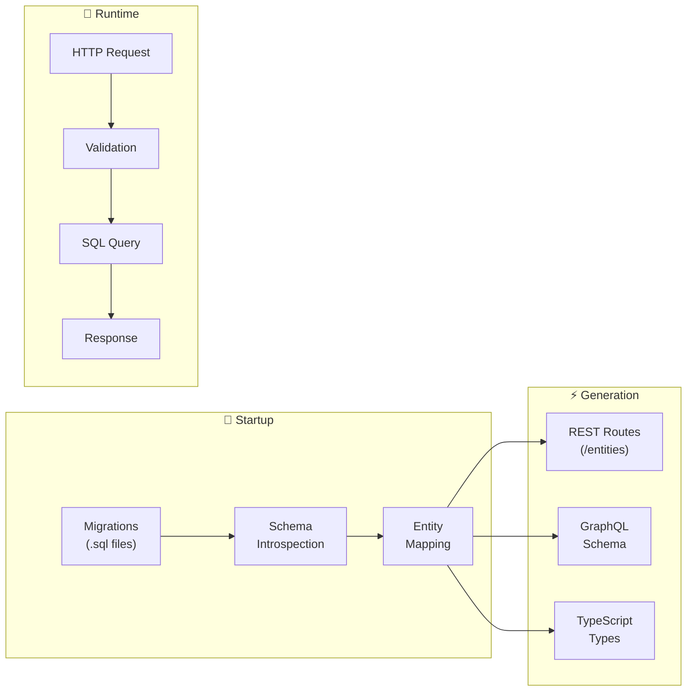
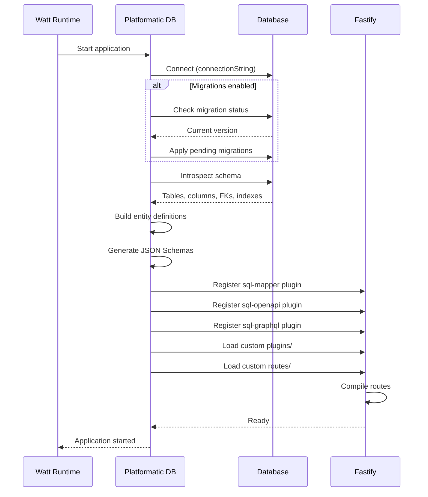
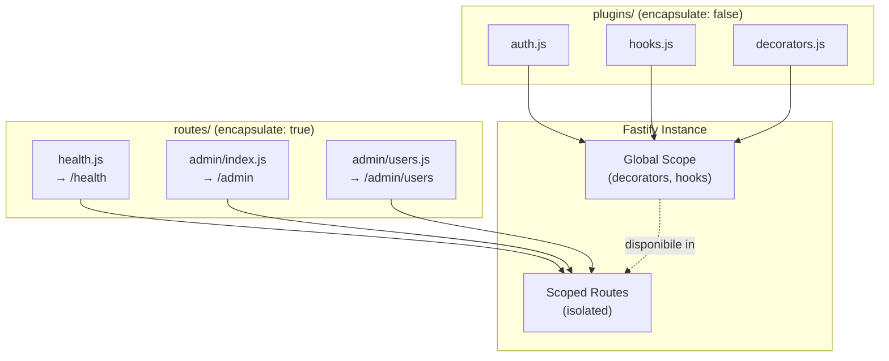
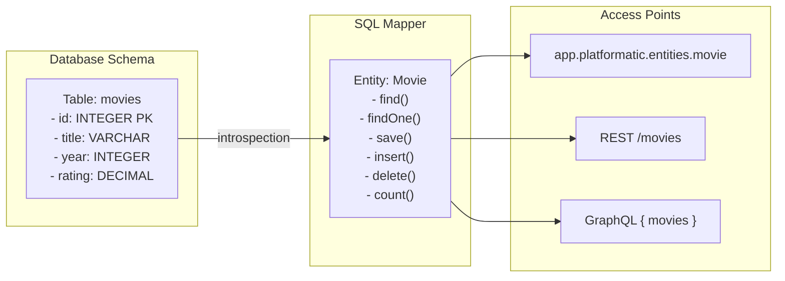
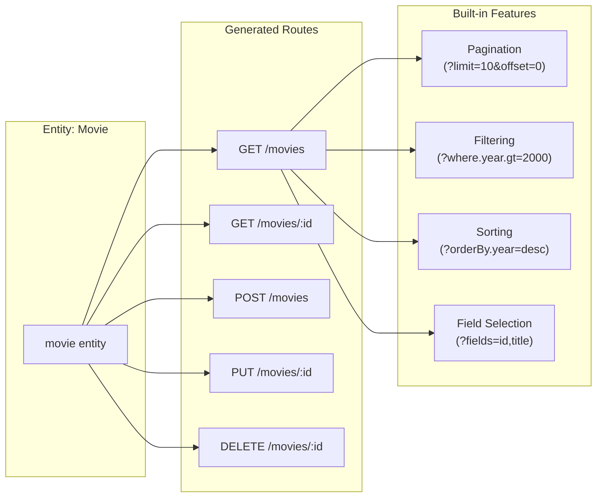
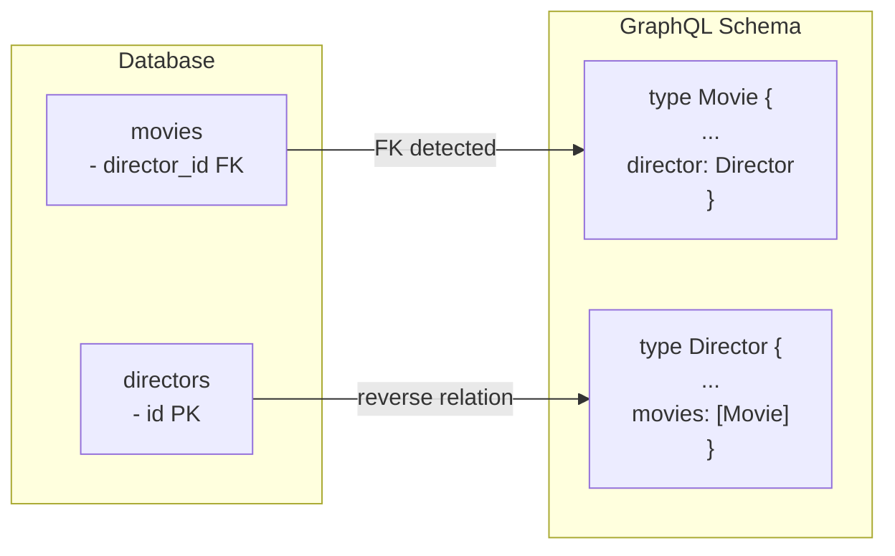
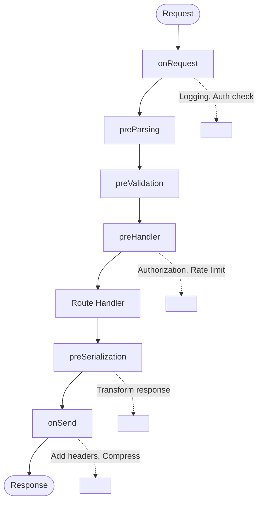
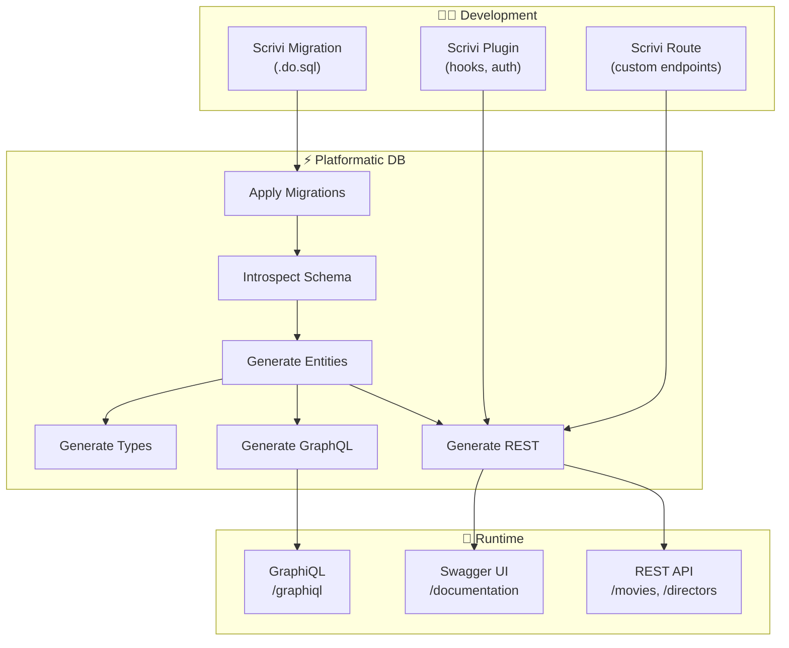

# Guida 11: Platformatic DB - Generazione Dinamica CRUD con Fastify

> **Filosofia**: Il database è il contratto. Le migrazioni SQL definiscono lo schema, Platformatic
> lo introspecta e genera automaticamente REST API, GraphQL, e tipi TypeScript. Zero boilerplate,
> massima coerenza.

---

## Indice

1. [Architettura del Sistema](#1-architettura-del-sistema)
2. [Pipeline di Generazione](#2-pipeline-di-generazione)
3. [Struttura Directory](#3-struttura-directory)
4. [Migrations: La Fonte di Verità](#4-migrations-la-fonte-di-verità)
5. [SQL Mapper: L'ORM Leggero](#5-sql-mapper-lorm-leggero)
6. [Generazione OpenAPI](#6-generazione-openapi)
7. [Generazione GraphQL](#7-generazione-graphql)
8. [Customizzazione con Plugins](#8-customizzazione-con-plugins)
9. [Customizzazione con Routes](#9-customizzazione-con-routes)
10. [Hooks e Lifecycle](#10-hooks-e-lifecycle)
11. [Type Generation](#11-type-generation)
12. [Pattern Avanzati](#12-pattern-avanzati)
13. [Troubleshooting](#13-troubleshooting)

---

## 1. Architettura del Sistema

### 1.1 Stack dei Componenti

Platformatic DB è costruito come una serie di layer che collaborano per trasformare uno schema SQL
in API complete.

```
┌─────────────────────────────────────────────────────────────┐
│                    PLATFORMATIC DB                          │
├─────────────────────────────────────────────────────────────┤
│                                                             │
│  ┌─────────────────────────────────────────────────────┐   │
│  │                   FASTIFY SERVER                     │   │
│  │              (HTTP layer, routing, hooks)            │   │
│  └─────────────────────────────────────────────────────┘   │
│                           │                                 │
│           ┌───────────────┼───────────────┐                │
│           ▼               ▼               ▼                │
│  ┌─────────────┐  ┌─────────────┐  ┌─────────────┐        │
│  │ sql-openapi │  │ sql-graphql │  │   plugins   │        │
│  │  (REST gen) │  │ (GQL gen)   │  │  (custom)   │        │
│  └──────┬──────┘  └──────┬──────┘  └──────┬──────┘        │
│         │                │                │                │
│         └────────────────┼────────────────┘                │
│                          ▼                                  │
│  ┌─────────────────────────────────────────────────────┐   │
│  │                    SQL-MAPPER                        │   │
│  │         (ORM leggero, entities, queries)             │   │
│  └─────────────────────────────────────────────────────┘   │
│                          │                                  │
│                          ▼                                  │
│  ┌─────────────────────────────────────────────────────┐   │
│  │              DATABASE ADAPTER                        │   │
│  │        (SQLite / PostgreSQL / MySQL)                 │   │
│  └─────────────────────────────────────────────────────┘   │
│                                                             │
└─────────────────────────────────────────────────────────────┘
```

### 1.2 Componenti Chiave

Ogni componente ha una responsabilità precisa nel sistema.

**@platformatic/sql-mapper** rappresenta il cuore del sistema: un ORM leggero che introspecta il
database, mappa le tabelle in entities, e fornisce metodi CRUD type-safe. Non usa un query builder
pesante, ma genera query SQL ottimizzate direttamente.

**@platformatic/sql-openapi** prende le entities dal mapper e genera automaticamente endpoint REST
seguendo le convenzioni OpenAPI 3.0. Include validazione JSON Schema, pagination, filtering, e
sorting out-of-the-box.

**@platformatic/sql-graphql** genera uno schema GraphQL completo dalle stesse entities, con query,
mutations, subscriptions (se abilitate), e relazioni automatiche basate sulle foreign keys.

**Fastify** è il web server sottostante che gestisce routing, serializzazione JSON veloce, plugin
system, e lifecycle hooks.

### 1.3 Flusso dei Dati



---

## 2. Pipeline di Generazione

### 2.1 Processo di Boot

All'avvio, Platformatic DB esegue una sequenza ordinata di operazioni che trasformano lo schema SQL
in API funzionanti.



### 2.2 Pseudocodice del Boot Process

```
FUNCTION bootPlatformaticDB(config):
    // 1. Connessione database
    connection ← connectDatabase(config.db.connectionString)

    // 2. Migrazioni (se abilitate)
    IF config.migrations.autoApply:
        pendingMigrations ← findPendingMigrations(config.migrations.dir)
        FOR EACH migration IN pendingMigrations:
            executeMigration(connection, migration)

    // 3. Introspection
    schema ← introspectDatabase(connection)
    // schema = { tables: [...], columns: {...}, foreignKeys: [...], indexes: [...] }

    // 4. Entity Mapping
    entities ← {}
    FOR EACH table IN schema.tables:
        entity ← createEntity(table, schema.columns[table], schema.foreignKeys)
        entities[entity.name] ← entity

    // 5. JSON Schema Generation
    FOR EACH entity IN entities:
        entity.jsonSchema ← generateJSONSchema(entity.columns)
        entity.inputSchema ← generateInputSchema(entity.columns)

    // 6. Fastify Plugin Registration
    fastify.register(sqlMapper, { entities, connection })

    IF config.db.openapi:
        fastify.register(sqlOpenAPI, { entities })

    IF config.db.graphql:
        fastify.register(sqlGraphQL, { entities })

    // 7. Custom Code Loading
    FOR EACH pluginPath IN config.plugins.paths:
        fastify.register(loadPlugin(pluginPath))

    // 8. Ready
    RETURN fastify
```

---

## 3. Struttura Directory

### 3.1 Layout Standard

Una Platformatic DB application segue una struttura convenzionale che Fastify autoload riconosce.

```
web/thc-db/
├── watt.json                    # Configurazione Platformatic DB
├── .env                         # Variabili ambiente locali
│
├── migrations/                  # 📁 Migrazioni SQL (ordinate)
│   ├── 001.do.sql              # Prima migrazione (forward)
│   ├── 001.undo.sql            # Prima migrazione (rollback)
│   ├── 002.do.sql              # Seconda migrazione
│   ├── 002.undo.sql
│   └── ...
│
├── plugins/                     # 📁 Plugin Fastify (autoload)
│   ├── authentication.js        # Hook globali, decorators
│   ├── authorization.js         # Logica autorizzazione
│   └── custom-hooks.js          # Entity hooks (beforeInsert, etc.)
│
├── routes/                      # 📁 Route custom (autoload)
│   ├── health.js               # GET /health
│   ├── admin/                   # Namespace /admin
│   │   └── stats.js            # GET /admin/stats
│   └── v2/                      # Versioned routes /v2
│       └── products.js
│
├── types/                       # 📁 Tipi auto-generati
│   ├── index.d.ts              # Export aggregato
│   └── Movie.d.ts              # Tipi per entity Movie
│
├── seed.js                      # Script per seed database
└── global.d.ts                  # Tipi globali (platformatic)
```

### 3.2 Convenzioni di Naming

Platformatic segue convenzioni precise che determinano il comportamento automatico.

```
┌─────────────────────────────────────────────────────────────┐
│                  CONVENZIONI DI NAMING                      │
├─────────────────────────────────────────────────────────────┤
│                                                             │
│  MIGRATIONS                                                 │
│  ──────────                                                │
│  {number}.do.sql   → Eseguita in ordine crescente          │
│  {number}.undo.sql → Rollback (opzionale ma consigliato)   │
│                                                             │
│  Esempi:                                                   │
│  001.do.sql, 002.do.sql, 010.do.sql                       │
│                                                             │
│  PLUGINS (encapsulate: false di default)                   │
│  ───────                                                   │
│  plugins/{name}.js → Caricato automaticamente              │
│  plugins/{name}/index.js → Stesso effetto                  │
│                                                             │
│  ROUTES (encapsulate: true di default)                     │
│  ──────                                                    │
│  routes/{name}.js → Route sotto /{name}                    │
│  routes/{name}/index.js → Stesso effetto                   │
│  routes/root.js → Route sotto /                            │
│                                                             │
│  ENTITIES (da database)                                    │
│  ────────                                                  │
│  Tabella: movies → Entity: Movie (singolare, PascalCase)  │
│  Tabella: movie_actors → Entity: MovieActor               │
│  Route REST: /movies (plurale, kebab-case)                │
│                                                             │
└─────────────────────────────────────────────────────────────┘
```

### 3.3 Autoload Behavior

Fastify autoload, usato internamente da Platformatic, segue regole precise.



**Differenza chiave**: I plugins sono "non-encapsulated", quindi decorators e hooks definiti lì sono
disponibili globalmente. Le routes sono "encapsulated", quindi modifiche allo scope non si
propagano.

---

## 4. Migrations: La Fonte di Verità

### 4.1 Filosofia

Le migrazioni SQL sono l'unica fonte di verità per lo schema del database. Non esiste un "model
file" separato: il database IS the schema.

```
┌─────────────────────────────────────────────────────────────┐
│              DATABASE-FIRST APPROACH                        │
├─────────────────────────────────────────────────────────────┤
│                                                             │
│  TRADIZIONALE (ORM-based)         PLATFORMATIC DB          │
│  ─────────────────────────        ──────────────           │
│                                                             │
│  Model File (JS/TS)                Migration SQL            │
│       │                                 │                   │
│       ▼                                 ▼                   │
│  ORM genera SQL                   Eseguita su DB            │
│       │                                 │                   │
│       ▼                                 ▼                   │
│  Database schema                  Introspection             │
│                                        │                   │
│                                        ▼                   │
│                                   Entities + Types          │
│                                                             │
│  PRO: Astrazione                  PRO: SQL puro,            │
│  CONTRO: Query nascoste,          controllo totale,         │
│          drift schema             zero drift                │
│                                                             │
└─────────────────────────────────────────────────────────────┘
```

### 4.2 Struttura Migration File

```
// migrations/001.do.sql
// Crea la struttura iniziale

CREATE TABLE IF NOT EXISTS movies (
    id INTEGER PRIMARY KEY AUTOINCREMENT,
    title VARCHAR(255) NOT NULL,
    year INTEGER,
    director_id INTEGER,
    rating DECIMAL(3,1),
    created_at TIMESTAMP DEFAULT CURRENT_TIMESTAMP,
    updated_at TIMESTAMP DEFAULT CURRENT_TIMESTAMP,

    FOREIGN KEY (director_id) REFERENCES directors(id)
);

CREATE INDEX idx_movies_year ON movies(year);
CREATE INDEX idx_movies_director ON movies(director_id);
```

```
// migrations/001.undo.sql
// Rollback pulito

DROP INDEX IF EXISTS idx_movies_director;
DROP INDEX IF EXISTS idx_movies_year;
DROP TABLE IF EXISTS movies;
```

### 4.3 Naming delle Migrazioni

```
┌─────────────────────────────────────────────────────────────┐
│              MIGRATION NAMING CONVENTIONS                   │
├─────────────────────────────────────────────────────────────┤
│                                                             │
│  FORMATO: {sequence}.do.sql / {sequence}.undo.sql          │
│                                                             │
│  SEQUENCE può essere:                                       │
│  • Numerico: 001, 002, 003...                              │
│  • Timestamp: 20250113120000                               │
│  • Semantico: 001_create_users, 002_add_email_index        │
│                                                             │
│  RACCOMANDAZIONE per team:                                  │
│  • Usa numeri sequenziali semplici (001, 002)              │
│  • Evita gap nella sequenza                                │
│  • Un file per operazione logica                           │
│  • Sempre fornire .undo.sql                                │
│                                                             │
│  ESEMPIO TIMELINE:                                          │
│  001.do.sql  → CREATE TABLE users                          │
│  002.do.sql  → CREATE TABLE posts                          │
│  003.do.sql  → ALTER TABLE posts ADD COLUMN likes          │
│  004.do.sql  → CREATE INDEX idx_posts_created_at           │
│                                                             │
└─────────────────────────────────────────────────────────────┘
```

### 4.4 Comandi Migrations

```
# Applica tutte le pending migrations
npx wattpm thc-db:migrations:apply

# Rollback ultima migration
npx wattpm thc-db:migrations:rollback

# Mostra stato migrations
npx wattpm thc-db:migrations:status

# Crea nuova migration (scaffold)
npx wattpm thc-db:migrations:create add_categories_table
```

---

## 5. SQL Mapper: L'ORM Leggero

### 5.1 Concetto di Entity

Dopo l'introspection, ogni tabella diventa una Entity con metodi CRUD.



### 5.2 Entity API

Ogni entity espone metodi standard per le operazioni CRUD.

```
┌─────────────────────────────────────────────────────────────┐
│                    ENTITY METHODS                           │
├─────────────────────────────────────────────────────────────┤
│                                                             │
│  LETTURA                                                    │
│  ───────                                                   │
│  find({ where, orderBy, limit, offset })                   │
│    → Array di record                                       │
│                                                             │
│  findOne({ where })                                        │
│    → Singolo record o null                                 │
│                                                             │
│  count({ where })                                          │
│    → Numero totale                                         │
│                                                             │
│  SCRITTURA                                                  │
│  ────────                                                  │
│  save({ input })                                           │
│    → Insert se nuovo, Update se esiste (by PK)             │
│                                                             │
│  insert({ inputs })                                        │
│    → Bulk insert, ritorna array                            │
│                                                             │
│  delete({ where })                                         │
│    → Elimina matching records                              │
│                                                             │
│  PARAMETRI COMUNI                                          │
│  ────────────────                                          │
│  where: { field: value, field: { gt: 10 }, ... }          │
│  orderBy: [{ field: 'name', direction: 'ASC' }]           │
│  limit: number                                             │
│  offset: number                                            │
│  fields: ['id', 'name']  // proiezione                    │
│                                                             │
└─────────────────────────────────────────────────────────────┘
```

### 5.3 Where Clause Operators

Il mapper supporta operatori di confronto nei filtri.

```
┌─────────────────────────────────────────────────────────────┐
│                    WHERE OPERATORS                          │
├─────────────────────────────────────────────────────────────┤
│                                                             │
│  OPERATORE    │ SQL EQUIVALENTE    │ ESEMPIO               │
│  ─────────────────────────────────────────────────────────  │
│  eq           │ =                  │ { year: { eq: 2020 }} │
│  neq          │ <>                 │ { year: { neq: 2020 }}│
│  gt           │ >                  │ { year: { gt: 2000 }} │
│  gte          │ >=                 │ { rating: { gte: 7 }} │
│  lt           │ <                  │ { year: { lt: 2000 }} │
│  lte          │ <=                 │ { rating: { lte: 5 }} │
│  like         │ LIKE               │ { title: { like: '%Star%' }}│
│  in           │ IN                 │ { year: { in: [2020, 2021] }}│
│  nin          │ NOT IN             │ { year: { nin: [2019] }}│
│  null         │ IS NULL            │ { director: { null: true }}│
│                                                             │
│  IMPLICIT eq:                                               │
│  { year: 2020 } equivale a { year: { eq: 2020 }}          │
│                                                             │
└─────────────────────────────────────────────────────────────┘
```

---

## 6. Generazione OpenAPI

### 6.1 Route Generate Automaticamente

Per ogni entity, sql-openapi genera un set completo di route REST.



### 6.2 Mappa Completa Endpoint

```
┌─────────────────────────────────────────────────────────────┐
│           ENDPOINT REST AUTO-GENERATI                       │
├─────────────────────────────────────────────────────────────┤
│                                                             │
│  GET /movies                                                │
│  ────────────                                              │
│  Lista con pagination, filtering, sorting                   │
│  Query params:                                              │
│    • limit, offset (pagination)                            │
│    • where.{field}.{op}={value} (filtering)                │
│    • orderBy.{field}=asc|desc (sorting)                    │
│    • fields={field1},{field2} (projection)                 │
│    • totalCount=true (include count in response)           │
│                                                             │
│  GET /movies/:id                                            │
│  ───────────────                                           │
│  Singolo record by primary key                              │
│  Query params:                                              │
│    • fields={field1},{field2}                              │
│                                                             │
│  POST /movies                                               │
│  ────────────                                              │
│  Crea nuovo record                                          │
│  Body: JSON object matching entity schema                   │
│  Returns: created object with id                            │
│                                                             │
│  PUT /movies/:id                                            │
│  ──────────────                                            │
│  Aggiorna record esistente (partial update)                 │
│  Body: JSON object with fields to update                    │
│  Returns: updated object                                    │
│                                                             │
│  DELETE /movies/:id                                         │
│  ─────────────────                                         │
│  Elimina record                                             │
│  Returns: deleted object                                    │
│                                                             │
└─────────────────────────────────────────────────────────────┘
```

### 6.3 Query String Filtering

Esempi pratici di filtering via query string.

```
# Tutti i film dopo il 2000
GET /movies?where.year.gt=2000

# Film con rating tra 7 e 9
GET /movies?where.rating.gte=7&where.rating.lte=9

# Film il cui titolo contiene "Star"
GET /movies?where.title.like=%Star%

# Film di anni specifici
GET /movies?where.year.in=2020,2021,2022

# Combinazione: film recenti ben votati, ordinati per rating
GET /movies?where.year.gte=2020&where.rating.gte=8&orderBy.rating=desc&limit=10

# Con count totale per pagination UI
GET /movies?limit=10&offset=20&totalCount=true
```

### 6.4 Swagger UI

Platformatic genera automaticamente documentazione Swagger accessibile via browser.

```
┌─────────────────────────────────────────────────────────────┐
│                    SWAGGER ENDPOINTS                        │
├─────────────────────────────────────────────────────────────┤
│                                                             │
│  /documentation                                             │
│    → Swagger UI interattivo                                │
│    → Permette test delle API direttamente dal browser      │
│                                                             │
│  /documentation/json                                        │
│    → OpenAPI 3.0 schema in JSON                            │
│    → Usabile per generare client                           │
│                                                             │
│  /documentation/yaml                                        │
│    → OpenAPI 3.0 schema in YAML                            │
│                                                             │
│  Nel contesto Watt con gateway su /api/db:                 │
│  http://localhost:3042/api/db/documentation                │
│  http://localhost:3042/api/db/documentation/json           │
│                                                             │
└─────────────────────────────────────────────────────────────┘
```

---

## 7. Generazione GraphQL

### 7.1 Schema Auto-Generato

Quando `graphql: true` è abilitato, Platformatic genera uno schema GraphQL completo.

```
┌─────────────────────────────────────────────────────────────┐
│                GRAPHQL SCHEMA GENERATO                      │
├─────────────────────────────────────────────────────────────┤
│                                                             │
│  Per ogni entity viene generato:                           │
│                                                             │
│  TYPE                                                       │
│  ────                                                      │
│  type Movie {                                              │
│    id: ID!                                                 │
│    title: String!                                          │
│    year: Int                                               │
│    rating: Float                                           │
│    director: Director    # relazione da FK                 │
│  }                                                         │
│                                                             │
│  QUERIES                                                    │
│  ───────                                                   │
│  movies(                                                   │
│    limit: Int,                                             │
│    offset: Int,                                            │
│    orderBy: [MovieOrderBy],                                │
│    where: MovieWhereInput                                  │
│  ): [Movie]!                                               │
│                                                             │
│  getMovieById(id: ID!): Movie                              │
│                                                             │
│  MUTATIONS                                                  │
│  ─────────                                                 │
│  saveMovie(input: MovieInput!): Movie!                     │
│  insertMovies(inputs: [MovieInput]!): [Movie]!             │
│  deleteMovies(where: MovieWhereInput!): [Movie]!           │
│                                                             │
│  SUBSCRIPTIONS (se sql-events abilitato)                   │
│  ─────────────                                             │
│  movieSaved: Movie                                         │
│  movieDeleted: Movie                                       │
│                                                             │
└─────────────────────────────────────────────────────────────┘
```

### 7.2 Relazioni Automatiche

Le foreign keys nel database diventano relazioni navigabili in GraphQL.



### 7.3 GraphQL Endpoints

```
# GraphQL endpoint (POST queries qui)
POST /graphql

# GraphiQL UI (interfaccia interattiva)
GET /graphiql

# Nel contesto Watt con gateway su /api/db:
POST http://localhost:3042/api/db/graphql
GET  http://localhost:3042/api/db/graphiql
```

### 7.4 Esempio Query GraphQL

```graphql
# Lista film con regista (nested)
query {
  movies(where: { year: { gte: 2020 } }, orderBy: [{ field: rating, direction: DESC }], limit: 5) {
    id
    title
    year
    rating
    director {
      name
      country
    }
  }
}

# Mutation: crea nuovo film
mutation {
  saveMovie(input: { title: "New Movie", year: 2025, directorId: 1 }) {
    id
    title
  }
}
```

---

## 8. Customizzazione con Plugins

### 8.1 Plugin Structure

I plugins permettono di aggiungere logica globale: hooks, decorators, autenticazione.

```
┌─────────────────────────────────────────────────────────────┐
│                    PLUGIN ANATOMY                           │
├─────────────────────────────────────────────────────────────┤
│                                                             │
│  // plugins/my-plugin.js                                   │
│                                                             │
│  EXPORT: async function (fastify, options)                 │
│                                                             │
│  RESPONSABILITÀ:                                            │
│  • Decorators (fastify.decorate)                           │
│  • Hooks globali (fastify.addHook)                         │
│  • Entity hooks (app.platformatic.addEntityHooks)          │
│  • Registrazione altri plugins                             │
│                                                             │
│  ENCAPSULATION: false (default in plugins/)                │
│  → Modifiche visibili globalmente                          │
│                                                             │
└─────────────────────────────────────────────────────────────┘
```

### 8.2 Pseudocodice Plugin Pattern

```
// plugins/authentication.js

EXPORT ASYNC FUNCTION plugin(fastify, options):
    // 1. Aggiungi decorator disponibile ovunque
    fastify.decorate('authenticate', ASYNC FUNCTION(request):
        token ← request.headers['authorization']
        IF NOT token:
            THROW Unauthorized("Missing token")
        user ← verifyToken(token)
        request.user ← user
    )

    // 2. Hook globale su tutte le route
    fastify.addHook('preHandler', ASYNC FUNCTION(request, reply):
        // Skip per route pubbliche
        IF request.routeOptions.config.public:
            RETURN

        AWAIT fastify.authenticate(request)
    )

// plugins/entity-hooks.js

EXPORT ASYNC FUNCTION plugin(fastify, options):
    // Hook su operazioni entity specifiche
    fastify.platformatic.addEntityHooks('movie', {
        beforeInsert: ASYNC FUNCTION(entity, input):
            input.createdAt ← NOW()
            input.updatedAt ← NOW()
            RETURN input

        beforeUpdate: ASYNC FUNCTION(entity, input):
            input.updatedAt ← NOW()
            RETURN input

        afterFind: ASYNC FUNCTION(entity, results):
            // Post-processing dei risultati
            RETURN results.map(addComputedFields)
    })
```

### 8.3 Entity Hooks Disponibili

```
┌─────────────────────────────────────────────────────────────┐
│                    ENTITY HOOKS                             │
├─────────────────────────────────────────────────────────────┤
│                                                             │
│  HOOK              │ QUANDO                │ MODIFICA       │
│  ─────────────────────────────────────────────────────────  │
│  beforeInsert      │ Prima di INSERT       │ input          │
│  afterInsert       │ Dopo INSERT           │ result         │
│  beforeUpdate      │ Prima di UPDATE       │ input          │
│  afterUpdate       │ Dopo UPDATE           │ result         │
│  beforeDelete      │ Prima di DELETE       │ where clause   │
│  afterDelete       │ Dopo DELETE           │ result         │
│  beforeFind        │ Prima di SELECT       │ query params   │
│  afterFind         │ Dopo SELECT           │ results        │
│                                                             │
│  USI COMUNI:                                                │
│  • Audit logging (afterInsert, afterUpdate, afterDelete)   │
│  • Timestamp automatici (beforeInsert, beforeUpdate)       │
│  • Validazione business (beforeInsert, beforeUpdate)       │
│  • Soft delete (beforeDelete → beforeUpdate)               │
│  • Computed fields (afterFind)                             │
│  • Cache invalidation (after*)                             │
│                                                             │
└─────────────────────────────────────────────────────────────┘
```

---

## 9. Customizzazione con Routes

### 9.1 Route Custom Structure

Le route custom estendono le API generate con endpoint specifici.

```
┌─────────────────────────────────────────────────────────────┐
│                    ROUTE ANATOMY                            │
├─────────────────────────────────────────────────────────────┤
│                                                             │
│  // routes/stats.js                                        │
│                                                             │
│  EXPORT DEFAULT ASYNC FUNCTION (fastify, options):         │
│      fastify.get('/stats', handler)                        │
│      fastify.post('/bulk-import', handler)                 │
│                                                             │
│  URL MAPPING (basato su struttura file):                   │
│  routes/stats.js        → /stats                           │
│  routes/admin/users.js  → /admin/users                     │
│  routes/v2/movies.js    → /v2/movies                       │
│                                                             │
│  ENCAPSULATION: true (default in routes/)                  │
│  → Scope isolato, non inquina altre route                  │
│                                                             │
└─────────────────────────────────────────────────────────────┘
```

### 9.2 Accesso alle Entities da Route Custom

```
// routes/reports.js

EXPORT DEFAULT ASYNC FUNCTION (fastify, options):

    fastify.get('/top-rated', ASYNC FUNCTION(request, reply):
        // Accesso diretto all'entity Movie
        movies ← AWAIT fastify.platformatic.entities.movie.find({
            where: { rating: { gte: 8 } },
            orderBy: [{ field: 'rating', direction: 'DESC' }],
            limit: 10
        })

        RETURN { topRated: movies }
    )

    fastify.get('/stats', ASYNC FUNCTION(request, reply):
        // Query aggregate custom
        totalMovies ← AWAIT fastify.platformatic.entities.movie.count({})

        avgRating ← AWAIT fastify.platformatic.db.query(
            'SELECT AVG(rating) as avg FROM movies'
        )

        RETURN {
            total: totalMovies,
            averageRating: avgRating[0].avg
        }
    )
```

### 9.3 Sovrascrivere Route Generate

È possibile sovrascrivere il comportamento delle route auto-generate.

```
// routes/movies.js
// Sovrascrive GET /movies per aggiungere logica custom

EXPORT DEFAULT ASYNC FUNCTION (fastify, options):

    // Questa route ha precedenza su quella generata
    fastify.get('/movies', {
        schema: {
            querystring: {
                type: 'object',
                properties: {
                    genre: { type: 'string' }
                }
            }
        }
    }, ASYNC FUNCTION(request, reply):
        where ← {}

        IF request.query.genre:
            where.genre ← request.query.genre

        // Usa l'entity ma con logica custom
        movies ← AWAIT fastify.platformatic.entities.movie.find({
            where,
            limit: 20
        })

        // Aggiungi campi computati
        RETURN movies.map(m => ({
            ...m,
            isClassic: m.year < 1980
        }))
    )
```

---

## 10. Hooks e Lifecycle

### 10.1 Fastify Request Lifecycle

Comprendere il lifecycle è fondamentale per posizionare la logica correttamente.



### 10.2 Hook Timing per Use Case

```
┌─────────────────────────────────────────────────────────────┐
│                USE CASE → HOOK MAPPING                      │
├─────────────────────────────────────────────────────────────┤
│                                                             │
│  USE CASE                    │ HOOK                         │
│  ─────────────────────────────────────────────────────────  │
│  Request logging             │ onRequest                    │
│  Authentication              │ onRequest o preHandler       │
│  Authorization               │ preHandler                   │
│  Input transformation        │ preHandler                   │
│  Rate limiting               │ preHandler                   │
│  Response transformation     │ preSerialization             │
│  Add response headers        │ onSend                       │
│  Response logging            │ onResponse                   │
│  Error handling              │ onError                      │
│  Cleanup                     │ onResponse                   │
│                                                             │
└─────────────────────────────────────────────────────────────┘
```

---

## 11. Type Generation

### 11.1 Automatic TypeScript Types

Quando `types.autogenerate: true`, Platformatic genera tipi TypeScript dalle entities.

```
┌─────────────────────────────────────────────────────────────┐
│                TYPE GENERATION FLOW                         │
├─────────────────────────────────────────────────────────────┤
│                                                             │
│  Database Schema                                            │
│       │                                                     │
│       ▼                                                     │
│  Introspection (columns, types, constraints)                │
│       │                                                     │
│       ▼                                                     │
│  SQL → TypeScript Type Mapping                              │
│       │                                                     │
│       ├──────────────────┐                                 │
│       ▼                  ▼                                  │
│  types/Movie.d.ts    types/index.d.ts                      │
│                                                             │
│  SQL TYPE        → TS TYPE                                  │
│  ─────────────────────────                                  │
│  INTEGER, INT    → number                                   │
│  VARCHAR, TEXT   → string                                   │
│  BOOLEAN         → boolean                                  │
│  DECIMAL, FLOAT  → number                                   │
│  DATE, TIMESTAMP → string (ISO format)                      │
│  JSON, JSONB     → unknown                                  │
│  NULL            → | null (union)                           │
│                                                             │
└─────────────────────────────────────────────────────────────┘
```

### 11.2 Generated Types Structure

```
// types/Movie.d.ts (auto-generato)

INTERFACE Movie:
    id: number
    title: string
    year: number | null
    rating: number | null
    directorId: number | null
    createdAt: string
    updatedAt: string

INTERFACE MovieInput:
    title: string                // required (NOT NULL)
    year?: number | null         // optional
    rating?: number | null
    directorId?: number | null

// types/index.d.ts

DECLARE MODULE 'fastify':
    INTERFACE FastifyInstance:
        platformatic:
            entities:
                movie: Entity<Movie, MovieInput>
                director: Entity<Director, DirectorInput>
            db: DatabaseConnection
```

### 11.3 Rigenerazione Tipi

I tipi vengono rigenerati automaticamente quando cambiano le migrations.

```
# Forza rigenerazione manuale
npx wattpm thc-db:types:generate

# I tipi si rigenerano automaticamente su:
# • npm run dev (watch mode)
# • Dopo migrations:apply
# • Al primo avvio se mancanti
```

---

## 12. Pattern Avanzati

### 12.1 Soft Delete

Implementare soft delete invece di eliminazione fisica.

```
// migrations/001.do.sql
CREATE TABLE movies (
    ...
    deleted_at TIMESTAMP NULL,  -- NULL = non eliminato
    ...
);

CREATE INDEX idx_movies_deleted ON movies(deleted_at);

// plugins/soft-delete.js

EXPORT ASYNC FUNCTION plugin(fastify):

    // Intercetta DELETE e trasformalo in UPDATE
    fastify.platformatic.addEntityHooks('movie', {
        beforeDelete: ASYNC FUNCTION(entity, { where }):
            // Invece di DELETE, fai UPDATE
            AWAIT entity.save({
                input: { ...where, deletedAt: NOW() }
            })

            // Ritorna array vuoto per saltare DELETE reale
            RETURN { skipDelete: true }

        beforeFind: ASYNC FUNCTION(entity, params):
            // Escludi automaticamente i soft-deleted
            params.where ← params.where OR {}
            params.where.deletedAt ← { null: true }
            RETURN params
    })
```

### 12.2 Multi-Tenancy

Isolare dati per tenant automaticamente.

```
// plugins/multi-tenant.js

EXPORT ASYNC FUNCTION plugin(fastify):

    // Aggiungi tenantId a tutte le query
    FOR EACH entityName IN fastify.platformatic.entities:
        entity ← fastify.platformatic.entities[entityName]

        fastify.platformatic.addEntityHooks(entityName, {
            beforeFind: ASYNC FUNCTION(e, params, context):
                tenantId ← context.request.user.tenantId
                params.where ← { ...params.where, tenantId }
                RETURN params

            beforeInsert: ASYNC FUNCTION(e, input, context):
                input.tenantId ← context.request.user.tenantId
                RETURN input
        })
```

### 12.3 Audit Trail

Logging automatico delle modifiche.

```
// plugins/audit.js

EXPORT ASYNC FUNCTION plugin(fastify):
    auditLog ← fastify.platformatic.entities.auditLog

    FOR EACH entityName IN ['movie', 'director', 'actor']:
        fastify.platformatic.addEntityHooks(entityName, {
            afterInsert: ASYNC FUNCTION(e, result, context):
                AWAIT auditLog.save({
                    input: {
                        entity: entityName,
                        action: 'INSERT',
                        recordId: result.id,
                        newValue: JSON.stringify(result),
                        userId: context.request.user?.id,
                        timestamp: NOW()
                    }
                })

            afterUpdate: ASYNC FUNCTION(e, result, context):
                // Simile per UPDATE

            afterDelete: ASYNC FUNCTION(e, result, context):
                // Simile per DELETE
        })
```

---

## 13. Troubleshooting

### 13.1 Problemi Comuni

```
┌─────────────────────────────────────────────────────────────┐
│                    TROUBLESHOOTING                          │
├─────────────────────────────────────────────────────────────┤
│                                                             │
│  PROBLEMA: Entity non trovata                               │
│  CAUSA: Tabella non esiste o migration non applicata       │
│  SOLUZIONE: npx wattpm <app>:migrations:apply              │
│                                                             │
│  PROBLEMA: Tipi TypeScript non aggiornati                  │
│  CAUSA: Cache o mancata rigenerazione                      │
│  SOLUZIONE: Elimina types/, riavvia dev mode               │
│                                                             │
│  PROBLEMA: Route custom non trovata                         │
│  CAUSA: File non nella directory routes/ o export errato   │
│  SOLUZIONE: Verifica export default async function         │
│                                                             │
│  PROBLEMA: Hook non eseguito                                │
│  CAUSA: Plugin non caricato o ordine errato               │
│  SOLUZIONE: Verifica plugins/ path in watt.json           │
│                                                             │
│  PROBLEMA: Foreign key non genera relazione GraphQL        │
│  CAUSA: FK non riconosciuta in introspection              │
│  SOLUZIONE: Verifica sintassi FK nel SQL                   │
│                                                             │
│  PROBLEMA: Performance lente su query                       │
│  CAUSA: Mancanza di indici                                 │
│  SOLUZIONE: Aggiungi CREATE INDEX nella migration          │
│                                                             │
└─────────────────────────────────────────────────────────────┘
```

### 13.2 Debug Mode

```
# Abilita logging verbose
LOG_LEVEL=debug npm run dev

# Stampa tutte le route registrate
# (automatico con fastify-print-routes)

# Verifica schema generato
curl http://localhost:3042/api/db/documentation/json | jq .paths
```

---

## Diagramma Riassuntivo



---

## Quick Reference Commands

```
# Migrations
npx wattpm <app>:migrations:apply      # Applica pending
npx wattpm <app>:migrations:rollback   # Rollback ultima
npx wattpm <app>:migrations:status     # Mostra stato

# Schema
npx wattpm <app>:schema openapi        # Esporta OpenAPI JSON
npx wattpm <app>:schema graphql        # Esporta GraphQL SDL

# Types
npx wattpm <app>:types:generate        # Rigenera TypeScript

# Database
npx wattpm <app>:seed seed.js          # Esegui seed

# Development
npm run dev                             # Start con hot reload
LOG_LEVEL=debug npm run dev            # Verbose logging
```

---

## Riferimenti

| Risorsa              | URL/Path                                           |
| -------------------- | -------------------------------------------------- |
| Platformatic DB Docs | https://docs.platformatic.dev/db                   |
| Fastify Docs         | https://fastify.dev                                |
| SQL Mapper API       | https://docs.platformatic.dev/reference/sql-mapper |
| Guida 01             | Watt Architecture                                  |
| Guida 08             | Modular Monolith Quick Reference                   |
| Guida 10             | HTTP Caching                                       |

---

**Creato**: 2025-12-13  
**Stato**: Production-ready  
**Compatibilità**: Platformatic 3.27+, Fastify 5.x
